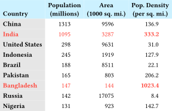
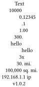

# `tblr` — Table generation helpers for Typst

`tblr` provides helper functions to better control table formatting.
`tblr` was inspired by the LaTeX
[Tabularray](https://ctan.org/pkg/tabularray) package. Like Tabularray,
table formatting can be specified with directives, so the formatting can
be separate from table entries. You can also continue to use cell-level
formatting, too.

Here is an example:



```typ
#import "@preview/tblr:0.2.0": *

#let pop = csv.decode("
China,1313,9596,136.9
India,1095,3287,333.2
United States,298,9631,31.0
Indonesia,245,1919,127.9
Brazil,188,8511,22.1
Pakistan,165,803,206.2
Bangladesh,147,144,1023.4
Russia,142,17075,8.4
Nigeria,131,923,142.7"
).flatten()

#set table(stroke: none)

#context tblr(header-rows: 1, columns: 4,
  align: (left+bottom, center, center, center),
  // formatting directives
  rows(within: "header", 0, fill: aqua.lighten(60%), hooks: strong),
  cols(within: "body", 0, fill: gray.lighten(70%), hooks: strong),
  rows(within: "body", 1, 6, hooks: text.with(red)),
  cells(((2, -3), end), hooks: strong),
  col-apply(span(1, end), decimal-align), 
  // content
  [Country], [Population \ (millions)],[Area\ (1000 sq. mi.)],[Pop. Density\ (per sq. mi.)],
  ..pop
)
```


## API

### `tblr`

```typ
#tblr(header-rows: 0, caption: none, placement: auto, remarks: none, table-fun: table, ..args)
```

`tblr` is the main function for table creation that supports several
helper functions.

Returns a Typst `table`.

Normal table arguments like `columns`, `fill`, `gutter`,
`table.hline`, and cell contents are passed to the `table` function.

Other arguments can be special directives to control formatting.
These include `cells()`, `cols()`, `rows()`, `hline()`, ...
 
Named arguments specific to `tblr` include:

* `header-rows` (default: auto): Number of header rows in the content. `auto` means determine number from header rows provided with content, otherwise zero.
* `remarks`: Content to include as a comment below the table.
* `caption`: If provided, wrap the `table` in a `figure`.
* `placement` (default: `auto`): Passed to `figure`.
* `table-fun` (default: `table`): Specifies the table-creation function to use.


### `cells` and other special formatting directives

`cells` is a directive to control formatting of cells. Positional
arguments can be one or more row and column indicators or special types.
The named argument `within` applies row ranges to "header" or "body" if
supplied.

Each indicator is specified by a `(row, col)` array pair.
Each `row` and `col` can be an integer or array of integers or indicators.

Accepted indicators include:

* Positive integers: normal row/column indicators starting at 0.
* `end`: the last row or column.
* `auto`: all rows or columns.
* Negative integers: indexing from the end; -1 is the last row/column.
* `span(to)` or `span(from, to)`: ranges of rows or columns. Note that the `to` argument to `span` is different than the `to` argument for `range`. With `span`, the `to` argument is inclusive. `span(2, end)` includes the last row/column.
* A function that returns a boolean indicating whether to include the row or column; commonly `calc.even` or `calc.odd` to select alternating rows or columns.

Named arguments are passed to cells. These include normal arguments like
`fill` and `colspan`.

Special arguments include directives that specify further processing.
These include:

* `hooks`: apply the given function to the cell content. Can also be an
  array of functions to apply sequentially.

Variations of `cells` include the following functions:

* `cols`: Control formatting of columns. Normal positional arguments
  are one or more column indicators. All rows are included.
* `rows`: Control formatting of rows. Normal positional arguments
  are one or more row indicators. All columns are included.

Several directives are available to control horizontal and vertical
lines. These are like `table.hline` and `table.vline`, but they can
include directives like `end`.

* `hline` -- also takes a `within` argument to apply to "header" or
  "body".
* `vline`

Another special directive function is `apply` which applies a function
to columns of a matrix. The function supplied will receive a
one-dimensional array and should return a one-dimensional array of the
same size. The function is supplied as the last positional argument. It
accepts a `within` argument of "body" to apply only to the columns in
the body of the table. Like `cells`, each positional argument is a
`(row, col)` array pair, and normal positional indicators can be used.
`col-apply` is a version of apply where each positional argument is a
column indicator.
  
Note that the order of formatting directives matters. These are
processed in reverse order, so later entries override earlier entries.

### Decimal Alignment

```typ
#decimal-align(a, decimal: regex("\.\d"), marker: "&", other-align: center)
```

`decimal-align` takes an array `a` and returns an array with contents
aligned. Rules mostly follow
[tbl](https://typst.app/universe/package/tbl/):
- One position after the leftmost occurrence of the non-printing
  input token `marker` (default: `&`), if any is present.
- Otherwise, the rightmost occurrence of the `decimal`. Defaults to
  `.` just before a digit.
- Otherwise, the rightmost digit.
- Otherwise, the content is aligned using `other-align` (default:
  `center`).

Note that `decimal-align` needs to be used in a context. Common usage is
to apply that to `tblr` and use `decimal-align` with `apply`. Note that
the `apply` directive must come after other formatting directives. That
means it is applied first before any of the other formatting directives,
and the contents are still strings.

Here is an example:



```typ
#context tblr(columns: 1,
  align: center, inset: 3pt, stroke: none,
  col-apply(auto, decimal-align),
  // content
  "Text",
  "10000",
  "0.12345",
  ".1",
  "1.00",
  "300.",
  "hello&",
  "&hello",
  "3x",
  "30. mi.",
  "100,000 sq. mi.",
  "192.168.1.1 ip",
  "v1.0.2"
)
```


## More Examples

This example shows use of a custom function to add some graphical
styling to one of the columns of a table. Adapted from
[here](https://www.storytellingwithdata.com/blog/2012/02/grables-and-taphs). It also shows including passing in a `table.header` with `header-rows` defaulting to `auto`.


```typ
#import "@preview/tblr:0.2.0": *

#let data = csv.decode("
Tower Hamlets          | 1  | 3  | 269 | 9692642
Hackney                | 2  | 2  | 225 | 7809608
Southwark              | 3  | 12 | 232 | 7266118
Camden                 | 4  | 14 | 136 | 6140419
Islington              | 5  | 4  | 156 | 5424137
Lambeth                | 6  | 8  | 156 | 5257941
Newham                 | 7  | 2  | 154 | 5217075
Hammersmith and Fulham | 8  | 13 | 109 | 4085708
Merton                 | 9  | 29 | 113 | 3656112
Croydon                | 10 | 20 | 127 | 3629066
", delimiter: "|").flatten().map(x => x.trim())

#set table(stroke: none)

#let bar(x) = {
  rect(width: int(x) / 7000000 * 2in, fill: blue, text(fill: white, x))
}

#tblr(columns: 5,
  align: center+horizon,
  // formatting directives
  rows(within: "header", auto, fill: aqua.lighten(60%), hooks: strong),
  cols(within: "body", 0, align: left, fill: gray.lighten(70%), hooks: strong),
  cols(within: "body", -1, align: left, hooks: bar),
  // content
  table.header([Borough],[Trust\ rank],[Index\ rank],[Number\ of grants],[Amount approved (£)]),
  ..data
)
```

This example tries to mimic [booktabs](https://ctan.org/pkg/booktabs).
Replicating booktabs with Typst tables is a bit fiddly. `table.hline`
works fine, but adjusting the spacings between rule locations and rows
is tough. It'd be great to have [this
feature](https://github.com/typst/typst/issues/4743) to adjust spacing
around `hlines`. The approach below adjusts insets to make the spacing
between rows nicer. The `column-gutter` is needed for
separation of the rules between the two column blocks. This example also 
shows the use of `caption` and `remarks`.


```typ
#import "@preview/tblr:0.2.0": *

#tblr(columns: 7, header-rows: 2,
  stroke: none,
  // combine header cells
  cells((0, (1,4)), colspan: 3, stroke: (bottom: 0.03em)),
  column-gutter: 0.6em,
  // booktabs style rules
  rows(within: "header", auto, inset: (y: 0.5em)),
  rows(within: "header", auto, align: center),
  hline(within: "header", y: 0, stroke: 0.08em),
  hline(within: "header", y: end, position: bottom, stroke: 0.05em),
  rows(within: "body", 0, inset: (top: 0.5em)),
  hline(y: end, position: bottom, stroke: 0.08em),
  rows(end, inset: (bottom: 0.5em)),
  // table note and caption
  remarks: [Note: ] + lorem(18),
  caption: [This is a caption],
  // content
  [], [tol $= mu_"single"$], [], [], [tol $= mu_"double"$], [], [],
  [], [$m v$ ], [Rel.~err], [Time   ], [$m v$ ], [Rel.~err], [Time], 
  [trigmv   ],  [11034], [1.3e-7], [3.9], [15846], [2.7e-11], [5.6 ], 
  [trigexpmv], [21952], [1.3e-7], [6.2], [31516], [2.7e-11], [8.8 ], 
  [trigblock], [15883], [5.2e-8], [7.1], [32023], [1.1e-11], [1.4e1], 
  [expleja  ], [11180], [8.0e-9], [4.3], [17348], [1.5e-11], [6.6 ])
 ```

The approach above is a bit cumbersome, but the formatting directives
can be used as part of a wrapper function if you want to create many
tables with a booktabs style. Here's an example:

```typ
#let booktbl = tblr.with(
  stroke: none,
  column-gutter: 0.6em,
  // booktabs style rules
  rows(within: "header", auto, inset: (y: 0.5em)),
  rows(within: "header", auto, align: center),
  hline(within: "header", y: 0, stroke: 0.08em),
  hline(within: "header", y: end, position: bottom, stroke: 0.05em),
  rows(within: "body", 0, inset: (top: 0.5em)),
  hline(y: end, position: bottom, stroke: 0.08em),
  rows(end, inset: (bottom: 0.5em)),
)
```

## Changelog

### v0.2.0

* Remove functions like `body-cells`. Use `cells(within: "body"...)` instead.
* Add `apply` and `col-apply`to apply a function column wise.
* Fix a bug in span on the `to` argument.
* Add `decimal-align` to align on decimals.
* Change the default in `header-rows` to `auto`. Traverse into headers provided with content. 

### v0.1.0

* Initial release
