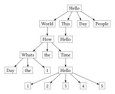

# tdtr

A Typst package for drawing beautiful tidy tree easily

This package uses [fletcher](https://typst.app/universe/package/fletcher) to render and customize nodes and edges

- [tdtr](#tdtr)
  - [Getting Started](#getting-started)
    - [From list](#from-list)
    - [From file](#from-file)
      - [JSON](#json)
      - [YAML](#yaml)
      - [Note](#note)
  - [Customization](#customization)
    - [Pre-defined drawing functions](#pre-defined-drawing-functions)
    - [Custom drawing functions](#custom-drawing-functions)
  - [API Reference](#api-reference)

## Getting Started

Import the package using:

```typ
#import "@preview/tdtr:0.2.0" : *
```

### From list

The most common case is to draw a tree directly from a bullet list.

Typical structure of the bullet list is:

```typ
- Parent node
  - Child node 1
    - Grandchild node 1
    - Grandchild node 2
  - Child node 2
```

where there must be only one root node (the top-level bullet list item), and each bullet list item represents a node in the tree, and the indentation level represents the parent-child relationship between nodes.

Here is an example:


```typ
#tidy-tree-graph(compact: true)[
  - $integral_0^infinity e^(-x) dif x = 1$
    - `int main() { return 0; }`
      - Hello
        - This
        - Continue
        - Hello World
      - This
    - _literally_
      - Like
    - *day*
      - tomorrow $1$
]
```

where `compact: true` option will try its best to make the tree more compact by reducing the space between nodes, however, it may cause overlapping nodes in some cases.

Another common case is that you may want to specify the labels of some edges, and then you can add a numbered list item before the child bullet list item (the item pointed by the edge) to specify the label of the edge.

Typical structure of the bullet list with edge labels is:

```typ
- Parent node
  + Edge label 1
  - Child node 1
    + Edge label 2
    - Grandchild node 1
//    + Edge label 3
    - Grandchild node 2
  + Edge label 4
  - Child node 2
```

where each numbered list item represents an edge label, and it's optional if you don't want to label the edge.

Here is an example:


```typ
#tidy-tree-graph(
  spacing: (20pt, 20pt),
  node-inset: 4pt
)[
  - $I_0$
    + $E$
    - $I_1$
      + $+$
      - $I_6$
        + $T$
        - $I_9$
          + $F$
          - $I_7$
        + $F$
        - $I_3$
        + $a$
        - $I_4$
        + $b$
        - $I_5$
    + $T$
    - $I_2$
      + $F$
      - $I_7$
        + $*$
        - $I_8$
      + $a$
      - $I_4$
      + $b$
      - $I_5$
    + $F$
    - $I_3$
      + $*$
      - $I_8$
    + $a$
    - $I_4$
    + $b$
    - $I_5$
]
```

where `spacing: (20pt, 20pt)` option specifies the horizontal and vertical spacing between nodes, and `node-inset: 4pt` option specifies the padding inside each node. They are passed to `fletcher.diagram` internally.

During the drawing of the tidy tree, the package compresses nodes horizontally by default to make the tree more compact and thus beautiful and tidy, which is why this package is provided.

Here is an example for a larger tree:


```typ
#tidy-tree-graph(
  draw-edge: tidy-tree-draws.horizontal-vertical-draw-edge
)[
  - Hello
    - World
      - How
        - Whats
          - Day
        - the
        - Time
          - Hello
            - World
              - How
                - Whats
                  - Day
                - the
                - Time
                  - Hello
      - This
      - Day
        - Hello
      - People
    - are
      - Hello
          - World
        - Day
          - Hello
          - World
          - Fine
          - I'm
          - Very
            - Happy
            - That
            - They
            - have
            - what
        - you
        - Byte
        - integer
        - Today
      - you
    - !
      - Fine
      - Day
      - You
        - World
        - This
    - Day One
      - doing
        - abcd
        - efgh
      - today
        - Tomorrow
        - Tomorrow
        - Tomorrow
    - Hello
      - Day
      - One
    - Fine
      - Hello
      - Fine
      - Day
    - Hello
]
```

where `draw-edge: tidy-tree-draws.horizontal-vertical-draw-edge` option specifies a pre-defined edge drawing function to draw edges in a horizontal-vertical manner.

### From file

You can also draw import a tree from a file, supporting JSON and YAML formats, where every key and every value in the file represents a node in the tree.

Edge labels are not supported when importing from a file.

#### JSON

Here is an example of importing a tree from a JSON file:

`test.json`:

```json
{
    "Hello": {
        "World": {
            "How": {
                "Whats": [
                    "Day",
                    "the",
                    1
                ],
                "the": {},
                "Time": {
                    "Hello": [
                        1, 2, 3, 4, 5
                    ]
                }
            }
        },
        "This": {
            "Hello": {}
        },
        "Day": {},
        "People": {}
    }
}
```



```typ
#tidy-tree-graph(json("test.json"))
```

#### YAML

Here is an example of importing a tree from a YAML file:

`test.yaml`:

```yaml
app:
  server:
    host: localhost
    port: 8080
  database:
    user: 
      admin: admin
    password: 
      secret: kdi90gs78a7fgasad123gf70aa7ds0
```


```typ
#tidy-tree-graph(yaml("test.yaml"))
```

#### Note

- The json and yaml files should not contain any structure that an dictionary is included in an array, e.g.

    ```jsonc
    {
        "A": [
            {"B": "C"}  // this structure is not supported
        ],
        "B": [
            "D"  // this structure is supported
        ]
    }
    ```

    ```yaml
    A:
      - B: C  # this structure is not supported
    B:
      - D  # this structure is supported
    ```

## Customization

You might think the default edge drawing style is not suitable for your case, and you can customize it by providing edge drawing function when creating the tidy tree:

```typ
#tidy-tree-graph(
  draw-node: tidy-tree-draws.default-draw-node,
  draw-edge: tidy-tree-draws.default-draw-edge
)[
  ...
]
```

### Pre-defined drawing functions

This package provides several pre-defined drawing functions for nodes and edges, which are defined in `tidy-tree-draws` dictionary variable.

Default node and edge drawing functions are defined as follows:

```typ
#let tidy-tree-draws = (
  /// default function for drawing a node
  default-draw-node: (name, label, (i, j, k, x)) => 
    fletcher.node((x, i), [#label], name: name, shape: rect),
  ...
  /// default function for drawing an edge
  default-draw-edge: ((from-name, from-label, (i1, j1, k1, x1)), (to-name, to-label, (i2, j2, k2, x2)), edge-label) => {
    if edge-label == none {
      fletcher.edge(from-name, to-name, "-|>")
    } else {
      fletcher.edge(from-name, to-name, "-|>", box(fill: white, inset: 2pt)[#edge-label], label-sep: 0pt, label-anchor: "center")
    }
  },
  ...
)
```

where `default-draw-node` draws every node as a rectangle, and `default-draw-edge` draws every edge with an arrowhead, and if the edge has a label, it will be drawn inside a white box to avoid overlapping with the edge.

other node and edge drawing functions include but not limited to:

- `circle-draw-node`: draw every node as a circle
- `reversed-draw-edge`: draw every edge in reversed direction
- `horizontal-vertical-draw-edge`: draw every edge in a horizontal-vertical manner

### Custom drawing functions

You can also define your own drawing functions for nodes and edges.

For `draw-node`, the function should have the following signature:

```typ
(
  name: label, 
  label: any, 
  position: (
    i: int, 
    j: int, 
    k: int, 
    x: int | float
  )
) -> fletcher.node
```

where

- `name`: the unique label of the node, used for drawing edge, should not be changed, and should be used only by `fletcher.node(..., name: name, ...)`
- `label`: the content of the node, if the tree is from list, it's `content` type; if the tree is from file, it's `str` type, default used by `fletcher.node(..., [#label], ...)`
- `position`: a tuple representing the position of the node in the tree, where `i` is the depth of the node, `j` is the index of the parent node in `i - 1` level, `k` is the index of the node among its siblings, and `x` is the x-coordinate of the node after horizontal compression, used for positioning the node, default used by `fletcher.node((x, i), ...)`. Specially, the `(i, j, k)` of the root node is `(0, 0, 0)`.
- return value: should be a `fletcher.node` object representing the drawn node

For `draw-edge`, the function should have the following signature:

```typ
(
  from: (
    name: label, 
    label: any, 
    position: (
      i: int, 
      j: int, 
      k: int, 
      x: int | float
    )
  ), 
  to: (
    name: label, 
    label: any, 
    position: (
      i: int, 
      j: int, 
      k: int, 
      x: int | float
    )
  ), 
  edge-label: any) -> fletcher.edge
```

where

- `from`: a tuple representing the starting node of the edge, with the same structure as the parameters of `draw-node`
- `to`: a tuple representing the ending node of the edge, with the same structure as the parameters of `draw-node`
- `edge-label`: the label of the edge, if the edge has no label, it's `none` type
- return value: should be a `fletcher.edge` object representing the drawn edge

## API Reference

The main function provided by this package is `tidy-tree-graph`, which has the following signature:

```typ
(
  // main body of the diagram
  body: content | dictionary | array,

  // for customization of drawing functions
  draw-node: ..., // see above
  draw-edge: ..., // see above

  // make the tree more compact by reducing gaps between nodes
  // might cause overlapping nodes in some cases
  compact: bool = false,

  // the minimum relative gap while calculating the horizontal axis of nodes
  // do NOT use it unless you know what you are doing
  min-gap: int | float = 1,

  // set text(size: text-size)
  text-size: int | float = 8pt,

  // passed to fletcher.diagram
  node-stroke: stroke = .25pt,
  spacing: (length, length) = (6pt, 15pt),
  node-inset: length = 3pt,
  edge-corner-radius: length | none = none
) -> fletcher.diagram
```
