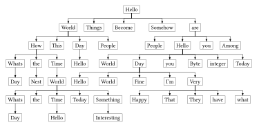

# tdtr

A Typst package for drawing beautiful tidy tree easily

This package uses [fletcher](https://typst.app/universe/package/fletcher) to render and customize nodes and edges

- [tdtr](#tdtr)
  - [Getting Started](#getting-started)
    - [From list](#from-list)
      - [Nodes only](#nodes-only)
      - [Nodes with Edges](#nodes-with-edges)
      - [(extra) Horizontal Compression](#extra-horizontal-compression)
    - [From file](#from-file)
      - [JSON](#json)
      - [YAML](#yaml)
      - [(extra) Forbidden Structure](#extra-forbidden-structure)
  - [Customization](#customization)
    - [Pre-defined graph drawing functions](#pre-defined-graph-drawing-functions)
      - [Binary/B-/Red-Black Tree](#binaryb-red-black-tree)
      - [Content Tree](#content-tree)
    - [(extra) Concept of node/edge drawing functions](#extra-concept-of-nodeedge-drawing-functions)
    - [Pre-defined node/edge drawing functions](#pre-defined-nodeedge-drawing-functions)
      - [Default node/edge drawing functions](#default-nodeedge-drawing-functions)
      - [Metadata Match node/edge drawing functions](#metadata-match-nodeedge-drawing-functions)
      - [Other Pre-defined node/edge drawing functions](#other-pre-defined-nodeedge-drawing-functions)
    - [Custom node/edge drawing functions](#custom-nodeedge-drawing-functions)
    - [Shortcut node/edge drawing functions](#shortcut-nodeedge-drawing-functions)
  - [API Reference](#api-reference)

## Getting Started

Import the package using:

```typ
#import "@preview/tdtr:0.3.0" : *
```

### From list

#### Nodes only

The most common case is to draw a tree directly from a bullet list.

Typical structure of the bullet list is:

```typ
- Parent node
  - Child node 1
    - Grandchild node 1
    - Grandchild node 2
  - Child node 2
```

where there must be only one root node (the top-level bullet list item), and each bullet list item represents a node in the tree, and the indentation level represents the parent-child relationship between nodes.

Here is an example:


```typ
#tidy-tree-graph(compact: true)[
  - $integral_0^infinity e^(-x) dif x = 1$
    - `int main() { return 0; }`
      - Hello
        - This
        - Continue
        - Hello World
      - This
    - _literally_
      - Like
    - *day*
      - tomorrow $1$
]
```

where `compact: true` option will try its best to make the tree more compact by reducing the space between nodes, however, it may cause overlapping nodes in some cases.

#### Nodes with Edges

Another common case is that you may want to specify the labels of some edges, and then you can add a numbered list item before the child bullet list item (the item pointed by the edge) to specify the label of the edge.

Typical structure of the bullet list with edge labels is:

```typ
- Parent node
  + Edge label 1
  - Child node 1
    + Edge label 2
    - Grandchild node 1
//    + Edge label 3
    - Grandchild node 2
  + Edge label 4
  - Child node 2
```

where each numbered list item represents an edge label, and it's optional if you don't want to label the edge.

Here is an example:


```typ
#tidy-tree-graph(
  spacing: (20pt, 20pt),
  node-inset: 4pt
)[
  - $I_0$
    + $E$
    - $I_1$
      + $+$
      - $I_6$
        + $T$
        - $I_9$
          + $F$
          - $I_7$
        + $F$
        - $I_3$
        + $a$
        - $I_4$
        + $b$
        - $I_5$
    + $T$
    - $I_2$
      + $F$
      - $I_7$
        + $*$
        - $I_8$
      + $a$
      - $I_4$
      + $b$
      - $I_5$
    + $F$
    - $I_3$
      + $*$
      - $I_8$
    + $a$
    - $I_4$
    + $b$
    - $I_5$
]
```

where `spacing: (20pt, 20pt)` option specifies the horizontal and vertical spacing between nodes, and `node-inset: 4pt` option specifies the padding inside each node. They are passed to `fletcher.diagram` internally.

#### (extra) Horizontal Compression

During the drawing of the tidy tree, the package compresses nodes horizontally by default to make the tree more compact.

Here is an extreme example:

(you might think it's too crowded, and thus ugly somehow, but it's just to show the capability of this package)



```typ
#tidy-tree-graph(
  draw-edge: tidy-tree-draws.horizontal-vertical-draw-edge,
)[
  - Hello
    - World
      - How
        - Whats
          - Day
        - the
          - Nest
        - Time
            - World
              - Whats
                - Day
              - the
              - Time
                - Hello
              - Today
              - Something
                - Interesting
      - This
      - Day
        - Hello
      - People
    - Things
    - Become
    - Somehow
    - are
      - People
      - Hello
        - World
        - Day
          - Hello
          - World
          - Fine
          - I'm
          - Very
            - Happy
            - That
            - They
            - have
            - what
        - you
        - Byte
        - integer
        - Today
      - you
      - Among
]
```

where `draw-edge: tidy-tree-draws.horizontal-vertical-draw-edge` option specifies a pre-defined edge drawing function to draw edges in a horizontal-vertical manner.

### From file

You can also draw import a tree from a file, supporting JSON and YAML formats, where every key and every value in the file represents a node in the tree.

Edge labels are not supported when importing from a file.

#### JSON

Here is an example of importing a tree from a JSON file:

`test.json`:

```json
{
    "Hello": {
        "World": {
            "How": {
                "Whats": [
                    "Day",
                    "the",
                    1
                ],
                "the": {},
                "Time": {
                    "Hello": [
                        1, 2, 3, 4, 5
                    ]
                }
            }
        },
        "This": {
            "Hello": {}
        },
        "Day": {},
        "People": {}
    }
}
```


```typ
#tidy-tree-graph(json("test.json"))
```

#### YAML

Here is an example of importing a tree from a YAML file:

`test.yaml`:

```yaml
app:
  server:
    host: localhost
    port: 8080
  database:
    user: 
      admin: admin
    password: 
      secret: kdi90gs78a7fgasad123gf70aa7ds0
```


```typ
#tidy-tree-graph(yaml("test.yaml"))
```

#### (extra) Forbidden Structure

- The json and yaml files should not contain any structure that an dictionary is included in an array, e.g.

    ```jsonc
    {
        "A": [
            {"B": "C"}  // this structure is not supported
        ],
        "B": [
            "D"  // this structure is supported
        ]
    }
    ```

    ```yaml
    A:
      - B: C  # this structure is not supported
    B:
      - D  # this structure is supported
    ```

## Customization

You might think the default drawing style is not suitable for your case, and you can customize it by either using pre-defined graph drawing functions or passing pre-defined/custom node/edge drawing functions when creating the tidy tree.

### Pre-defined graph drawing functions

This package provides several pre-defined graph drawing functions as variants of `tidy-tree-graph`.

They are all defined in `src/presets.typ`.

#### Binary/B-/Red-Black Tree

This package provides some graph drawing functions for common tree types as the variants of `tidy-tree-graph`:

- `binary-tree-graph`: suitable for the trees whose nodes and edges have simple and short content, e.g., a binary tree
- `red-black-tree-graph`: specialized for red-black trees, with color-coded nodes and hidden nil edges
- `b-tree-graph`: suitable for the trees whose node are relatively not short, e.g., B-trees

Here is an example of drawing a red-black tree:


```typ
#let red = metadata("red")
#let nil = metadata("nil")
#red-black-tree-graph[
  - M
    - E
      - N #red
      - P #red
    - Q #red
      - O
        - N #red
        - #nil
      - Y
        - X #red
        - Z #red
]
```

where nodes labeled with `#red` metadata are drawn in red color, and nodes labeled with `#nil` metadata are hidden.

#### Content Tree

Sometimes, for the need of debugging, you may want to visualize the content tree of a Typst document. Then you can use `content-tree-graph` function to draw the content tree of the given content.

Here is an example:


```typ
#content-tree-graph[
  = Heading 1

  `int main() {}` <code>
  
  $
    integral_0^infinity e^(-x) dif x
  $
]
```

### (extra) Concept of node/edge drawing functions

Before introducing node/edge drawing functions, let's first understand the concept of node/edge drawing functions.

- First, all node/edge drawing functions are ended with `-draw-node` and `-draw-edge` respectively.

- Second, all `draw-node` and `draw-edge` functions have the following signature:

  ```typ
  (
    // ...
  ) -> arguments | dictionary | array
  ```

  namely, their return type must be either `arguments`, `dictionary` or `array`.

- Third, when drawing a tidy tree, for each node and edge in the tree, the package will call the provided `draw-node` and `draw-edge` functions respectively to get the **arguments** for drawing these nodes and edges using `fletcher.node` and `fletcher.edge`, i.e.,

  ```typ
  #{
    let node = fletcher.node(..draw-node(node-info))
    let edge = fletcher.edge(..draw-edge(from-node-info, to-node-info, edge-label))
  }
  ```

- Fourth, in `tidy-tree-graph` and its variants, you can specify the node and edge drawing functions using `draw-node` and `draw-edge` parameters respectively, for example:

  ```typ
  #tidy-tree-graph(
    draw-node: custom-draw-node,
    draw-edge: custom-draw-edge,
  )[
    // tree body
  ]
  ```

- Finally, if you have multiple drawing functions to apply to nodes/edges, you can pass an array of drawing functions instead of a single one to `draw-node` and `draw-edge`, then the package will call these drawing functions in order, and merge the returned arguments to get the final arguments for drawing the node/edge. In this way, you can combine multiple drawing functions together to achieve more complex drawing effects, i.e.

  ```typ
  #tidy-tree-graph(
    draw-node: (
      custom-1-draw-node,
      custom-2-draw-node,
      // ...
    ),
    draw-edge: (
      custom-1-draw-edge,
      custom-2-draw-edge,
      // ...
    )
  )[
    // tree body
  ]
  ```

  If `custom-2-draw-node` returns an argument that conflicts with the argument returned by `custom-1-draw-node`, the argument returned by `custom-2-draw-node` will override the previous one.

### Pre-defined node/edge drawing functions

This package provides several pre-defined drawing functions for nodes and edges.

They are defined in `src/draws.typ` as functions of module `tidy-tree-draws`.

#### Default node/edge drawing functions

Default node and edge drawing functions are defined as follows:

```typ
/// default function for drawing a node
#let default-draw-node = ((name, label, pos)) => {
  (
    pos: (pos.x, pos.i), 
    label: [#label], 
    name: name, 
    shape: rect
  )
}

/// default function for drawing an edge
#let default-draw-edge = (from-node, to-node, edge-label) => {
  (
    vertices: (from-node.name, to-node.name), 
    marks: "-|>"
  )
  if edge-label != none {
    (
      label: box(fill: white, inset: 2pt)[#edge-label], 
      label-sep: 0pt, 
      label-anchor: "center"
    )
  }
}
```

where `default-draw-node` draws every node as a rectangle, and `default-draw-edge` draws every edge with an arrowhead, and if the edge has a label, it will be drawn inside a white box to avoid overlapping with the edge.

#### Metadata Match node/edge drawing functions

As you have seen in [Red Black Tree](#binaryb-red-black-tree) example, this package provides some drawing functions that can conveniently label some nodes/edges and customize these labeled nodes/edges using `#metadata`.

To make understanding easier, we continue to use the red-black tree example.

Here is the source code of the pre-defined red-black tree graph drawing function (leaving out not related parts):

```typ
#let red = metadata("red")
#let nil = metadata("nil")
#let red-black-tree-graph = tidy-tree-graph.with(
  // ...
  draw-node: (
    // ...
    tidy-tree-draws.metadata-match-draw-node.with(
      matches: (
        red: (fill: color.rgb("#bb3e03")),
        nil: (post: x => none)
      ),
      default: (fill: color.rgb("#001219"))
    ),
    // ...
  ),
  draw-edge: (
    // ...
    tidy-tree-draws.metadata-match-draw-edge.with(
      to-matches: (
        nil: (post: x => none),
      )
    ),
    // ...
  )
)
```

where `metadata-match-draw-node` and `metadata-match-draw-edge` are pre-defined metadata match node/edge drawing functions talked about before.

For `metadata-match-draw-node`, it has the following signature:

```typ
(
  // ...
  matches: dictionary, 
  default: dictionary
) -> arguments | dictionary | array
```

where `matches` tells the appended arguments to `fletcher.node` for nodes with specific metadata, and `default` tells the appended arguments to `fletcher.node` for nodes without any matched metadata.

For example,

- `- N #red` node is labeled with `#metadata("red")`, so `metadata-match-draw-node` will append `(fill: color.rgb("#bb3e03"))` to the arguments of `fletcher.node` when drawing this node, making it drawn in red color.

- `- #nil` node is labeled with `#metadata("nil")`, so `metadata-match-draw-node` will append `(post: x => none)` to the arguments of `fletcher.node` when drawing this node, making it hidden.

- `- E` node is not labeled with any metadata, so `metadata-match-draw-node` will append `(fill: color.rgb("#001219"))` to the arguments of `fletcher.node` when drawing this node, making it drawn in black color.

Similarly, for `metadata-match-draw-edge`, it has the following signature:

```typ
(
  // ...
  from-matches: dictionary, 
  to-matches: dictionary, 
  matches: dictionary,
  default: dictionary
) -> arguments | dictionary | array
```

where `from-matches` tells the appended arguments to `fletcher.edge` for edges whose starting node has specific metadata, `to-matches` tells the appended arguments to `fletcher.edge` for edges whose ending node has specific metadata, `matches` tells the appended arguments to `fletcher.edge` for edges themselves with specific metadata, and `default` tells the appended arguments to `fletcher.edge` for edges themselves, the starting and ending nodes all without any matched metadata.

#### Other Pre-defined node/edge drawing functions

other node and edge drawing functions include but not limited to:

- `circle-draw-node`: draw every node as a circle
- `reversed-draw-edge`: draw every edge in reversed direction
- `horizontal-vertical-draw-edge`: draw every edge in a horizontal-vertical manner

### Custom node/edge drawing functions

You can also define your own node/edge drawing functions from scratch.

For `draw-node`, the function should have the following signature:

```typ
(
  // positional arguments
  node: (
    name: label, 
    label: any, 
    pos: (
      i: int, 
      j: int, 
      k: int, 
      x: int | float
    ),
  )
  // other optional named arguments
) -> arguments | dictionary | array
```

where

- `name`: the unique label of the node, used for drawing edge, should not be changed, and should be used only by `fletcher.node(..., name: name, ...)`
- `label`: the content of the node, if the tree is from list, it's `content` type; if the tree is from file, it's `str` type, default used by `fletcher.node(..., label: [#label], ...)`
- `pos`: a tuple representing the position of the node in the tree, where `i` is the depth of the node, `j` is the index of the parent node in `i - 1` level, `k` is the index of the node among its siblings, and `x` is the x-coordinate of the node after horizontal compression, used for positioning the node, default used by `fletcher.node(..., pos: (x, i), ...)`. Specially, the `(i, j, k)` of the root node is `(0, 0, 0)`.

For `draw-edge`, the function should have the following signature:

```typ
(
  // positional arguments
  from-node: (
    name: label, 
    label: any, 
    pos: (
      i: int, 
      j: int, 
      k: int, 
      x: int | float
    )
  ), 
  to-node: (
    name: label, 
    label: any, 
    pos: (
      i: int, 
      j: int, 
      k: int, 
      x: int | float
    )
  ), 
  edge-label: any,
  // other optional named arguments
) -> arguments | dictionary | array
```

where

- `from-node`: a tuple representing the starting node of the edge, with the same structure as the parameters of `draw-node`
- `to-node`: a tuple representing the ending node of the edge, with the same structure as the parameters of `draw-node`
- `edge-label`: the label of the edge, if the edge has no label, it's `none`.

### Shortcut node/edge drawing functions

For convenience, if your node/edge drawing functions do not use any arguments provided, you can abbreviate your custom node/edge drawing functions to only the return value, e.g.,

```typ
#tidy-tree-graph(
  // ...
  draw-node: (
    tidy-tree-draws.default-draw-node,
    ((label, )) => (label: text(blue)[#label]),
    tidy-tree-draws.metadata-match-draw-node.with(
      matches: (
        root: (..) => (shape: circle, fill: color.red)
      )
    )
  ),
  draw-edge: (
    tidy-tree-draws.default-draw-edge,
    (..) => (marks: "-o", stroke: color.red),
    tidy-tree-draws.metadata-match-draw-edge.with(
      to-matches: (
        leaf: (..) => (marks: "->", stroke: color.green)
      )
    ),
  )
)
```

abbreviates to

```typ
#tidy-tree-graph(
  // ...
  draw-node: (
    tidy-tree-draws.default-draw-node,
    ((label, )) => (label: text(blue)[#label]),
    tidy-tree-draws.metadata-match-draw-node.with(
      matches: (
        root: (shape: circle, fill: color.red)
      )
    )
  ),
  draw-edge: (
    tidy-tree-draws.default-draw-edge,
    (marks: "-o", stroke: color.red),
    tidy-tree-draws.metadata-match-draw-edge.with(
      to-matches: (
        leaf: (marks: "->", stroke: color.green)
      )
    ),
  )
)
```

## API Reference

The main function provided by this package is `tidy-tree-graph`, which has the following signature:

```typ
(
  // main body of the diagram
  body,

  // for customization of drawing functions
  draw-node: ..., // see above
  draw-edge: ..., // see above
  // if you would like to add some other nodes/edges to the final diagram,
  // you can pass a custom graph drawing function here
  draw-graph: tidy-tree-draws.default-draw-graph,

  // make the tree more compact by reducing gaps between nodes
  // might cause overlapping nodes in some cases
  compact: false,

  // the minimum relative gap while calculating the horizontal axis of nodes
  // do NOT use it unless you know what you are doing
  min-gap: 1,

  // set text(size: text-size)
  text-size: 8pt,

  // specify fixed width/height for all nodes
  // they are NOT the arguments of `fletcher.diagram`,
  // but passed to `fletcher.node` when drawing each node
  node-width: auto,
  node-height: auto,

  // passed to `fletcher.diagram`
  node-stroke: 0.25pt,
  node-inset: 3pt,
  spacing: (6pt, 15pt),
  edge-corner-radius: none,
  ..args,
) -> fletcher.diagram
```
