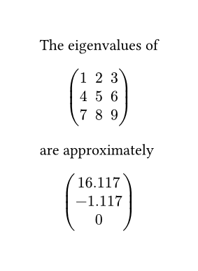

# teig

This package provides an `eigenvalue` function that calculates the eigenvalues of a matrix.

```typst
#import "@preview/teig:0.1.0": eigenvalues

#let data = (
  (1, 2, 3),
  (4, 5, 6),
  (7, 8, 9),
)

#let evals = eigenvalues(data)

The eigenvalues of
$
  #math.mat(..data)
$
are approximately

$
  #math.vec(..evals.map(x => str(calc.round(x, digits: 3))))
$
```

