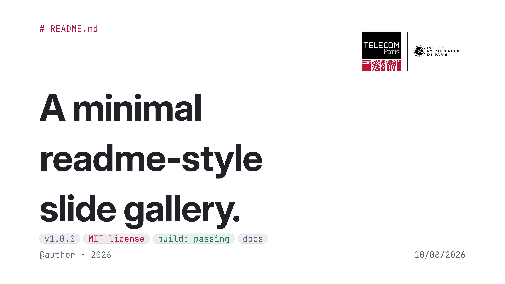

# telepresentation

A [Télécom Paris](https://en.wikipedia.org/wiki/T%C3%A9l%C3%A9com_Paris) themed [Touying](https://github.com/touying-typ/touying) presentation template for Typst.

Based on [gh-minimal-slides](https://github.com/xingjian-zhang/gh-minimal-slides) by Jimmy Zhang.


<sub>Cover page. In-depth example available [here](example.pdf) ([source](example.typ)).</sub>

## Features

- Télécom Paris color scheme, automatically passed to [Lilaq](https://github.com/lilaq-project/lilaq) plots
- Boxes for different purposes (theorems, results, remarks, warnings)
- Bibliography slide
- Adjusted title padding

## Usage

```typst
#import "@preview/touying:0.7.3": *
#import "@preview/telepresentation:0.1.0" as tp

#show: tp.register.with(
  theme:   "light",
  accent:  "telecom",
  density: "comfy",
)
```

## License

Disclaimer : This package is an unofficial and independent project. It is neither endorsed, affiliated nor maintained by Télécom Paris. The logo's copyritht is theirs only. Everything here is licensed under a [MIT LICENSE](LICENSE) but their logo. 
