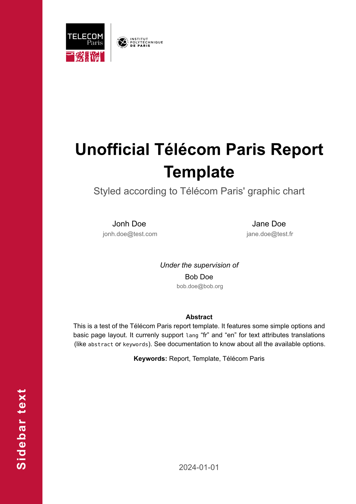

# TéléReport (Télécom Paris Report) Template
> version 0.1.0

This is a template for a basic report. Styled according to the Télécom Paris
school's graphic chart, this template aims to provide a quick and easy method
for anyone willing to write a report on anything regarding the school. As a
student, I made this template evolve over time, and wanted to publish it for
others to use.

*Disclaimer*: While this template features the official logotypes of *Télécom
Paris* and *IP Paris*, it is completely **UNOFFICIAL**, and **not endorsed,
sponsored, or affiliated** with the administration of *Télécom Paris* or *the
Institut Polytechnique de Paris*. The logos' copyright is theirs, see
[here](https://www.telecom-paris.fr/fr/ecole/bref/logos).



## Features

- **Visual Identity**: Implements the Télécom Paris graphic chart with specific
  colors, typography and logo placement.
- **Configurable Layout**: Includes support for title, subtitle, authors,
  supervisors, keywords, abstract and date.
- **Localization**: Built-in support for both English and French languages.
- **Document Elements**: Features a dedicated cover page with a sidebar, custom
  headers, footers, and headings.

## Usage

Below is an example of how one can import and use this template in their
project:

```typst
#import "@preview/telereport:0.1.0": *

#show: telereport.with(
  title: "Your Project Title",
  subtitle: "Optional Subtitle",
  authors: (
    (name: "First Last", mail: "email@example.fr"),
  ),
  supervisors: (
    (name: "Supervisor Name", mail: "supervisor@example.fr"),
  ),
  keywords: ("Report", "Template"),
  abstract: [Your abstract content here.],
  date: "June 25, 2026",
  sidebar-text: "Sidebar Context",
  show-mail: true,
  lang: "en",
)

= Your First Section
Content goes here...
```

For a short, yet complete, documentation, see [the manual](docs/manual.pdf).

## Contributing

Feedback and contributions are welcome. Please open an issue or submit a pull
request on the repository if you have suggestions for improvement of find any
bugs.

