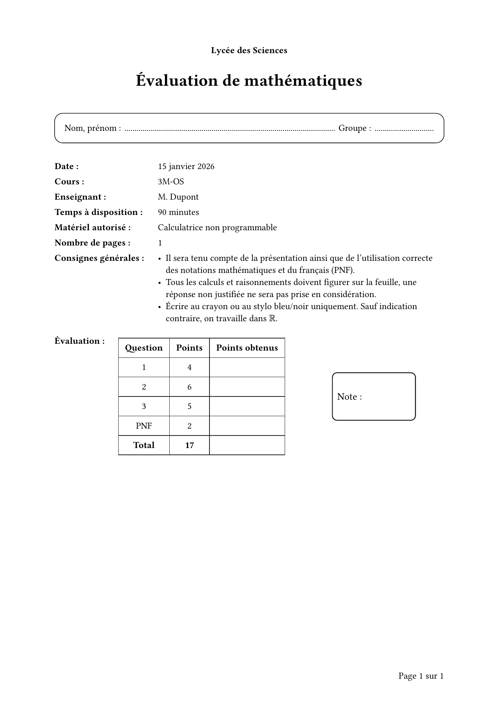
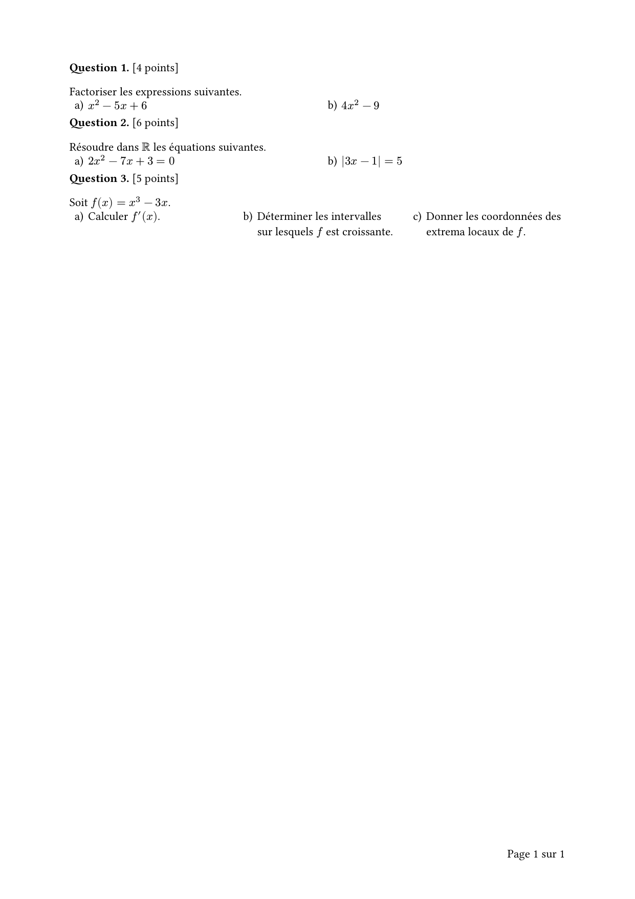
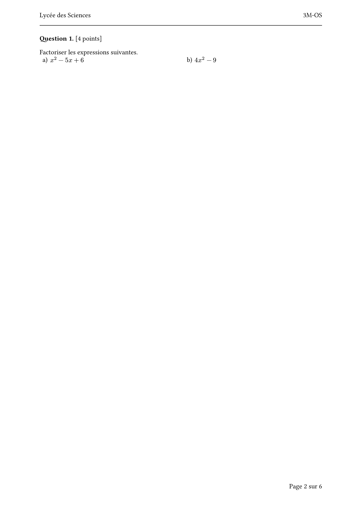
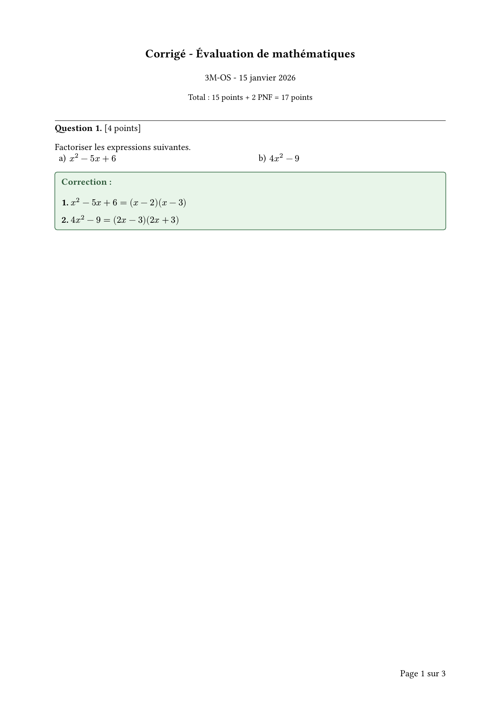

# texam

A standalone Typst exam page-layout template. Provides a cover page with an evaluation table, header/footer, student name box, draft (brouillon) page, and end page — all through a single `#show: texam.with(...)` template call. No exercise-bank dependency required.

## Gallery

Click on an image to see the source code.

| | | | | |
|:---:|:---:|:---:|:---:|:---:|
| [](https://github.com/nathan-ed/typst-package-texam/blob/ea9fa48263db55526d8a85733d1cbcff41c2482e/gallery/cover.typ) | [](https://github.com/nathan-ed/typst-package-texam/blob/ea9fa48263db55526d8a85733d1cbcff41c2482e/gallery/questions.typ) | [](https://github.com/nathan-ed/typst-package-texam/blob/ea9fa48263db55526d8a85733d1cbcff41c2482e/gallery/full-exam.typ) | [](https://github.com/nathan-ed/typst-package-texam/blob/ea9fa48263db55526d8a85733d1cbcff41c2482e/gallery/correction.typ) | [](https://github.com/nathan-ed/typst-package-texam/blob/ea9fa48263db55526d8a85733d1cbcff41c2482e/gallery/exercise-bank.typ) |
| Cover Page | Questions | Full Exam | Correction | Exercise Bank |

## Features

- **Cover page** — Title, student name/group box, info table (date, teacher, duration, materials, page count, instructions), evaluation table, grade box
- **Auto-collection** — Evaluation table built automatically from `#exam-question` calls; no need to list points twice
- **Header/footer** — School name and course code in header, automatic page numbering in footer; header hidden on first page by default
- **Evaluation table** — Dynamic point totals with configurable extra rows (PNF, Présentation, etc.)
- **Question formatting** — Consistent display with bold label and automatic point pluralisation
- **Correction box** — Green-highlighted answer box (matches exercise-bank style), shown only when `show-corrections: true`
- **Draft page** — Dedicated brouillon page with name box and instruction box, auto-positioned to odd page
- **State-based configuration** — Set defaults once via `exam-setup()`, override per-component if needed
- **Full localisation** — All labels (end marker, brouillon, header fields, table headers…) are overridable

## Quick Start

```typst
#import "@preview/texam:0.1.0": texam, exam-question

#show: texam.with(
  school: "Lycée des Sciences",
  course-code: "3M-OS",
  title: "Évaluation de mathématiques",
  date: "15 janvier 2026",
  teacher: "M. Dupont",
  duration: "90 minutes",
  allowed-materials: "Calculatrice non programmable",
)

#exam-question(1, 4, [
  Factoriser $x^2 - 5x + 6$.
])

#pagebreak()

#exam-question(2, 6, [
  Résoudre $2x^2 - 7x + 3 = 0$ dans $RR$.
])
```

This produces a complete exam document: cover page → exam questions → draft page → end page. The evaluation table on the cover is built **automatically** from the `#exam-question` calls — no need to list points twice.

## `texam()` Parameters

| Parameter | Type | Default | Description |
|-----------|------|---------|-------------|
| `school` | string | `""` | School or institution name (shown in header and cover) |
| `course-code` | string | `""` | Course code shown in header and cover info table |
| `title` | string | `"Épreuve de mathématiques"` | Exam title |
| `date` | string/none | `none` | Exam date |
| `teacher` | string/none | `none` | Teacher name |
| `teacher-initials` | string/none | `none` | Teacher initials |
| `duration` | string | `"75 minutes"` | Duration string |
| `allowed-materials` | string | `"Aucun"` | Allowed materials |
| `instructions` | content/none | `none` | Custom instructions (overrides the default French instructions) |
| `extras` | array | `((label: "PNF", points: 2),)` | Extra rows after questions in the evaluation table. Pass `()` to remove, or use multiple entries for e.g. Présentation + Conventions. |
| `questions` | array/auto | `auto` | Auto-collected from `#exam-question` calls. Override with explicit array only if not using `#exam-question`. |
| `show-corrections` | bool | `false` | Show `#exam-correction-box` content (set `true` to produce the correction version) |
| `brouillon` | bool | `true` | Append a draft/scratch page |
| `brouillon-code` | string/auto | `auto` | Code printed on the draft page (auto generates a daily code) |
| `show-header-on-first-page` | bool | `false` | Show the header on the cover page |
| `margin` | dict | `(top: 2.1cm, bottom: 2.3cm, left: 2.3cm, right: 2.3cm)` | Page margins |

## Individual Components

For finer control, the template functions can be used independently.

### `exam-setup(...)`

Update exam state at any point. Accepts all the same fields as `texam()`, plus label overrides for full localisation:

```typst
#import "@preview/texam:0.1.0": *

#exam-setup(
  school-name: "Lycée des Sciences",
  course-code: "3M-OS",
  title: "Évaluation de mathématiques",
  date: "15 janvier 2026",
  teacher: "M. Dupont",
  duration: "90 minutes",
  allowed-materials: "Calculatrice non programmable",
  extras: ((label: "PNF", points: 2),),
  // Label overrides for localisation:
  brouillon-label: "DRAFT",
  end-label: "End of exam",
  name-label: "Name:",
  group-label: "Group:",
)
```

### Cover Page

```typst
#exam-cover-page()
```

The cover page includes the exam title, a student name/group box, an exam info grid (date, teacher, duration, materials, page count, instructions), an evaluation table, and a grade box.

### Evaluation Table

```typst
#exam-evaluation-table()
```

### Header and Footer

```typst
#set page(
  header: exam-header(),
  footer: exam-footer(),
)
```

The header shows the school name and course code; the footer shows the current page out of total. The header is hidden on the first page by default.

### Individual Question

```typst
#exam-question(1, 4, [
  Factoriser $x^2 - 5x + 6$.
])
```

Arguments: question number (int), point value (int), content. Automatically pluralises "point/points".

### Draft Page

```typst
#exam-brouillon-page(code: auto)
```

Inserts a draft/scratch page with a name box and an instruction box, auto-positioned to an odd page. Pass `code: "MY-CODE"` to fix the code, or `code: none` to omit it.

### End Page

```typst
#exam-end-page()
```

Adds the end-of-exam marker at the bottom of the current page.

### Correction Cover

```typst
#exam-correction-cover()
```

A compact header for correction documents showing the title, course, date, and total points (questions + extras). Reads questions automatically from `#exam-question` calls.

### Correction Box

```typst
#exam-correction-box[
  $(x - 2)(x - 3)$
]
```

A green-highlighted answer block placed after an `#exam-question`. Only rendered when `show-corrections: true` — so the same source file produces both the student version and the correction by changing one flag. Style matches exercise-bank's `exam-solution-box`.

To produce a correction document:

```typst
#show: texam.with(
  school: "Lycée des Sciences",
  course-code: "3M-OS",
  title: "Évaluation de mathématiques",
  show-corrections: true,
  brouillon: false,
)

#exam-correction-cover()

#exam-question(1, 4, [Factoriser $x^2 - 5x + 6$])
#exam-correction-box[$= (x - 2)(x - 3)$]
```

## Integration with exercise-bank

texam pairs well with the [exercise-bank](https://typst.app/universe/package/exercise-bank) package. Define exercises once in a shared registry, then reference them by ID in your exam. The cover evaluation table is built automatically — no need to list points twice.

```typst
#import "@preview/texam:0.1.0": texam, exam-question, exam-correction-box
#import "@preview/exercise-bank:0.5.0": exo-define, exo-registry
#import "@preview/taskize:0.2.5": tasks

// Define exercises in a shared registry
#exo-define(
  id: "fact-1",
  points: 4,
  exercise: [
    Factoriser les expressions suivantes.
    #tasks[
      + $x^2 - 5x + 6$
      + $4x^2 - 9$
    ]
  ],
  correction: [
    *a)* $x^2 - 5x + 6 = (x - 2)(x - 3)$

    *b)* $4x^2 - 9 = (2x - 3)(2x + 3)$
  ],
)

// Helper to pull exercise body or correction from the registry
#let exo-body(id) = context {
  let found = exo-registry.get().find(e => e.id == id)
  if found != none { found.exercise } else { [] }
}

#let exo-corr(id) = context {
  let found = exo-registry.get().find(e => e.id == id)
  if found != none { found.at("correction", default: []) } else { [] }
}

// Assemble the exam — corrections hidden by default, set show-corrections: true to reveal
#show: texam.with(
  school: "Lycée des Sciences",
  course-code: "3M-OS",
  title: "Évaluation de mathématiques",
  show-corrections: false,
)

#exam-question(1, 4, exo-body("fact-1"))
#exam-correction-box(exo-corr("fact-1"))
```

See the [exercise-bank gallery example](https://github.com/nathan-ed/typst-package-texam/blob/ea9fa48263db55526d8a85733d1cbcff41c2482e/gallery/exercise-bank.typ) for a complete working file with three exercises.

## License

MIT License — see LICENSE file for details.

## Changelog

### [0.1.0] — 2026-05-26

- Initial release
- Standalone exam template with no external dependencies
- Cover page with evaluation table auto-built from `#exam-question` calls — no need to list points twice
- Correction box (`#exam-correction-box`) shown only when `show-corrections: true` — same source file produces student and correction versions
- Correction cover page (`#exam-correction-cover`) with auto-computed point total
- Configurable extra evaluation rows (`extras` parameter) replacing hardcoded PNF — supports any label/points combination
- Header/footer with school name, course code, and automatic page numbering
- Draft (brouillon) page auto-positioned to odd page with daily code
- Full label localisation via `exam-setup()`
- Template entrypoint for `typst init @preview/texam`
