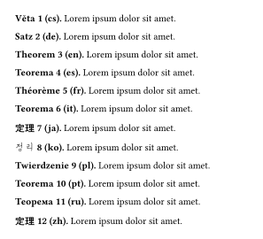

# theofig

An implementation of theorem environments for
[Typst](https://github.com/typst/typst).

Import as
```typ
#import "@preview/theofig:0.1.0": *
```

## Documentation

For detailed guide and documentation see 
[manual](https://github.com/Danila-Bain/typst-theorems/blob/v0.1.0/docs/manual.pdf).

## Features

- Many default theorem environments:
    - `definition`,
    - `theorem`,
    - `lemma`,
    - `statement`,
    - `proof`,
    - `corollary`,
    - `remark`,
    - `example`,
    - `algorithm`,
    - `problem`,
    - `solution`.
    
    All of them are defined as `theofig.with(...)`. Custom environments can also be defined
    in terms of generic `theofig` with appropriate `kind`, `suppliment` and `numberation`.
    
- Environments can share counters by having the same `kind` but different `suppliment`.
- Environments can be `<label>`'d and `@reference`'d
- Environments can be customized with show rules as `figure`s with
  corresponding kinds (with some limitations on nested figures).
- Environments can be customized using arguments in the corresponding functions.
- Default environments are translated depending on `lang.text` to many languages.

## Examples

### Basic usage

```typ
#import "@preview/theofig:0.1.0": *
#set page(paper: "a6", height: auto, margin: 6mm)

#definition[#lorem(5)]<def-1>

#theorem[Lorem, 2025][
  #lorem(12)
]<th-1>

#theorem[
  #lorem(14)
]<th-2>

#proof[
  @th-2 follows immediately from @def-1 and @th-1, which is obvious.
]
```


### Custom environments
```typ
#import "@preview/theofig:0.1.0": theofig, problem, solution
#set page(paper: "a6", height: auto, margin: 6mm)

#let hard-problem = theofig.with(
  supplement: "Problem", 
  numbering: n => $#n^*$
)

#let hint = theofig.with(
  supplement: "Hint", 
  numbering: none, 
  format-caption: none,
  separator: ":"
)

= Default

#problem[ What $1 + 1$ equals to in $ZZ_2$? ]

#solution[
  Observe that $1 + 1$ is $2$, and $2 mod 2$ is $0$. 
  Hense, the answer is $0$.
]

= Custom

#hard-problem[ Prove that $ZZ_2$ is a field. ]

#hint[ Verify all axioms of a field exaustively. ]
```


### Language support

```typ
#import "@preview/theofig:0.1.0": *
#set page(paper: "a6", height: auto, margin: 6mm)

#for lang in theofig-translations.keys() [
  #set text(lang: lang)
  #theorem[#lang][#lorem(5)]
]
```



### Per-section numbering 

```typ
#import "@preview/theofig:0.1.0": *
#set page(paper: "a6", height: auto, margin: 6mm)

#let thm-numbering(n) = numbering("1.1", counter(heading).get().first(), n)
#let eq-numbering(n) = numbering("(1.1)", counter(heading).get().first(), n)

#show figure-where-kind-in(theofig-kinds): set figure(numbering: thm-numbering)
#set math.equation(numbering: eq-numbering)

#set heading(numbering: "1.")
#show heading: it => {
  theofig-reset-counters(theofig-kinds)
  counter(math.equation).update(0)
  it
}

= Addition

#theorem[$ 1 + 1 = 2. $<eq-add-1>]<th-add-1>
#theorem[$ 2 + 2 = 4. $<eq-add-2>]<th-add-2>
#theorem[$ 4 + 4 = 8. $<eq-add-3>]<th-add-3>

= Multiplication

#theorem[$ 1 times 1 =  1. $<eq-mul-1>]<th-mul-1>
#theorem[$ 2 times 2 =  4. $<eq-mul-2>]<th-mul-2>
#theorem[$ 4 times 4 = 16. $<eq-mul-3>]<th-mul-3>

= References
Note that @th-add-2 about @eq-add-2 and
@th-mul-2 about @eq-mul-2 are similar.
```


### Styling

```typ
#import "@preview/theofig:0.1.0": *
#set page(paper: "a6", height: auto, margin: 6mm)

// show rule for all (optionally except some)
#show figure-where-kind-in(
  theofig-kinds, except: ("proposition",)
): it => {
  show figure.caption: strong.with(delta: -300)
  show: emph 
  show figure.caption: emph // double emph = no emph
  it
}

// show rule for one
#show figure.where(kind: "remark"): set text(blue)

// styling arguments for one
#let proposition = proposition.with(
  format-caption: (underline, text.with(tracking: 3pt)),
  format-body: smallcaps,
)

#definition[#lorem(15)]
#theorem[#lorem(15)]
#remark[#lorem(15)]

#proposition[#lorem(15)]
```


## Why another one?

There is a number of packages for theorem environments, including [all
theese](https://typst.app/universe/search/?q=theorem). Many of them are
similar to this project, but differ in small details of how style 
customization is handled. Our package offers predefined commands
such as `#definition`, `#theorem`, `#proof`, ..., together with
style customization which can be applied to all or some environments.
This project aims to offer a one-import solution to theorem environments 
with sencible defaults, providing with an intuitive (i.e. following
standard typst coding practices) capabilities for customization when it is
needed.

