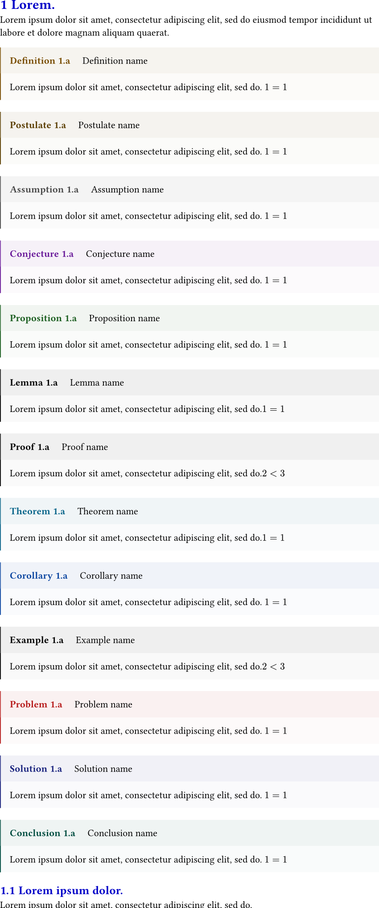
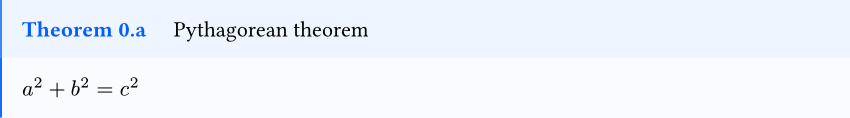

# theoframe

A lightweight and easy-to-use [Typst](https://typst.app/) package that provides beautifully styled theorem-like environments for academic writing. It offers `Definition`, `Postulate`, `Assumption`, `Conjecture`, `Proposition`, `Lemma`, `Proof`, `Theorem`, `Corollary`, `Example`, `Problem`, `Solution`, and `Conclusion` blocks with automatic numbering, customizable colors, and multi-language support.


## Basic Usage

To use, simply import the package:

```typst
#import "@preview/theoframe:0.1.0": *
```

# Example

```typst
#import "@preview/theoframe:0.1.0": *

#set page(width: 150mm, height:auto, margin: 0em)
#set heading(numbering: "1.1")
#show heading: set text(fill: rgb(0, 0, 200))

= #lorem(1)
#lorem(20)
#definition(name: [Definition name])[#lorem(10) $1 = 1$]
#postulate(name: [Postulate name])[#lorem(10) $1 = 1$]
#assumption(name: [Assumption name])[#lorem(10) $1 = 1$]
#conjecture(name: [Conjecture name])[#lorem(10) $1 = 1$]
#proposition(name: [Proposition name])[#lorem(10) $1 = 1$]
#lemma(name: [Lemma name])[#lorem(10)$1 = 1$]
#proof(name: [Proof name])[#lorem(10)$2 < 3$]
#theorem(name: [Theorem name])[#lorem(10)$1 = 1$]
#corollary(name: [Corollary name])[#lorem(10) $1 = 1$]
#example(name: [Example name])[#lorem(10)$2 < 3$]
#problem(name: [Problem name])[#lorem(10) $1 = 1$]
#solution(name: [Solution name])[#lorem(10) $1 = 1$]
#conclusion(name: [Conclusion name])[#lorem(10) $1 = 1$]
== #lorem(3)
#lorem(10)

```



# Customization

Each environment accepts a `color` parameter to customize its appearance:

```typst
#theorem(name: [Pythagorean theorem], color: rgb("#005eff"))[
  $a^2 + b^2 = c^2$
]
```


The `color` affects both the left border stroke and the header background tint. The content area uses a lighter transparent variant of the same color.


# Changelog

## Version: 0.1.0

- Initial release with thirteen theorem-like environments: `Definition`, `Postulate`, `Assumption`, `Conjecture`, `Proposition`, `Lemma`, `Proof`, `Theorem`, `Corollary`, `Example`, `Problem`, `Solution`, and `Conclusion`.
- Auto-numbering counters tied to level-1 headings for organized referencing.
- Customizable frame colors per environment.
- Multi-language support: English, French, Korean, Japanese, and Chinese.