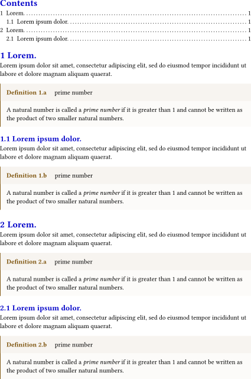
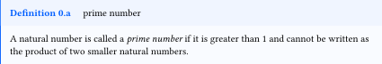

# theoframe

A lightweight and easy-to-use [Typst](https://typst.app/) package that provides beautifully styled theorem-like environments for academic writing. It offers `Definition`, `Postulate`, `Assumption`, `Conjecture`, `Proposition`, `Lemma`, `Proof`, `Theorem`, `Corollary`, `Example`, `Problem`, `Solution`, and `Conclusion` blocks with automatic numbering, customizable colors, and multi-language support.


## Basic Usage

To use, simply import the package:

```typst
#import "@preview/theoframe:0.2.0": *
```

# Example

```typst
#import "@preview/theoframe:0.2.0":*
#show: reset

#set page(width: 150mm, height: auto, margin: 0cm)
#set heading(numbering: "1.1")
#show heading: set text(fill: rgb(0, 0, 200))

#outline()

= #lorem(1)
#lorem(20)
#definition("prime number")[A natural number is called a _prime number_ if it is greater than 1 and cannot be written as the product of two smaller natural numbers.]

== #lorem(3)
#lorem(20)
#definition("prime number")[A natural number is called a _prime number_ if it is greater than 1 and cannot be written as the product of two smaller natural numbers.]


= #lorem(1)
#lorem(20)
#definition("prime number")[A natural number is called a _prime number_ if it is greater than 1 and cannot be written as the product of two smaller natural numbers.]

== #lorem(3)
#lorem(20)
#definition("prime number")[A natural number is called a _prime number_ if it is greater than 1 and cannot be written as the product of two smaller natural numbers.]

```
<p align="center">
  
</p>


# Customization

Each environment accepts a `color` parameter to customize its appearance:

```typst
#definition("prime number",color: rgb("#005eff"))[A natural number is called a _prime number_ if it is greater than 1 and cannot be written as the product of two smaller natural numbers.]
```
<p align="center">
  
</p>

The `color` affects both the left border stroke and the header background tint. The content area uses a lighter transparent variant of the same color.


# Changelog

## Version: 0.1.0

- Initial release with thirteen theorem-like environments: `Definition`, `Postulate`, `Assumption`, `Conjecture`, `Proposition`, `Lemma`, `Proof`, `Theorem`, `Corollary`, `Example`, `Problem`, `Solution`, and `Conclusion`.
- Auto-numbering counters tied to level-1 headings for organized referencing.
- Customizable frame colors per environment.
- Multi-language support: English, French, Korean, Japanese, and Chinese.

## Version: 0.2.0

- Fix: Counter not resetting when encountering a level-1 heading (= heading).
- Root Cause Analysis: In Typst, #import only brings in variable bindings (functions and variables defined with #let) from a module. Meanwhile, #show rules are document-level directives, meaning their scope is strictly confined to the module where they are defined.