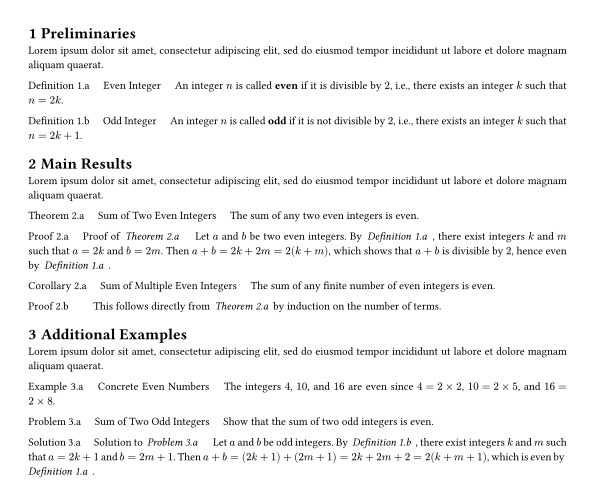
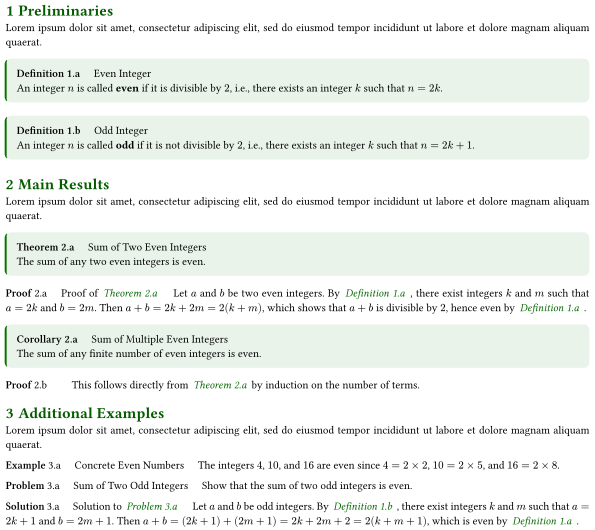
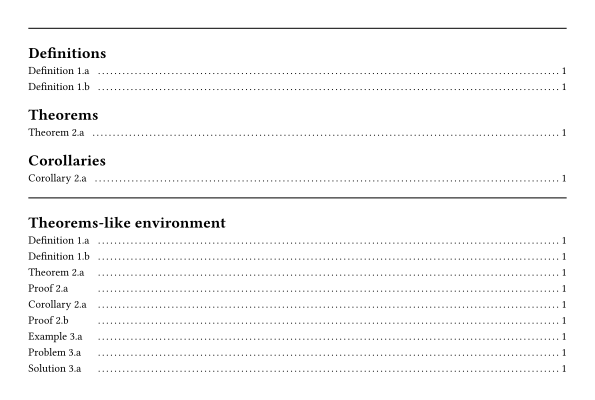

# theoframe

A lightweight and easy-to-use [Typst](https://typst.app/) package that provides beautifully styled theorem-like environments for academic writing. It offers two styles of blocks: **highlighted framed** blocks — `Definition`, `Property`, `Axiom`, `Postulate`, `Assumption`, `Hypothesis`, `Conjecture`, `Proposition`, `Lemma`, `Theorem`, `Corollary`, `Remark`, and `Note`; and **plain** blocks — `Proof`, `Example`, `Exercise`, `Problem`, `Solution`, and `Conclusion`. All blocks come with automatic numbering, customizable colors, and multi-language support.

## Basic Usage

To use, simply import the package:

```typst
#import "@preview/theoframe:0.3.0": *
#show: theoframe-setup
```

### Setup Options

The `#show: theoframe-setup` rule accepts a `theme` argument to customize the appearance of all theorem-like environments:

| Option | Type | Default | Description |
|--------|------|---------|-------------|
| `theme.style` | `string` | `"minimal"` | Visual style of blocks. Options: `"minimal"` (inline header) or `"box"` (highlighted framed header with background). |
| `theme.color` | `color` | `rgb("#000000")` | Base theme color applied to titles, borders, and references. |

**Example with custom theme:**

```typst
#show: theoframe-setup.with(theme: (style: "box", color: rgb("#0077ff")))
```

- With `style: "minimal"`, the block title appears inline with the content.
- With `style: "box"`, the block has a colored header background and a subtle content background.
- The `color` affects all environment titles and cross-reference links.

# Example

**Note on numbering:** The `fig-counter` resets to `0` only when a level-1 heading (`= Heading`) is encountered. Each time a theorem-like environment (e.g., `#definition`, `#theorem`) is called, the counter increments by `1` and is displayed as a letter starting from `"a"`.


## minimal style
```typst
#import "@preview/theoframe:0.3.0":*
#show: theoframe-setup
// #show: theoframe-setup.with(theme: (style: "box", color: rgb("#0084ff")))

#set page(paper:"a4",  margin: 1cm)

= Preliminaries
#lorem(20)

#definition(name: [Even Integer])[
  An integer $n$ is called *even* if it is divisible by $2$, i.e., there exists an integer $k$ such that $n = 2k$.
]<def:even>

#definition(name: [Odd Integer])[
  An integer $n$ is called *odd* if it is not divisible by $2$, i.e., there exists an integer $k$ such that $n = 2k + 1$.
]<def:odd>

= Main Results
#lorem(20)

#theorem(name: [Sum of Two Even Integers])[
  The sum of any two even integers is even.
]<thm:sum-even>

#proof(name: [Proof of @thm:sum-even])[
  Let $a$ and $b$ be two even integers. By @def:even, there exist integers $k$ and $m$ such that $a = 2k$ and $b = 2m$. Then
  $a + b = 2k + 2m = 2(k + m)$,
  which shows that $a + b$ is divisible by $2$, hence even by @def:even.
]<pf:sum-even>

#corollary(name: [Sum of Multiple Even Integers])[
  The sum of any finite number of even integers is even.
]<cor:sum-multiple>

#proof[
  This follows directly from @thm:sum-even by induction on the number of terms.
]

= Additional Examples
#lorem(20)

#example(name: [Concrete Even Numbers])[
  The integers $4$, $10$, and $16$ are even since $4 = 2 times 2$, $10 = 2 times 5$, and $16 = 2 times 8$.
]<ex:even-numbers>

#problem(name: [Sum of Two Odd Integers])[
  Show that the sum of two odd integers is even.
]<prob:sum-odd>

#solution(name: [Solution to @prob:sum-odd])[
  Let $a$ and $b$ be odd integers. By @def:odd, there exist integers $k$ and $m$ such that $a = 2k + 1$ and $b = 2m + 1$. Then
  $a + b = (2k + 1) + (2m + 1) = 2k + 2m + 2 = 2(k + m + 1)$,
  which is even by @def:even.
]<sol:sum-odd>

```

<p align="left">
  
</p>

## box style

```typst
#import "@preview/theoframe:0.3.0":*
// #show: theoframe-setup
#show: theoframe-setup.with(theme: (style: "box", color: rgb("#0084ff")))
```

<p align="left">
  
</p>


# Outline for theorems

```typst
#line(length: 100%)
// #show outline: it => {
//   show heading: set text(fill: rgb("#0077ff"))
//   it
// }
#outline(title: "Definitions", target: figure.where(kind: "definition"))
#outline(title: "Theorems", target: figure.where(kind: "theorem"))

#line(length: 100%)
#let fig-arr = kind-array.map(it => figure.where(kind: it))
#outline(title: "Theorems-like environment", target: selector.or(..fig-arr))
```
<p align="left">
  
</p>


# Changelog

## Version: 0.1.0

- Initial release with thirteen theorem-like environments: `Definition`, `Postulate`, `Assumption`, `Conjecture`, `Proposition`, `Lemma`, `Proof`, `Theorem`, `Corollary`, `Example`, `Problem`, `Solution`, and `Conclusion`.
- Auto-numbering counters tied to level-1 headings for organized referencing.
- Customizable frame colors per environment.
- Multi-language support: English, French, Korean, Japanese, and Chinese.

## Version: 0.2.0

- Add: Cross-reference support.
- Fix: Counter not resetting when encountering a level-1 heading (= heading).
- Root Cause Analysis: In Typst, #import only brings in variable bindings (functions and variables defined with #let) from a module. Meanwhile, #show rules are document-level directives, meaning their scope is strictly confined to the module where they are defined.

## Version: 0.3.0

- Add: Global theme configuration via `theoframe-setup`. Users can now set `theme.style` (`"minimal"` or `"box"`) and `theme.color` globally, instead of configuring each environment individually.
- Added six new environments: `Property`, `Axiom`, `Hypothesis`, `Remark`, `Note`, and `Exercise`.
- Refactor: Restructured the codebase to separate `thmbox` (highlighted framed blocks) and `thmplain` (plain blocks) templates, improving maintainability and clarity. 
