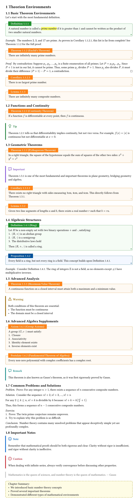

# 🌌Theorion

[Theorion](https://github.com/OrangeX4/typst-theorion) (The Orion) is an out-of-the-box, customizable and multilingual **theorem** environment package for [Typst](https://typst.app/docs/).

[](https://typst.app/universe/package/theorion)


## Quick Start

```typst
#import "@preview/theorion:0.2.0": *
#import cosmos.fancy: *
// #import cosmos.rainbow: *
// #import cosmos.clouds: *
#show: show-theorion

#theorem(title: "Euclid's Theorem")[
  There are infinitely many prime numbers.
] <thm:euclid>

#theorem-box(title: "Theorem without numbering")[
  This theorem is not numbered.
]
```

## Customization

```typst
// 1. Change the color scheme (only for `fancy` cosmos):
#set-primary-border-color(red)
#set-primary-body-color(red.lighten(95%))
#set-primary-symbol[#sym.suit.diamond.filled]

// 2. Change the inherited levels:
#set-inherited-levels(1)
#set-zero-fill(true)
#set-leading-zero(true)

// 3. Other options:
#set-result("noanswer")
#set-qed-symbol[#math.qed]

// 4. Custom theorem environment for yourself
#let (theorem-counter, theorem-box, theorem, show-theorem) = make-frame(
  "theorem",  // identifier
  "Theorem",  // supplement, string or dictionary like `(en: "Theorem")`, or `theorion-i18n-map.at("theorem")` for built-in i18n support
  counter: theorem-counter,  // inherit the old counter, `none` by default
  inherited-levels: 2,  // useful when you need a new counter
  inherited-from: heading,  // heading or just another counter
  render: (prefix: none, title: "", full-title: auto, body) => [#strong[#full-title.]#sym.space#emph(body)],
)
#show: show-theorem

// 5. Just use it.
#theorem(title: "Euclid's Theorem")[
  There are infinitely many prime numbers.
] <thm:euclid>
```

## Example

[Source code](examples/example.typ)



```typst
#import "@preview/theorion:0.2.0": *
#import cosmos.fancy: *
// #import cosmos.rainbow: *
// #import cosmos.clouds: *
#show: show-theorion

#set page(height: auto, margin: 2em, width: 50em)
#set heading(numbering: "1.1")
#set text(lang: "en")

/// 1. Change the color scheme (only for `fancy` cosmos):
// #set-primary-border-color(red)
// #set-primary-body-color(red.lighten(95%))
// #set-primary-symbol[#sym.suit.diamond.filled]

/// 2. Change the inherited levels:
// #set-inherited-levels(1)
// #set-zero-fill(true)
// #set-leading-zero(true)

/// 3. Other options:
// #set-result("noanswer")
// #set-qed-symbol[#math.qed]

/// 4. Custom theorem environment for yourself
// #let (theorem-counter, theorem-box, theorem, show-theorem) = make-frame(
//   "theorem",
//   "Theorem",  // supplement, string or dictionary like `(en: "Theorem")`, or `theorion-i18n-map.at("theorem")` for built-in i18n support
//   counter: theorem-counter,  // inherit the counter, `none` by default
//   inherited-levels: 2,  // useful when you need a new counter
//   inherited-from: heading,  // heading or another counter
//   render: (prefix: none, title: "", full-title: auto, body) => [#strong[#full-title.]#sym.space#emph(body)],
// )
// #show: show-theorem

/// 5. Just use it.
// #theorem(title: "Euclid's Theorem")[
//   There are infinitely many prime numbers.
// ] <thm:euclid>

= Theorion Environments

== Basic Theorem Environments

Let's start with the most fundamental definition.

#definition[
  A natural number is called a #highlight[_prime number_] if it is greater than 1
  and cannot be written as the product of two smaller natural numbers.
] <def:prime>

#example[
  The numbers $2$, $3$, and $17$ are prime. As proven in @cor:infinite-prime,
  this list is far from complete! See @thm:euclid for the full proof.
]

#theorem(title: "Euclid's Theorem")[
  There are infinitely many prime numbers.
] <thm:euclid>

#proof[
  By contradiction: Suppose $p_1, p_2, dots, p_n$ is a finite enumeration of all primes.
  Let $P = p_1 p_2 dots p_n$. Since $P + 1$ is not in our list,
  it cannot be prime. Thus, some prime $p_j$ divides $P + 1$.
  Since $p_j$ also divides $P$, it must divide their difference $(P + 1) - P = 1$,
  a contradiction.
]

#corollary[
  There is no largest prime number.
] <cor:infinite-prime>

#lemma[
  There are infinitely many composite numbers.
]

== Functions and Continuity

#theorem(title: "Continuity Theorem")[
  If a function $f$ is differentiable at every point, then $f$ is continuous.
] <thm:continuous>

#tip-box[
  @thm:continuous tells us that differentiability implies continuity,
  but not vice versa. For example, $f(x) = |x|$ is continuous but not differentiable at $x = 0$.
]

== Geometric Theorems

#theorem(title: "Pythagorean Theorem")[
  In a right triangle, the square of the hypotenuse equals the sum of squares of the other two sides:
  $x^2 + y^2 = z^2$
] <thm:pythagoras>

#important-box[
  @thm:pythagoras is one of the most fundamental and important theorems in plane geometry,
  bridging geometry and algebra.
]

#corollary[
  There exists no right triangle with sides measuring 3cm, 4cm, and 6cm.
  This directly follows from @thm:pythagoras.
] <cor:pythagoras>

#lemma[
  Given two line segments of lengths $a$ and $b$, there exists a real number $r$
  such that $b = r a$.
] <lem:proportion>

== Algebraic Structures

#definition(title: "Ring")[
  Let $R$ be a non-empty set with two binary operations $+$ and $dot$, satisfying:
  1. $(R, +)$ is an abelian group
  2. $(R, dot)$ is a semigroup
  3. The distributive laws hold
  Then $(R, +, dot)$ is called a ring.
] <def:ring>

#proposition[
  Every field is a ring, but not every ring is a field. This concept builds upon @def:ring.
] <prop:ring-field>

#example[
  Consider @def:ring. The ring of integers $ZZ$ is not a field, as no elements except $plus.minus 1$
  have multiplicative inverses.
]

== Advanced Analysis

#theorem(title: "Maximum Value Theorem")[
  A continuous function on a closed interval must attain both a maximum and a minimum value.
]

#warning-box[
  Both conditions of this theorem are essential:
  - The function must be continuous
  - The domain must be a closed interval
]

== Advanced Algebra Supplements

#axiom(title: "Group Axioms")[
  A group $(G, \cdot)$ must satisfy:
  1. Closure
  2. Associativity
  3. Identity element exists
  4. Inverse elements exist
]

#postulate(title: "Fundamental Theorem of Algebra")[
  Every non-zero polynomial with complex coefficients has a complex root.
]

#remark[
  This theorem is also known as Gauss's theorem, as it was first rigorously proved by Gauss.
]

== Common Problems and Solutions

#problem[
  Prove: For any integer $n > 1$, there exists a sequence of $n$ consecutive composite numbers.
]

#solution[
  Consider the sequence: $n! + 2, n! + 3, ..., n! + n$

  For any $2 <= k <= n$, $n! + k$ is divisible by $k$ because:
  $n! + k = k(n! / k + 1)$

  Thus, this forms a sequence of $n-1$ consecutive composite numbers.
]

#exercise[
  1. Prove: The twin prime conjecture remains unproven.
  2. Try to explain why this problem is so difficult.
]

#conclusion[
  Number theory contains many unsolved problems that appear deceptively simple
  yet are profoundly complex.
]

== Important Notes

#caution-box[
  When dealing with infinite series, always verify convergence before discussing other properties.
]

#quote-box[
  Mathematics is the queen of sciences, and number theory is the queen of mathematics.
  — Gauss
]

#emph-box[
  Chapter Summary:
  - We introduced basic number theory concepts
  - Proved several important theorems
  - Demonstrated different types of mathematical environments
]
```

## All Cosmos

### 📄Simple

```typst
#import "@preview/theorion:0.2.0": *
#import cosmos.simple: *
#show: show-theorion
```

[Customize from source code](cosmos/simple.typ)


### 🌈Rainbow

```typst
#import "@preview/theorion:0.2.0": *
#import cosmos.rainbow: *
#show: show-theorion
```

[Customize from source code](cosmos/rainbow.typ)


### ☁️Clouds

```typst
#import "@preview/theorion:0.2.0": *
#import cosmos.clouds: *
#show: show-theorion
```

[Customize from source code](cosmos/clouds.typ)


### ✨Fancy

```typst
#import "@preview/theorion:0.2.0": *
#import cosmos.fancy: *
#show: show-theorion
```

[Customize from source code](cosmos/fancy.typ)


### Contributing your cosmos

Welcome to [open a pull request](htps://github.com/OrangeX4/typst-theorion/pulls) and contribute your beautiful cosmos to Theorion!


## Acknowledgements

- Thanks [Johann Birnick](https://github.com/jbirnick) for [rich-counters](https://github.com/jbirnick/typst-rich-counters)
- Thanks [Satvik Saha](https://github.com/sahasatvik) for [ctheorems](https://github.com/sahasatvik/typst-theorems)
- Thanks [s15n](https://github.com/s15n) for [typst-thmbox](https://github.com/s15n/typst-thmbox)
- Thanks [0x6b](https://github.com/0x6b) for [octique](https://github.com/0x6b/typst-octique)
- Thanks [Pablo González Calderón](https://github.com/Pablo-Gonzalez-Calderon) for [showybox](https://github.com/Pablo-Gonzalez-Calderon/showybox-package)
