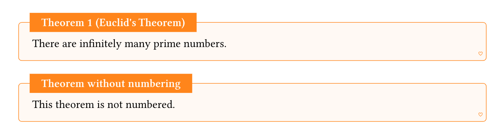
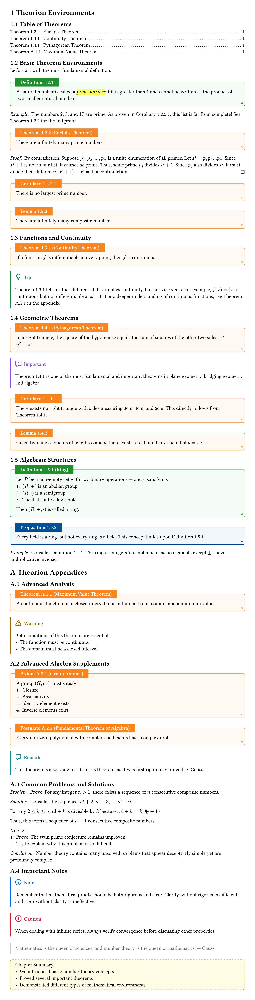
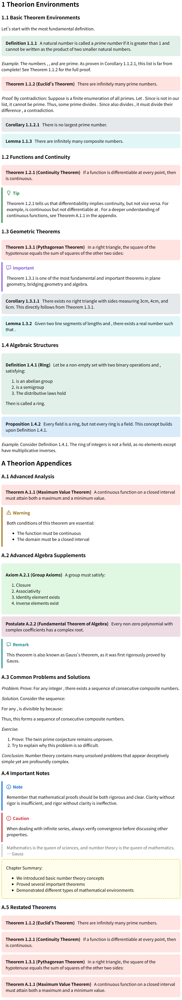

# 🌌 Theorion

[](https://typst.app/universe/package/theorion)


[Theorion](https://github.com/OrangeX4/typst-theorion) (The Orion) is an out-of-the-box, customizable and multilingual **theorem** environment package for [Typst](https://typst.app/docs/).

- **Out-of-the-box styles** 🎨
- **Built-in multilingual support** 🌐
- **Experimental HTML Support** 📑
- **Highly customizable** ⚙️:
  - Custom separate counters and numbering styles
  - Configurable inheritance levels from headings or math equation
  - Custom theorem environments
  - Custom separate rendering functions
- **Rich theorem environments** 📚: theorem, definition, lemma, corollary, example, proof, and many more presets for note-taking
- **Theorem restatement** 🔄: `#theorion-restate(filter: it => it.outlined and it.identifier == "theorem")`
- **Additional features** 📑:
  - Theorem table of contents
  - Appendix numbering adjustments
  - Complete label and reference system with flexible supplements
  - Optional outline and numbering display
  - Configurable paragraph indentation inside theorem environments
  - [Touying](https://github.com/touying-typ/touying) animation support

## Quick Start

Just import and use theorion.

```typst
#import "@preview/theorion:0.5.0": *
// #import cosmos.simple: *
#import cosmos.fancy: *
// #import cosmos.rainbow: *
// #import cosmos.clouds: *
#show: show-theorion

#theorem[Euclid's Theorem][
  There are infinitely many prime numbers.
] <thm:euclid>

#theorem-box(outlined: false)[Theorem without numbering][
  This theorem is not numbered.
]
```



## Customization

```typst
#import "@preview/theorion:0.5.0": *
#show: show-theorion

// 1. Change the counters and numbering:
#set-inherited-levels(1)
#set-zero-fill(true)
#set-leading-zero(true)
#set-theorion-numbering("1.1")

// 2. Other options:
#set-result("noanswer")
#set-qed-symbol[#math.qed]
#set-indent-mode(auto)  // auto (default), none, length or dictionary

// Use #qedhere to place the QED symbol at a specific position in a proof
// (e.g., when the proof ends with a block equation or inside a list)
#proof[
  The result follows from:
  $ x + y = z $  // QED appears at the right of this equation automatically
]
#proof[
  Consider two cases.
  - Case 1: #qedhere  // manual placement: QED appears here, not at end
]

// 3. Custom theorem environment for yourself
#let (theorem-counter, theorem-box, theorem, show-theorem) = make-frame(
  "theorem",
  "Theorem",  // supplement, string or dictionary like `(en: "Theorem")`, or `theorion-i18n-map.at("theorem")` for built-in i18n support
  counter: theorem-counter,  // inherit the old counter, `none` by default
  inherited-levels: 2,  // useful when you need a new counter
  inherited-from: heading,  // heading or just another counter
  render: (prefix: none, title: "", full-title: auto, body) => [#strong[#full-title.]#sym.space#emph(body)],
)
#show: show-theorem

// 4. Just use it.
#theorem[Euclid's Theorem][
  There are infinitely many prime numbers.
] <thm:euclid>
// Positional title syntax (alternative to named title parameter):
#theorem[Euclid's Theorem][
  There are infinitely many prime numbers.
]
#theorem-box(outlined: false)[Theorem without numbering][
  This theorem is not numbered.
]

// 5. Example of appendix
#counter(heading).update(0)
#set heading(numbering: "A.1")
#set-theorion-numbering("A.1")

// 6. Table of contents
#outline(title: none, target: figure.where(kind: "theorem"))

// 7. Specify a number or supplement
#theorem(title: "Euclid's Theorem", number: "233", supplement: [Theorion])[
  There are infinitely many prime numbers.
]

// 8. Counter continuation: use an array number to continue numbering from a specific value
#theorem(number: (2, 3))[
  This theorem is explicitly numbered 2.3.
  The counter continues from here, so the next auto-numbered theorem is 2.4.
]

// 9. Flexible References via specific supplements. A reference without the title using @label[-]; or one with title and number using @label[!!]
A reference without the title: @thm:euclid[-]; or one with title and number: @thm:euclid[!!]
```

## Restate Theorems

```typst
// 1. Restate all theorems
#theorion-restate(filter: it => it.outlined and it.identifier == "theorem", render: it => it.render)
// 2. Restate all theorems with custom render function
#theorion-restate(
  filter: it => it.outlined and it.identifier == "theorem",
  render: it => (prefix: none, title: "", full-title: auto, body) => block[#strong[#full-title.]#sym.space#emph(body)],
)
// 3. Restate a specific theorem
#theorion-restate(filter: it => it.label == <thm:euclid>)
// or we can use
#theorion-restate(filter: <thm:euclid>)
```

## Example

[Source code](examples/example.typ)



```typst
#import "@preview/theorion:0.5.0": *
// #import cosmos.simple: *
#import cosmos.fancy: *
// #import cosmos.rainbow: *
// #import cosmos.clouds: *
#show: show-theorion

#set page(height: auto)
#set heading(numbering: "1.1")
#set text(lang: "en")

/// 1. Change the counters and numbering:
// #set-inherited-levels(1)
// #set-zero-fill(true)
// #set-leading-zero(true)
// #set-theorion-numbering("1.1")

/// 2. Other options:
// #set-indent-mode(none)  // auto (default), none, length or dictionary
// #set-result("noanswer")
// #set-qed-symbol[#math.qed]

/// 3. Custom theorem environment for yourself
// #let (theorem-counter, theorem-box, theorem, show-theorem) = make-frame(
//   "theorem",
//   "Theorem",  // supplement, string or dictionary like `(en: "Theorem")`, or `theorion-i18n-map.at("theorem")` for built-in i18n support
//   counter: theorem-counter,  // inherit the counter, `none` by default
//   inherited-levels: 2,  // useful when you need a new counter
//   inherited-from: heading,  // heading or another counter
//   render: (prefix: none, title: "", full-title: auto, body) => [#strong[#full-title.]#sym.space#emph(body)],
// )
// #show: show-theorem

/// 4. Just use it.
// #theorem[Euclid's Theorem][
//   There are infinitely many prime numbers.
// ] <thm:euclid>
// #theorem-box(outlined: false)[Theorem without numbering][
//   This theorem is not numbered.
// ]

/// 5. Example of appendix
// #counter(heading).update(0)
// #set heading(numbering: "A.1")
// #set-theorion-numbering("A.1")

/// 6. Table of contents
// #outline(title: none, target: figure.where(kind: "theorem"))

= Theorion Environments

== Table of Theorems

#outline(title: none, target: figure.where(kind: "theorem"))

== Basic Theorem Environments

Let's start with the most fundamental definition.

#definition[
  A natural number is called a #highlight[_prime number_] if it is greater than 1
  and cannot be written as the product of two smaller natural numbers.
] <def:prime>

#example[
  The numbers $2$, $3$, and $17$ are prime. As proven in @cor:infinite-prime,
  this list is far from complete! See @thm:euclid for the full proof.
]

#assumption[
  For all $n in NN$, assume $n$ is even if $n = 2k$ for some $k in NN$.
]

#property[
  The sum of two even numbers is always even.
]

#conjecture[Twin Prime Conjecture][
  There are infinitely many primes $p$ such that $p+2$ is also prime.
]

#theorem[Euclid's Theorem][
  There are infinitely many prime numbers.
] <thm:euclid>

#proof[Proof of @thm:euclid][
  By contradiction: Suppose $p_1, p_2, dots, p_n$ is a finite enumeration of all primes.
  Let $P = p_1 p_2 dots p_n$. Since $P + 1$ is not in our list,
  it cannot be prime. Thus, some prime $p_j$ divides $P + 1$.
  Since $p_j$ also divides $P$, it must divide their difference $(P + 1) - P = 1$,
  a contradiction.
]

#corollary[
  There is no largest prime number.
] <cor:infinite-prime>

#lemma[
  There are infinitely many composite numbers.
]

== Functions and Continuity

#theorem[Continuity Theorem][
  If a function $f$ is differentiable at every point, then $f$ is continuous.
] <thm:continuous>

#tip-block[
  @thm:continuous tells us that differentiability implies continuity,
  but not vice versa. For example, $f(x) = |x|$ is continuous but not differentiable at $x = 0$.
  For a deeper understanding of continuous functions, see @thm:max-value in the appendix.
]

== Geometric Theorems

#theorem[Pythagorean Theorem][
  In a right triangle, the square of the hypotenuse equals the sum of squares of the other two sides:
  $x^2 + y^2 = z^2$
] <thm:pythagoras>

#important-block[
  @thm:pythagoras is one of the most fundamental and important theorems in plane geometry,
  bridging geometry and algebra.
]

#corollary[
  There exists no right triangle with sides measuring 3cm, 4cm, and 6cm.
  This directly follows from @thm:pythagoras.
] <cor:pythagoras>

#lemma[
  Given two line segments of lengths $a$ and $b$, there exists a real number $r$
  such that $b = r a$.
] <lem:proportion>

== Algebraic Structures

#definition[Ring][
  Let $R$ be a non-empty set with two binary operations $+$ and $dot$, satisfying:
  1. $(R, +)$ is an abelian group
  2. $(R, dot)$ is a semigroup
  3. The distributive laws hold
  Then $(R, +, dot)$ is called a ring.
] <def:ring>

#proposition[
  Every field is a ring, but not every ring is a field. This concept builds upon @def:ring.
] <prop:ring-field>

#example[
  Consider @def:ring. The ring of integers $ZZ$ is not a field, as no elements except $plus.minus 1$
  have multiplicative inverses.
]

/// Appendix
#counter(heading).update(0)
#set heading(numbering: "A.1")
#set-theorion-numbering("A.1")

= Theorion Appendices

== Advanced Analysis

#theorem[Maximum Value Theorem][
  A continuous function on a closed interval must attain both a maximum and a minimum value.
] <thm:max-value>

#warning-block[
  Both conditions of this theorem are essential:
  - The function must be continuous
  - The domain must be a closed interval
]

== Advanced Algebra Supplements

#axiom[Group Axioms][
  A group $(G, \cdot)$ must satisfy:
  1. Closure
  2. Associativity
  3. Identity element exists
  4. Inverse elements exist
] <axiom:group>

#postulate[Fundamental Theorem of Algebra][
  Every non-zero polynomial with complex coefficients has a complex root.
] <post:fta>

#remark-block[
  This theorem is also known as Gauss's theorem, as it was first rigorously proved by Gauss.
]

== Common Problems and Solutions

#problem[
  Prove: For any integer $n > 1$, there exists a sequence of $n$ consecutive composite numbers.
]

#solution(qed: auto)[
  Consider the sequence: $n! + 2, n! + 3, ..., n! + n$

  For any $2 <= k <= n$, $n! + k$ is divisible by $k$ because:
  $n! + k = k(n! / k + 1)$

  Thus, this forms a sequence of $n-1$ consecutive composite numbers.
]

#exercise[
  1. Prove: The twin prime conjecture remains unproven.
  2. Try to explain why this problem is so difficult.
]

#conclusion[
  Number theory contains many unsolved problems that appear deceptively simple
  yet are profoundly complex.
]

== Important Notes

#note-block[
  Remember that mathematical proofs should be both rigorous and clear.
  Clarity without rigor is insufficient, and rigor without clarity is ineffective.
]

#caution-block[
  When dealing with infinite series, always verify convergence before discussing other properties.
]

#quote-block[
  Mathematics is the queen of sciences, and number theory is the queen of mathematics.
  — Gauss
]

#emph-block[
  Chapter Summary:
  - We introduced basic number theory concepts
  - Proved several important theorems
  - Demonstrated different types of mathematical environments
]

== Restated Theorems

// 1. Restate all theorems
#theorion-restate(
  filter: it => it.outlined and it.identifier == "theorem",
  render: it => it.render,
)
// 2. Restate all theorems with custom render function
// #theorion-restate(
//   filter: it => it.outlined and it.identifier == "theorem",
//   render: it => (prefix: none, title: "", full-title: auto, body) => block[#strong[#full-title.]#sym.space#emph(body)],
// )
// 3. Restate a specific theorem
// #theorion-restate(filter: it => it.label == <thm:euclid>)
// or we can use
// #theorion-restate(filter: <thm:euclid>)
```

## All Cosmos

### 📄 Simple

```typst
#import "@preview/theorion:0.5.0": *
#import cosmos.simple: *
#show: show-theorion
```

[Customize from source code](cosmos/simple.typ)


### 🌈 Rainbow

```typst
#import "@preview/theorion:0.5.0": *
#import cosmos.rainbow: *
#show: show-theorion
```

[Customize from source code](cosmos/rainbow.typ)

```typst
/// Custom color
#let theorem = theorem.with(fill: blue.darken(10%))
#let theorem-box = theorem-box.with(fill: blue.darken(10%))
```


### ☁️ Clouds

```typst
#import "@preview/theorion:0.5.0": *
#import cosmos.clouds: *
#show: show-theorion
```

[Customize from source code](cosmos/clouds.typ)

```typst
/// Custom color
#let theorem = theorem.with(fill: blue.lighten(85%))
#let theorem-box = theorem-box.with(fill: blue.lighten(85%))

/// Custom block style
#let theorem = theorem.with(radius: 0pt)
#let theorem-box = theorem-box.with(radius: 0pt)
```


### ✨ Fancy

```typst
#import "@preview/theorion:0.5.0": *
#import cosmos.fancy: *
#show: show-theorion
```

[Customize from source code](cosmos/fancy.typ)

```typst
/// Custom color
#set-primary-border-color(red)
#set-primary-body-color(red.lighten(95%))
#set-primary-symbol[#sym.suit.diamond.filled]
#set-fancy-radius(0em)
```


### Contributing your cosmos

Welcome to [open a pull request](https://github.com/OrangeX4/typst-theorion/pulls) and contribute your beautiful cosmos to Theorion!

## Experimental HTML Support

Theorion provides experimental support for HTML rendering, allowing you to embed HTML elements within Typst documents. This feature is still under active development, and the external API is not exposed at this time. It is subject to change without notice and may have compatibility issues.



## Changelog

### 0.5.0

- **BREAKING CHANGE: rename `xxx-box` to `xxx-block`** — `remark`, `note-box`, `important-box` are now named `remark-block`, `note-block`, `important-bblock` to avoid duplicate names.
- **feat: flexible references** — `@label[-]` shows number only, `@label[!!]` shows supplement + number + title, thank theoretic for the idea
- **feat: border radius in fancy cosmos** `#set-fancy-radius(0em)` to remove the border radius for fancy cosmos
- **feat: positional title syntax** — `#theorem[Title][Body]` as an alternative to `#theorem(title: [Title])[Body]`
- **feat: counter continuation** — pass an array as `number` (e.g. `number: (2, 3)`) to set the counter and continue numbering from there
- **feat: `#set-indent-mode`** — configure paragraph indentation inside theorem environments (`auto`, `none`, a length, or a dictionary)
- **feat: `#indent-repairer`** — automatically repairs first-paragraph indentation inside theorem bodies
- **feat: improved QED placement** — `proof` now correctly places the QED symbol at the bottom-right of block equations when the proof ends with a math equation, thank theoretic for the idea
- **feat: `#qedhere`** — new function to manually place the QED symbol at a specific position for `proof`, `solution` and `conclusion`
- **feat: LaTeX-aligned body styles, numbered remark support** — simple cosmos styles now more closely match LaTeX defaults
- **feat(cosmos): add `note`, `remark`, `example`, `problem`, `exercise` environments**
- **feat(i18n): add Swedish translation**
- **fix: fix nested theorem numbering** — child counters (e.g. corollary inside theorem) now inherit the correct parent number
- **fix: prevent theorem indentation when `first-line-indent` is set**

### 0.5.0

- **URGENT FIX: fix display-number and support typst 0.14**
- feat(i18n): add polish translation [#21](https://github.com/OrangeX4/typst-theorion/pull/21)
- fix: add lower fn to fix upper-case text region [#22](https://github.com/OrangeX4/typst-theorion/pull/22)
- fix: bump octique version to 0.1.1
- fix: allow multiple outline targets [#19](https://github.com/OrangeX4/typst-theorion/pull/19)

### 0.4.0

- **feat: (Highlight): Experimental HTML Support**
- feat: `number` and `supplement` arguments to manually specify the number of a theorem/definition/...
- refactor: (Small breaking change) refactor `get-prefix(get-loc)` to `get-prefix(get-loc, number: auto, supplement: auto)` and refactor `get-full-title(get-loc, title)` to `get-full-title(prefix, title)`.
- feat: add Dutch translation
- feat: add direct label filter for theorion-restate
- fix: 100% width to center equations
- fix(fancy): feat some bugs for fancy cosmos


## Acknowledgements

- Thanks [Johann Birnick](https://github.com/jbirnick) for [rich-counters](https://github.com/jbirnick/typst-rich-counters)
- Thanks [Satvik Saha](https://github.com/sahasatvik) for [ctheorems](https://github.com/sahasatvik/typst-theorems)
- Thanks [s15n](https://github.com/s15n) for [typst-thmbox](https://github.com/s15n/typst-thmbox)
- Thanks [0x6b](https://github.com/0x6b) for [octique](https://github.com/0x6b/typst-octique)
- Thanks [Pablo González Calderón](https://github.com/Pablo-Gonzalez-Calderon) for [showybox](https://github.com/Pablo-Gonzalez-Calderon/showybox-package)
- Thanks [nleanba](https://github.com/nleanba) for [theoretic](https://github.com/nleanba/typst-theoretic), many ideas are inspired by theoretic
