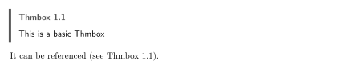
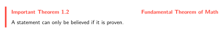
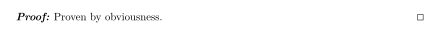
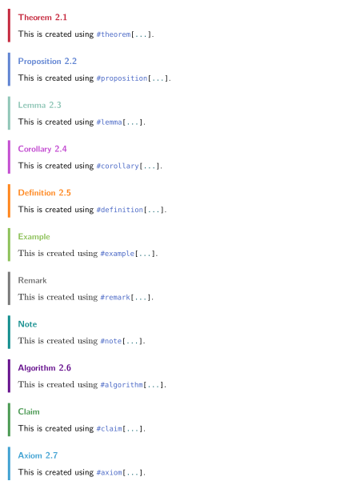
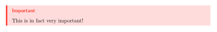
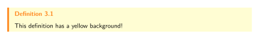

# Typst Thmbox

A typst package providing environments for theorems and proofs.

## Usage

Before using any of the features this package has to offer, add the following lines to the top of your document:

```typ
#import "@preview/thmbox:0.1.1": *

#show: thmbox-init()
```

Now, the basic building block for thmbox environments is `thmbox`:

```typ
#thmbox[
    This is a basic Thmbox
] <basic-box>

It can be referenced (see @basic-box).
```
<picture>
  <source media="(prefers-color-scheme: dark)" srcset="gallery/d1.svg">
  
</picture>

Using the `color`, `variant`, and `title` parameters, we can style this box:
```typ
#thmbox(
    variant: "Important Theorem", 
    title: "Fundamental Theorem of Math", 
    color: red
)[
    A statement can only be believed if it is proven. 
]
```
<picture>
  <source media="(prefers-color-scheme: dark)" srcset="gallery/d2.svg">
  
</picture>

To prove this statement, we can follow up with a `proof`:
```typ
#proof[
    Proven by obviousness.
]
```
<picture>
  <source media="(prefers-color-scheme: dark)" srcset="gallery/d3.svg">
  
</picture>

For your environments, Thmbox actually ships with a variety of predefined ones, for theorems, corollaries, definitions, examples, etc:

<!--```typ
#theorem[
    This is created using #raw("#theorem[...]", lang: "typ").
]

#proposition[
    This is created using #raw("#proposition[...]", lang: "typ").
]

#lemma[
    This is created using #raw("#lemma[...]", lang: "typ").
]

#corollary[
    This is created using #raw("#corollary[...]", lang: "typ").
]

#definition[
    This is created using #raw("#definition[...]", lang: "typ").
]

#example[
    This is created using #raw("#example[...]", lang: "typ").
]

#remark[
    This is created using #raw("#remark[...]", lang: "typ").
]

#note[
    This is created using #raw("#note[...]", lang: "typ").
]

#algorithm[
    This is created using #raw("#algorithm[...]", lang: "typ").
]

#claim[
    This is created using #raw("#claim[...]", lang: "typ").
]

#axiom[
    This is created using #raw("#axiom[...]", lang: "typ").
]
```-->
<picture>
  <source media="(prefers-color-scheme: dark)" srcset="gallery/d4.svg">
  
</picture>

## Usage Notes

The recommended way of implementing new types of thmboxes is like this:
```typ
#let important(
    // Specify parameters you want to change
    fill: rgb("#ffdcdc"),
    variant: "Important",
    color: red,
    // Use an args sink
    ..args
) = note(fill: fill, variant: variant, color: color, ..args) 
// derive from some predefined function

#important[
    This is in fact very important!
]
```
<picture>
  <source media="(prefers-color-scheme: dark)" srcset="gallery/d5.svg">
  
</picture>

Of course, deriving from `thmbox` is just as good, but the predefined environments have some other parameters already set as well.

As set rules don't work with user-defined functions, a similar effect can be achieved the following way:
```typ
// Define your custom thmbox
#let my-thmbox(
    // Specify parameters you want to change
    fill: rgb("#fffdd3"),
    // Use an args sink
    ..args
) = thmbox(fill: fill, ..args)

// redefine predefined environments
#let my-definition(..args) = definition(thmbox: my-thmbox, ..args)

// use
#my-definition[
    This definition has a yellow background!
]
```
<picture>
  <source media="(prefers-color-scheme: dark)" srcset="gallery/d6.svg">
  
</picture>

The recommended font for documents using this package is New Computer Modern (shipped with Typst).

The recommended sans-serif font (can be changed with the `sans-fonts` and `title-fonts` parameter) is New Computer Modern Sans (download at [CTAN](https://ctan.org/pkg/newcomputermodern))

By default, the counter for thmboxes has two levels where the first one marks the chapter and the second gets reset at the start of each chapter.
To change that, use the `counter-level` parameter of `thmbox-init`. The default is 2, but for example, 1 will be one number counting in the entire document, 3 will count per section, and so on.

Also by default, thmboxes don't break across pages. To enable that, you can use the rule `#show figure: set block(breakable: true)`. Other `set` and `show` rules for figures can be used with thmboxes as well, as figures are used under the hood.

## Installation

No steps are required when installing from `@preview`. To install this package [locally](https://github.com/typst/packages?tab=readme-ov-file#local-packages), do

```sh
cd <data-dir>/typst/packages/local/thmbox
git clone https://github.com/s15n/typst-thmbox.git 0.1.1
```
where `<data-dir>` is
- `$XDG_DATA_HOME` or `~/.local/share` on Linux
- `~/Library/Application Support` on macOS
- `%APPDATA%` on Windows

You might have to create the folder in the first line first.

## Translations

Thmbox automatically translates to the language of your document (if translations are available for it).

Translations are found in [src/translations.typ](https://github.com/s15n/typst-thmbox/blob/main/src/translations.typ). You are welcome to contribute for languages you speak.
