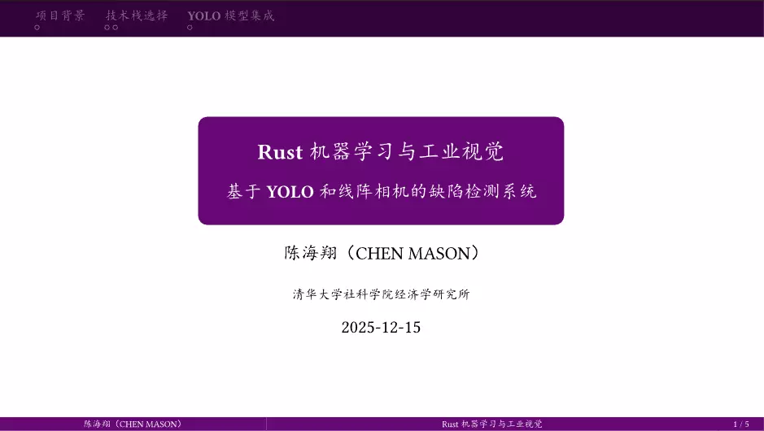

# THUTouying

## 基本介绍

这是一个基于Stargazer Theme(https://touying-typ.github.io/zh/docs/themes/stargazer)二次开发的，参考了thubeamer(https://github.com/YangLaTeX/thubeamer)样式的touying模板。

## 效果预览



## 使用方法

### 方式一：使用 Typst Universe (推荐)

```typst
#import "@preview/thu-touying:0.1.0": *

#show: THUTouying-theme.with(
  config-info(
    title: [汇报标题],
    subtitle: [副标题],
    author: [你的名字],
    date: datetime.today(),
    institution: [清华大学],
  ),
  display-section-slides: true, 
)

#title-slide()
#outline-slide()

= 第一章 项目背景

== 研究意义

#tblock(title: "核心目标")[
  这是一个带标题栏的文本块。
]
```

### 方式二：typst init命令

在你的工作目录下新建终端，并运行以下命令：

```
typst init @preview/thu-touying:0.1.0 my-slide
```

### 方式三：本地手动安装

下载本仓库，将 lib.typ 放在同级目录下：

然后在你的文档中输入：

```
#import "lib.typ": *

// 后续使用代码同上...
```
