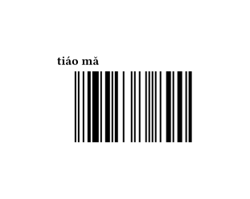

# tiaoma

[tiaoma(条码)](https://github.com/enter-tainer/zint-wasi) is a barcode generator for typst. It compiles [zint](https://github.com/zint/zint) to wasm and use it to generate barcode. It support nearly all common barcode types. For a complete list of supported barcode types, see [zint's documentation](https://zint.org.uk/):

- Australia Post
  - Standard Customer
  - Reply Paid
  - Routing
  - Redirection
- Aztec Code
- Aztec Runes
- Channel Code
- Codabar
- Codablock F
- Code 11
- Code 128 with automatic subset switching
- Code 16k
- Code 2 of 5 variants:
  - Matrix 2 of 5
  - Industrial 2 of 5
  - IATA 2 of 5
  - Datalogic 2 of 5
  - Interleaved 2 of 5
  - ITF-14
- Deutsche Post Leitcode
- Deutsche Post Identcode
- Code 32 (Italian pharmacode)
- Code 3 of 9 (Code 39)
- Code 3 of 9 Extended (Code 39 Extended)
- Code 49
- Code 93
- Code One
- Data Matrix ECC200
- DotCode
- Dutch Post KIX Code
- EAN variants:
  - EAN-13
  - EAN-8
- Grid Matrix
- GS1 DataBar variants:
  - GS1 DataBar
  - GS1 DataBar Stacked
  - GS1 DataBar Stacked Omnidirectional
  - GS1 DataBar Expanded
  - GS1 DataBar Expanded Stacked
  - GS1 DataBar Limited
- Han Xin
- Japan Post
- Korea Post
- LOGMARS
- MaxiCode
- MSI (Modified Plessey)
- PDF417 variants:
  - PDF417 Truncated
  - PDF417
  - Micro PDF417
- Pharmacode
- Pharmacode Two-Track
- Pharmazentralnummer
- POSTNET / PLANET
- QR Code
- rMQR
- Royal Mail 4-State (RM4SCC)
- Royal Mail 4-State Mailmark
- Telepen
- UPC variants:
  - UPC-A
  - UPC-E
- UPNQR
- USPS OneCode (Intelligent Mail)

## Example

```typ
#import "@preview/tiaoma:0.3.0"
#set page(width: auto, height: auto)

= tiáo mǎ

#tiaoma.ean("1234567890128")
```



## Manual

Please refer to [manual](./manual.pdf) for more details.

## Alternatives

There are other barcode/qrcode packages for typst such as:
- https://github.com/jneug/typst-codetastic
- https://github.com/Midbin/cades

Packages differ in provided customization options for generated barcodes. This package is limited by zint functionality, which focuses more on coverage than customization (e.g. inserting graphics into QR codes). Patching upstream zint code is (currently) outside of the scope of this package - if it doesn't provide functionality you need, check the rest of the typst ecosystem to see if it's available elsewhere or request it [upstream](https://github.com/zint/zint) and [notify us](https://github.com/Enter-tainer/zint-wasi/issues) when it's been merged.

### Pros

1. Support for far greater number of barcode types (all provided by zint library)
2. Should be faster as is uses a WASM plugin which bundles zint code which is written in C; others are written in pure typst or javascript.

### Cons

1. While most if not all of zint functionality is covered, it's hard to guarantee there's no overlooked functionality.
2. This package uses typst plugin system and has a WASM backend written in Rust which makes is less welcoming for new contributors.
