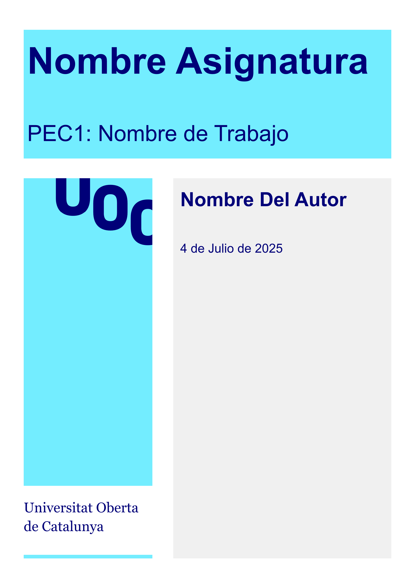

# Tidbit UOC Template

A Typst template for academic reports, practices, papers and thesis at the Universitat Oberta de Catalunya (UOC) with professional styling.

This template provides a clean and modern layout following UOC's visual identity guidelines, featuring the university's branding colors and logo.

## Preview



## Usage

Using the Typst Universe package/template:

```bash
typst init @preview/tidbit-uoc:0.1.0
```

### Basic Example

```typst
#import "@preview/tidbit-uoc:0.1.0": template

#show: template.with(
  subject: "Programación II",
  title: "PEC1: Estructuras de Datos",
  subtitle: "Implementación de Algoritmos de Ordenamiento",
  author: "Juan Pérez García",
  date: datetime.today(),
)

= Introducción

Este trabajo presenta...

= Metodología

La metodología utilizada...

= Resultados

Los resultados obtenidos...

= Conclusiones

En conclusión...
```

### Template Parameters

The template accepts the following parameters:

- `subject`: Name of the subject/course (default: "Nombre Asignatura")
- `title`: Main title of the work (default: "PEC1: Nombre de Trabajo")
- `subtitle`: Subtitle for additional context (default: "Un subtítulo de la tarea")
- `author`: Author's name (default: "Nombre Del Autor")
- `date`: Date of the document (default: `datetime.today()`)
- `region`: Text region for localization (default: "es")
- `lang`: Language code (default: "es")

### Fonts

This template uses the following fonts:

- **Arial**: Main text and headings
- **Georgia**: University name styling

These fonts are commonly available across platforms. Arial is used as the primary typeface following UOC's style guidelines, while Georgia provides an elegant serif option for institutional branding.

### Features

- **Professional Cover Page**: Includes UOC branding with aqua and marine color scheme
- **Branded Headers and Footers**: Every page includes UOC logo and branding
- **Automatic Date Formatting**: Dates are formatted in Spanish format
- **APA Citation Style**: Pre-configured for academic citations
- **Responsive Layout**: Optimized margins and spacing for A4 paper
- **Structured Typography**: Consistent heading numbering and text formatting

### Colors

The template uses UOC's official colors:

- **Aqua**: `#73EDFF` - Used for accents and branding elements
- **Marine**: `#000078` - Used for text and primary elements

### Document Structure

The template automatically creates:

1. **Cover Page**: Subject, title, subtitle, author, and date with UOC branding
2. **Content Pages**: Clean layout with headers, footers, and page numbering
3. **Proper Margins**: Academic-appropriate spacing for binding and readability

### Assets

Make sure to include the UOC logo in your project:

- Place `logo.svg` in an `assets/` directory
- The logo will be automatically included in the cover page and headers

## File Structure

```
your-project/
├── main.typ          # Your main document
└── assets/
    └── logo.svg     # UOC logo (required)
```

## Tips

- Use standard Typst syntax for headings, lists, and citations
- Images are automatically sized to 75% width
- The template includes justified text and proper paragraph spacing
- Page numbering starts after the cover page

## License

This project is licensed under the MIT License - see the [LICENSE](LICENSE) file for details.

## Contributing

Contributions are welcome! Please feel free to submit issues or pull requests to improve the template.

## Author

Created by [Daniel Ramos Acosta](https://github.com/DanielRamosAcosta) for the UOC academic community.

## Credits

Based in [Andrés Merino's LaTeX template](https://es.overleaf.com/latex/templates/formato-tareas-uoc/xtkjjsdbmmcy)
