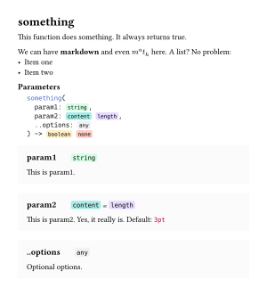

# Tidy
*Keep it tidy.*

<!-- [](https://github.com/Mc-Zen/tidy/actions/workflows/run_tests.yml) -->

**tidy** is a package that generates documentation directly in [Typst](https://typst.app/) for your Typst modules. It parses docstring comments similar to javadoc and co. and can be used to easily build a beautiful reference section for the parsed module.  

Within the docstring you may use (almost) any Typst syntax − so markup, equations and even figures are no problem!

Features:
- **Customizable** output styles. 
- Call your own module's code within the docstring, e.g., to **render examples**. 
- **Annotate types** of parameters and return values.
- Automatically read off default values for named parameters.
- Docstring tests. 


The [guide](./docs/tidy-guide.pdf) describes the usage of this module and defines the format for the docstrings. 

## Usage

Using `tidy` is as simple as writing some docstrings and calling:
```typ
#import "@preview/tidy:0.2.0"
#let docs = tidy.parse-module(read("my-module.typ"))
#tidy.show-module(docs, style: tidy.styles.default)
```

The available predefined styles are currenty `tidy.styles.default` and `tidy.styles.minimal`. Custom styles can be added by hand (see the [guide](./docs/tidy-guide.pdf)). 

Furthermore, it is possible to access user-defined functions and use images through the `scope` argument of `tidy.parse-module()`:

```typ
#{
    import "my-module.typ"
    let module = tidy.parse-module(read("my-module.typ"))
    let an-image = image("img.png")
    tidy.show-module(
        module,
        style: tidy.styles.default,
        scope: (my-module: my-module, img: an-image)
    )
}
```
The docstrings in `my-module.typ` may now access the image with `#img` and can call any function or variable from `my-module` in the style of `#my-module.my-function`. This makes rendering examples right in the docstrings as easy as a breeze!

## Example

A full example on how to use this module for your own package (maybe even consisting of multiple files) can be found at [examples](https://github.com/Mc-Zen/tidy/tree/main/examples).

```typ
/// This function does something. It always returns true.
///
/// We can have *markdown* and 
/// even $m^a t_h$ here. A list? No problem:
///  - Item one 
///  - Item two 
/// 
/// - param1 (string): This is param1.
/// - param2 (content, length): This is param2.
///           Yes, it really is. 
/// - ..options (any): Optional options. 
/// -> boolean, none
#let something(param1, param2: 3pt, ..options) = { return true }
```

**tidy** turns this into:

<h3 align="center">
  
</h3>


## Changelog

### v0.2.0
- New features:
  - Add executable examples to docstrings. 
  - Documentation for variables (as well as functions). 
  - Docstring tests. 
  - Rainbow-colored types `color` and `gradient`. 
- Improvements:
  - Allow customization of cross-references through `show-reference()`. 
  - Allow customization of spacing between functions through styles. 
  - Allow color customization (especially for the `default` theme). 
- Fixes:
  - Empty parameter descriptions are omitted (if the corresponding option is set). 
  - Trim newline characters from parameter descriptions. 
- ⚠️ Breaking changes:
  - Before, cross-references for functions using the `@@` syntax could omit the function parentheses. Now this is not possible anymore, since such references refer to variables now. 
  - (only concerning custom styles) The style functions `show-outline()`, `show-parameter-list`, and `show-type()` now take `style-args` arguments as well. 

### v0.1.0

Initial Release.