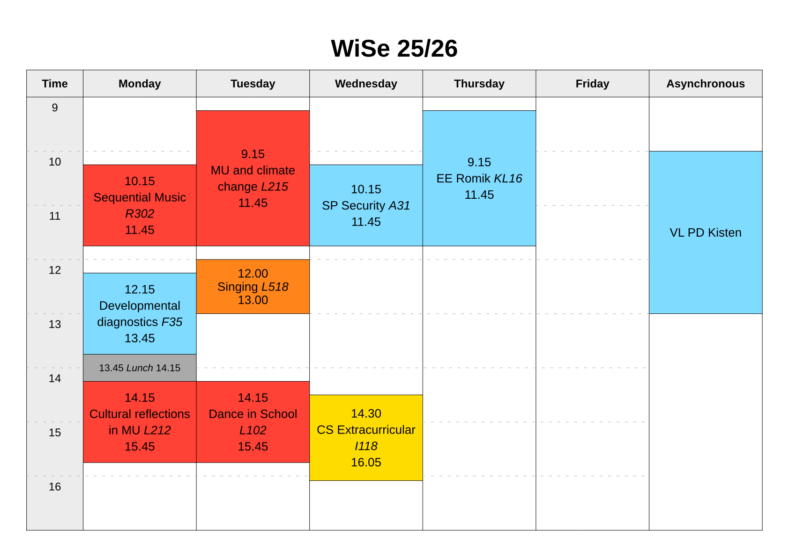

# Timble
Draw and style precise time tables with ease.

## Example
```typst
#import "@preview/timble:1.0.0": *
#set page(paper: "a4", margin: 1cm, flipped: true)

#timetable(title: "WiSe 25/26", font: "Liberation Sans", base-font-size: 13pt,
    start-hour: 9, end-hour: 16,
    monday: (
        (10.15, 11.45, red, [Sequential Music _R302_]),
        (12.15, 13.45, aqua, [Developmental diagnostics _F35_]),
        (13.45, 14.15, gray, [_Lunch_]),
        (14.15, 15.45, red, [Cultural reflections in MU _L212_]),
    ),
    tuesday: (
        (09.15, 11.45, red, [MU and climate change _L215_]),
        (12.00, 13.00, orange, [Singing _L518_],),
        (14.15, 15.45, red, [Dance in School _L102_]),
    ),
    wednesday: (
        (10.15, 11.45, aqua, [SP Security _A31_]),
        (14.30, 16.05, yellow, [CS Extracurricular _I118_]),
    ),
    thursday: (
        (09.15, 11.45, aqua, [EE Romik _KL16_]),
    ),
    asynchronous: (
        (10, 13, aqua, [VL PD Kisten]),
    ),
)
```



## Quick overview
- Import via `#import "@preview/timble:1.0.0"`.
- Draw precise timetables with `#timetable()`:
    - Define your schedule by setting the parameters `monday` through `sunday`
      (with an option for `asynchronous` as well).
    - Each day is an array with each item being an array that defines one entry
      on your schedule. The items have four members: starting time, end time,
      color and content to display in the resulting cell.
        - Time indications are made in 24-hour format and are done as follows:
          `14` (int) for full hours, `13.42` (float) / `"13.42"` (string) for
          hours and minutes.
    - To make basic changes to the timetable, use the following parameters:
        - `am-pm-format: true` to display 12-hour time format.
        - `start-hour: 10` and `end-hour: 18` to change the extent of the
          displayed time.
        - `title: "String"` to display a title.
        - `base-font-size: 12pt` to change the starting point for font size
          adjustments.

## Usage
### Import
`#import "@preview/timble:1.0.0": *`

### Functionality

#### timetable()
Draws a timetable with variable days, colors and styling. Call `timetable()`
and set the parameters for weekdays like `monday` to fill the table with
entries.

Each day or the asynchronous column are assigned an array that is filled with
individual entries.Each entry is given as an array of
`(starttime, endtime, color, content)`.

- `starttime` and `endtime` are supplied in 24-hour time format and can be
  given as integers (`11`) for full hours or floats (`11.30`) / strings
  (`"11.30"`) for hours and minutes.
    - _Note:_ Entries should ideally be supplied in their time order (not an
      entry for the evening before one in the morning).
- `color` is the fill color to use for the timetable entry.
- `content` is the text that will be put in the entry.
    - _Note:_ The start and end times will be included with the label
      automatically.

The timetable automatically includes or excludes the weekend and the
asynchronous column based on whether they contain any entries or not.
Furthermore, text sizes are adjusted automatically to make labels fit within
their entries' bounds (within reason). This means that even very short entries
do not clip their contents, but this can lead to small text.

Main function parameters:

- `monday` to `sunday` and `asynchronous` (default `()`): Parameters to fill
  the day columns in the timetable with. See above for how to create timeslots
  to be displayed.
- `title` (default `none`): Title to optionally display above the timetable.
- `start-hour` (default `8`): First hour time to include in the timetable.
    - `end-hour` (default `18`): Last hour time to include in the timetable.

Styling parameters:

- `info-names` (default `("Time", "Monday", "Tuesday", "Wednesday", "Thursday", "Friday", "Saturday", "Sunday", "Asynchronous")`):
  How to label the different days in the timetable as well as the time
  indication column. Provide your own array with strings to adjust for your
  language.
- `time-prefix` (default `""`): Optionally set a prefix to print infront of the
  time indications.
    - `time-suffix` (default `""`): A suffix option for time indications is
      also available.
- `am-pm-format` (default `false`): Whether to print times in AM/PM format
  instead of a sensible one.
- `info-fill` (default `rgb("ececec")`): What color to fill the timetables
  info fields with (day names and hour column).
- `empty-fill` (default `none`): What color to fill empty time with.
- `font` (default `auto`): What font to use for the timetable. `auto` means any
  previously set font is used.
- `base-font-size` (default `12pt`): What starting size to use inside the
  timetable. Adjustments are still made automatically based on space
  constraints.
- `title-font-size` (default `26pt`): What font size to use for the title.
- `stroke` (default `0.5pt`): What stroke to use for most lines in the
  timetable.
- `hour-stroke` (default
  `(paint: gray, thickness: 0.5pt, dash: "loosely-dashed")`): What stroke to
  use for the hour indication lines inside the timetable proper.
    - `hour-stroke-in-time-cells` (default `true`): Whether to use the hour
      stroke inside the hour column as well or not.
- `hour-num-spacing` (default `1mm`): How much spacing to add below the hour
  mark lines in the hour column before the time indications.
- `border` (default `none`): Stroke to draw around the whole timetable chart
  (both the timetable itself and the possible title).
- `margin` (default `0pt`): Inset to use between the `border` and the whole
  chart.
- `background` (default `none`): Color to underlay the whole chart with.
- `width` (default: `auto`): Used to set the exact width for the whole chart.
  `auto` means all available space will be filled.
    - `height` (default: `auto`): Used to set the exact height for the whole
      chart. `auto` means all available space will be filled.

## Local package
If you want to use the package locally, you have two options:

1. Download and extract the package folder to your chosen package namespace.
   Check the
   [official documentation](https://github.com/typst/packages?tab=readme-ov-file#local-packages)
   for where to find and create a namespace. Then simply import the package
   from that namespace. The following example assumes a namespace named `local`
   to be used: `#import "@local/timble:1.0.0": *`

   This makes the package available anywhere on your system via the namespace
   import.
2. Download only the single file named `timble.typ` and place it next to
   the typst file you wish to use the package in. Then simply import the file
   as follows: `#import "timble.typ": *`
   
   This method will make the package available only to files that you directly
   copy the source file next to.
