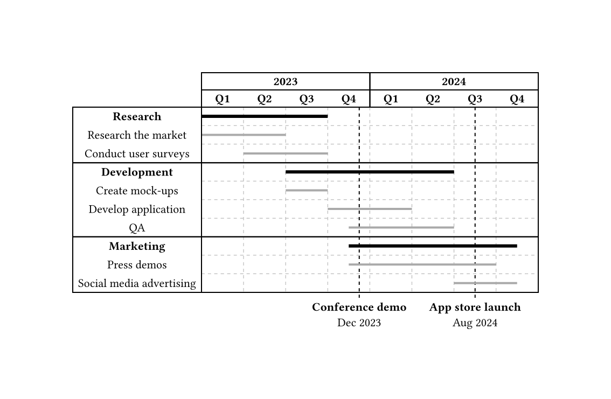

# Timeliney

Create Gantt charts automatically with Typst!

Here's a fully-featured example:

```typst
#import "@preview/timeliney:0.2.1"

#timeliney.timeline(
  show-grid: true,
  {
    import timeliney: *
      
    headerline(group(([*2023*], 4)), group(([*2024*], 4)))
    headerline(
      group(..range(4).map(n => strong("Q" + str(n + 1)))),
      group(..range(4).map(n => strong("Q" + str(n + 1)))),
    )
  
    taskgroup(title: [*Research*], {
      task("Research the market", (0, 2), style: (stroke: 2pt + gray))
      task("Conduct user surveys", (1, 3), style: (stroke: 2pt + gray))
    })

    taskgroup(title: [*Development*], {
      task("Create mock-ups", (2, 3), style: (stroke: 2pt + gray))
      task("Develop application", (3, 5), style: (stroke: 2pt + gray))
      task("QA", (3.5, 6), style: (stroke: 2pt + gray))
    })

    taskgroup(title: [*Marketing*], {
      task("Press demos", (3.5, 7), style: (stroke: 2pt + gray))
      task("Social media advertising", (6, 7.5), style: (stroke: 2pt + gray))
    })

    milestone(
      at: 3.75,
      style: (stroke: (dash: "dashed")),
      align(center, [
        *Conference demo*\
        Dec 2023
      ])
    )

    milestone(
      at: 6.5,
      style: (stroke: (dash: "dashed")),
      align(center, [
        *App store launch*\
        Aug 2024
      ])
    )
  }
)
```



## Installation
Import with `#import "@preview/timeliney:0.2.1"`. Then, call the `timeliney.timeline` function.

## Documentation
See [the manual](manual.pdf)!

## Changelog

### 0.2.1
- Update CeTZ to 0.3.2 (@JKRhb)

### 0.2.0
- Update CeTZ to 0.3.1 (@Bahex)
- Fix deprecation warnings (@Bahex)
- Fix header height calculation (@tonyddg)

### 0.1.0
- Update CeTZ to 0.2.2 (@LordBaryhobal)
- Add offset parameter
