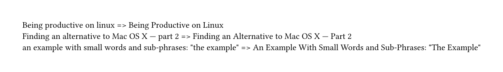

# titleize

Small wrapper around the [titlecase](https://crates.io/crates/titlecase) library to convert text to title case.
It follows the [rules defined by John Gruber](https://daringfireball.net/2008/05/title_case).
For more details, refer to the library.

```typst
#import "@preview/titleize:0.1.0": titlecase

#set page(width: auto, height: auto, margin: 1cm)

#for s in (
  "Being productive on linux",
  "Finding an alternative to Mac OS X — part 2",
  "an example with small words and sub-phrases: \"the example\"",
) [
  #s => #titlecase(s) \
]
```

