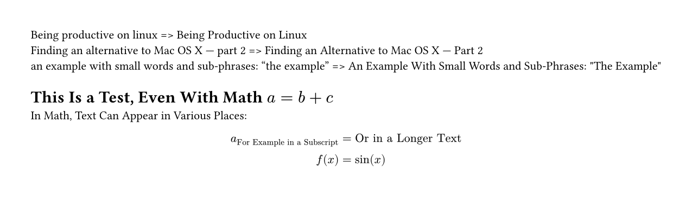

# titleize

Small wrapper around the [titlecase](https://crates.io/crates/titlecase) library to convert text to title case.
It follows the [rules defined by John Gruber](https://daringfireball.net/2008/05/title_case).
For more details, refer to the library.

`titlecase` applies a show rule, that by default transforms every string of at least four characters.
This limit can be changed with the `limit` parameter.
Especially with equations, the results can be a bit unpredictable, so proceed with care.

```typst
#import "@preview/titleize:0.1.1": titlecase

#for s in (
  "Being productive on linux",
  "Finding an alternative to Mac OS X — part 2",
  [an example with small words and sub-phrases: "the example"],
) [
  #s => #titlecase(s) \
]

#let debug-print(x) = {
  if type(x) == content {
    let fields = x.fields()
    let func = x.func()
    [
      #repr(func)
      #for (k, v) in fields [
        - #k: #debug-print(v)
      ]
    ]
  } else {
    if type(x) == array [
      array
      #for y in x [
        - #debug-print(y)
      ]
    ] else [
      #repr(type(x)) (#repr(x))
    ]
  }
}

#show: titlecase

= This is a test, even with math $a = b + c$

In math, text can appear in various places:

$
  a_"for example in a subscript" &= "or in a longer text" \
  f(x) &= sin(x)
$
```

