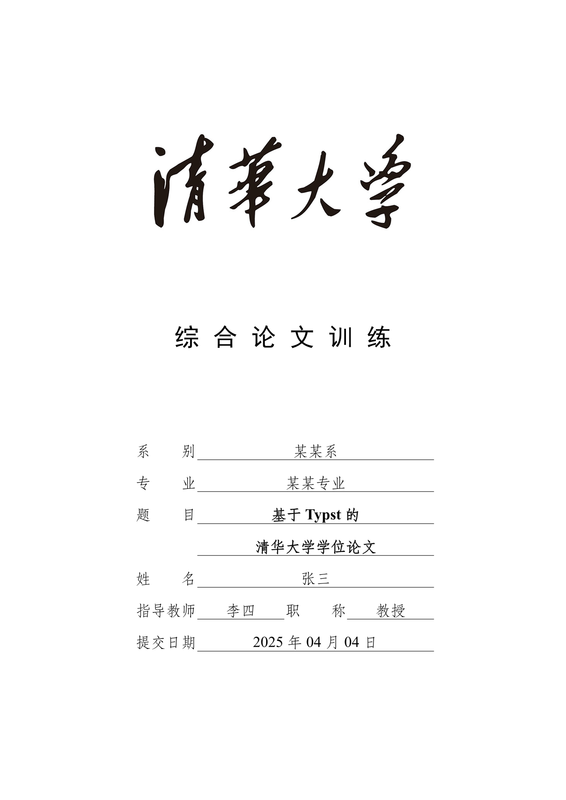

# TnTT: Typst and Tsinghua University Template

> **TnTT** is **N**ot a **T**ex **T**hesis **T**emplate for **T**singhua university...

简体中文 | [English](#tntt-1)

## 介绍

TnTT 是 Tntt is Not a Tex Thesis Template for Tsinghua university 的递归缩写。一个基于 [Typst](https://typst.app) 的非官方清华大学学位论文模板。

**目前仅支持本科生的综合论文训练。**

## 使用

您可以在 [Typst Web](https://typst.app) 应用程序中使用此模板，方法是单击仪表板上的“Start from template”并搜索 `tntt`，或单击 [此处](https://typst.app/app?template=tntt&version=0.1.0) 快速创建一个项目。

或者，你也可以使用 `typst` 命令行工具来创建一个新的项目：

```bash
$ typst init @preview/tntt
```

当然，您也可以在任意 typst 文件中添加

```typst
#import "@preview/tntt:0.1.0": define-config
```

来导入此模板。

## 预览



## 致谢

非常感谢 [OrangeX4](https://github.com/OrangeX4) 为南京大学学位论文 Typst 模板 [modern-nju-thesis](https://typst.app/universe/package/modern-nju-thesis) 所做的贡献，本项目移植自由 OrangeX4 及 nju-lug 维护的 modern-nju-thesis 模板，感谢他们所作工作。

移植过程中主要参考了 [清华大学学位论文 Word 模板](https://github.com/fatalerror-i/ThuWordThesis) 和 [清华大学学位论文 LaTeX 模板](https://github.com/tuna/thuthesis)，在此表达感谢。

感谢 [纸叶姐姐](https://github.com/Myriad-Dreamin) 开发的 [Tinymist](https://github.com/Myriad-Dreamin/tinymist) 工具。

## 许可证

模板源代码采用 [MIT](LICENSE) 许可证分发，您可以自由使用、修改和分发，但不提供任何担保。

> [!IMPORTANT]
>
> 本项目中包含清华大学校徽与校名的图形文件，用于制作制作本科生综合论文训练封面。这些图形取自 [清华大学视觉形象系统](https://vi.tsinghua.edu.cn/)，项目维护者未进行任何修改。
>
> **请注意：相关图形与文字都是清华大学的注册商标，除此模板外，请勿用于任何其他用途。**

---

# TnTT

English | [简体中文](#tntt)

## Introduction

TnTT is a recursive acronym for "Tntt is Not a Tex Thesis Template for Tsinghua University". An unofficial Tsinghua University thesis template based on [Typst](https://typst.app).

**Currently, it only supports the Comprehensive Thesis Training for undergraduates.**

## Usage

You can use this template in the [Typst Web](https://typst.app) application by clicking "Start from template" on the dashboard and searching for `tntt`, or click [here](https://typst.app/app?template=tntt&version=0.1.0) to quickly create a project.

Alternatively, you can use the `typst` command-line tool to create a new project:

```bash
$ typst init @preview/tntt
```

Of course, you can also import this template in any Typst file by adding:

```typst
#import "@preview/tntt:0.1.0": define-config
```

## Preview


## Acknowledgements

Special thanks to [OrangeX4](https://github.com/OrangeX4) for their contributions to the Nanjing University thesis template [modern-nju-thesis](https://typst.app/universe/package/modern-nju-thesis). This project is adapted from the modern-nju-thesis template maintained by OrangeX4 and nju-lug. We appreciate their work.

During the porting process, we mainly referenced the [Tsinghua University Thesis Word Template](https://github.com/fatalerror-i/ThuWordThesis) and [Tsinghua University Thesis LaTeX Template](https://github.com/tuna/thuthesis). Our gratitude goes to their contributors.

Thanks to [Myriad-Dreamin](https://github.com/Myriad-Dreamin) for developing the [Tinymist](https://github.com/Myriad-Dreamin/tinymist) tool.

## License

The template source code is distributed under the [MIT](LICENSE) license. You are free to use, modify, and distribute it without any warranty.

> [!IMPORTANT]
>
> This project contains the Tsinghua University emblem and name graphics for creating the Comprehensive Thesis Training cover for undergraduates. These graphics are obtained from the [Tsinghua University Visual Identity System](https://vi.tsinghua.edu.cn/) without any modification by the maintainers.
>
> **Please note: The related graphics and text are registered trademarks of Tsinghua University. Except for this template, they should not be used for any other purposes.**
