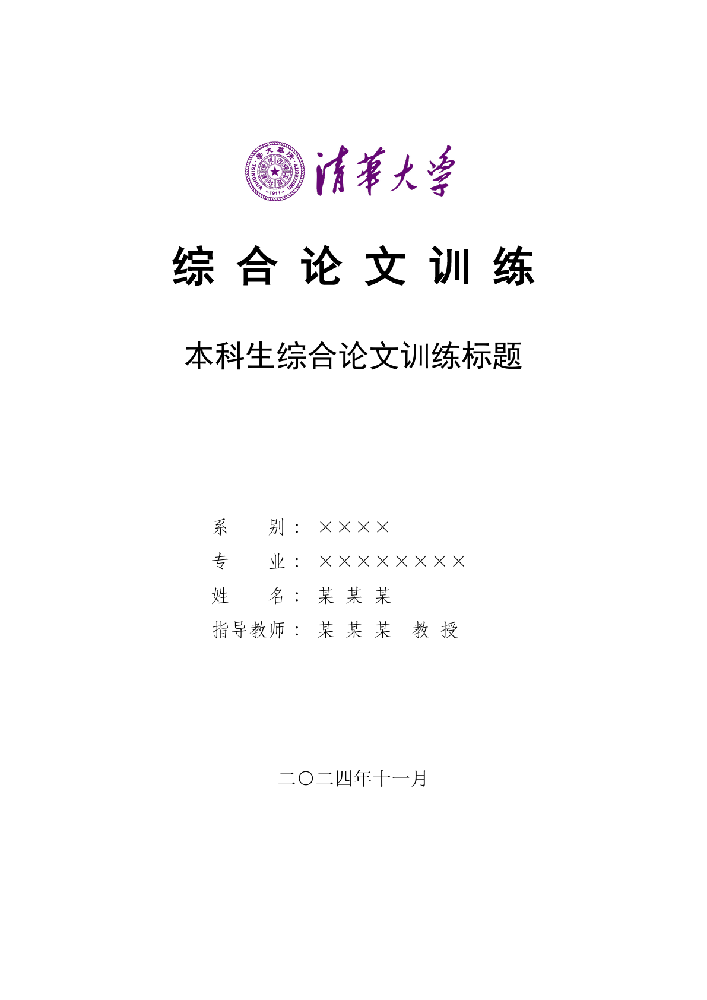

# TnTT: Typst & Tsinghua University Template

> **TnTT** is **N**ot a **T**ex **T**hesis **T**emplate for **T**singhua university...

简体中文 | [English](#tntt-typst--tsinghua-university-template-1)

## 介绍

TnTT 是 Tntt is Not a Tex Thesis Template for Tsinghua university 的递归缩写。一个基于 [Typst](https://typst.app) 的**非官方**清华大学学位论文模板。

**目前仅支持本科生的综合论文训练。**

## 使用

您可以在 [Typst Web](https://typst.app) 应用程序中使用此模板，方法是单击仪表板上的“Start from template”并搜索 `tntt`，或单击 [此处](https://typst.app/app?template=tntt&version=0.3.0) 快速创建一个项目。

或者，你也可以使用 `typst` 命令行工具来创建一个带有模板的新项目：

```bash
typst init @preview/tntt
```

当然，您也可以在任意 typst 文件中添加

```typst
#import "@preview/tntt:0.3.0"
#import tntt: define-config
```

来导入此模板。

## 导引

如果您对 [typst](https://typst.app/docs) 不熟悉，请参阅 [中文社区导航](https://typst.dev) 获得快速指引。推荐使用 [tinymist](https://github.com/Myriad-Dreamin/tinymist) 或 [webapp](https://typst.app) 来编辑项目，对于重要的论文材料，您应该及时备份或进行版本管理来避免内容丢失。

在开始编辑之前，请简单阅读如下的字体配置说明：

### 字体配置

本模板主要服务于中文排版，因而内置了常用的中文字族信息，即：

- SongTi: 宋体，正文字体，通常对应西文中的衬线字体
- HeiTi: 黑体，标题字体，通常对应西文中的无衬线字体
- KaiTi: 楷体，用于说明性文本和主观性的表达
- FangSong: 仿宋，通常用于注释、引文及权威性阐述
- Mono: 等宽字体，对于代码，会优先使用此项，推荐中文字体使用黑体或楷体，或者一些流行的中文等宽字体
- Math: 数学字体，中文字体默认使用楷体

对于 win10/11 用户或安装了对应字体的 Linux 用户，相应的字体配置为 `SimSun/NSimSun`、`SimHei`、`KaiTi`、`STFangSong`，对于 macOS 用户，相应的字体配置为 `Songti SC`、`Heiti SC`、`Kaiti SC`、`Fangsong SC`，此外，您也可以用 `Noto Serif CJK`、`Noto Sans CJK` 等来替代宋体和黑体。

本模板内置了对 win10/11 字体的相关字体配置。

对于使用 webapp 的用户，由于其默认不提供内置的上述字体，因而需要手动将字体文件上传到 webapp 中，您可以在 [release 页面](https://github.com/chillcicada/tntt/releases/)下找到提供的字体包并解压上传到您的项目中，webapp 会自动识别字体文件。

---

对于更多的使用说明，已经内置于[模板](template/thesis.typ)中，推荐从模板创建，获得更好的阅读体验。

## 预览



## 致谢

非常感谢 [OrangeX4](https://github.com/OrangeX4) 为南京大学学位论文 Typst 模板 [modern-nju-thesis](https://typst.app/universe/package/modern-nju-thesis) 所做的贡献，本项目移植自由 OrangeX4 及 nju-lug 维护的 modern-nju-thesis 模板，感谢他们所作工作。

移植过程中主要参考了 [清华大学学位论文 Word 模板](https://github.com/fatalerror-i/ThuWordThesis) 和 [清华大学学位论文 LaTeX 模板](https://github.com/tuna/thuthesis)，在此表达感谢。

感谢 [纸叶姐姐](https://github.com/Myriad-Dreamin) 开发的 [Tinymist](https://github.com/Myriad-Dreamin/tinymist) 工具。

## 相关资源

- [清华大学学位论文 Word 模板](https://github.com/fatalerror-i/ThuWordThesis)
- [清华大学学位论文 LaTeX 模板](https://github.com/tuna/thuthesis)

## 许可证

模板源代码采用 [MIT](LICENSE) 许可证分发，您可以自由使用、修改和分发，但不提供任何担保。

> [!IMPORTANT]
>
> 本项目中包含清华大学校徽与校名的图形文件，用于制作制作本科生综合论文训练封面。这些图形取自 [清华大学视觉形象系统](https://vi.tsinghua.edu.cn/)，项目维护者未进行任何修改。
>
> **请注意：相关图形与文字都是清华大学的注册商标，除此模板外，请勿用于任何其他用途。**

---

# TnTT: Typst & Tsinghua University Template

English | [简体中文](#tntt-typst--tsinghua-university-template)

## Introduction

TnTT is a recursive acronym for "Tntt is Not a Tex Thesis Template for Tsinghua University". An unofficial Tsinghua University thesis template based on [Typst](https://typst.app).

**Currently, it only supports the Comprehensive Thesis Training for undergraduates.**

## Usage

You can use this template in the [Typst Web](https://typst.app) application by clicking "Start from template" on the dashboard and searching for `tntt`, or click [here](https://typst.app/app?template=tntt&version=0.3.0) to quickly create a project.

Alternatively, you can use the `typst` command-line tool to create a new project with template:

```bash
typst init @preview/tntt
```

Of course, you can also import this template in any Typst file by adding:

```typst
#import "@preview/tntt:0.3.0"
#import tntt: define-config
```

## Instructions

If you are unfamiliar with [typst](https://typst.app/docs), please refer to the [Chinese community navigation](https://typst.dev) for quick guidance. It is recommended to use [tinymist](https://github.com/Myriad-Dreamin/tinymist) or the [webapp](https://typst.app) to edit projects. For important thesis materials, you should promptly back up or implement version control to avoid content loss.

Before starting your edits, please briefly read the following font configuration instructions:

### Font Configuration

This template primarily serves Chinese typesetting and includes built-in configurations for common Chinese font families:

- **SongTi**: SongTi typeface (serif), the main body font, typically corresponding to Western serif fonts.
- **HeiTi**: HeiTi typeface (sans-serif), used for headings, analogous to Western sans-serif fonts.
- **KaiTi**: KaiTi typeface, used for explanatory text and subjective expressions.
- **FangSong**: FangSong typeface, typically used for annotations, citations, and authoritative explanations.
- **Mono**: Monospace font, prioritized for code. It is recommended to use Hei or Kai typefaces for Chinese characters, or popular Chinese monospace fonts.
- **Math**: Math font, with the default Chinese font set to KaiTi.

For Windows 10/11 users or Linux users with corresponding fonts installed, the font configurations are `SimSun/NSimSun`, `SimHei`, `KaiTi`, and `STFangSong`. For macOS users, the configurations are `Songti SC`, `Heiti SC`, `Kaiti SC`, and `Fangsong SC`. Additionally, you may use `Noto Serif CJK` or `Noto Sans CJK` as alternatives for Song and Hei typefaces.

This template includes built-in font configurations optimized for Windows 10/11 systems.

For users of the Typst webapp, since it does not provide the above fonts by default, you need to manually upload the font files to your project. You can find the provided font package in the [release page](https://github.com/chillcicada/tntt/releases/), extract and upload it to your project. The webapp will automatically recognize the font files.

---

For further usage instructions, please refer to the [template](template/thesis.typ). It is recommended to start from the template for an improved reading experience.

## Preview


## Acknowledgements

Special thanks to [OrangeX4](https://github.com/OrangeX4) for their contributions to the Nanjing University thesis template [modern-nju-thesis](https://typst.app/universe/package/modern-nju-thesis). This project is adapted from the modern-nju-thesis template maintained by OrangeX4 and nju-lug. We appreciate their work.

During the porting process, we mainly referenced the [Tsinghua University Thesis Word Template](https://github.com/fatalerror-i/ThuWordThesis) and [Tsinghua University Thesis LaTeX Template](https://github.com/tuna/thuthesis). Our gratitude goes to their contributors.

Thanks to [Myriad-Dreamin](https://github.com/Myriad-Dreamin) for developing the [Tinymist](https://github.com/Myriad-Dreamin/tinymist) tool.

## Relevant Resources

- [Tsinghua University Thesis Word Template](https://github.com/fatalerror-i/ThuWordThesis)
- [Tsinghua University Thesis LaTeX Template](https://github.com/tuna/thuthesis)

## License

The template source code is distributed under the [MIT](LICENSE) license. You are free to use, modify, and distribute it without any warranty.

> [!IMPORTANT]
>
> This project contains the Tsinghua University emblem and name graphics for creating the Comprehensive Thesis Training cover for undergraduates. These graphics are obtained from the [Tsinghua University Visual Identity System](https://vi.tsinghua.edu.cn/) without any modification by the maintainers.
>
> **Please note: The related graphics and text are registered trademarks of Tsinghua University. Except for this template, they should not be used for any other purposes.**
