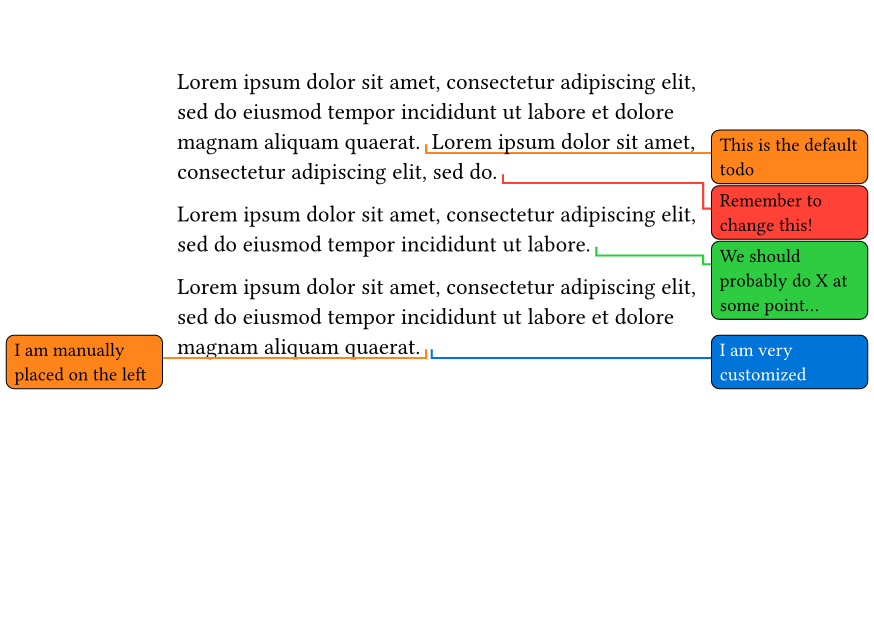
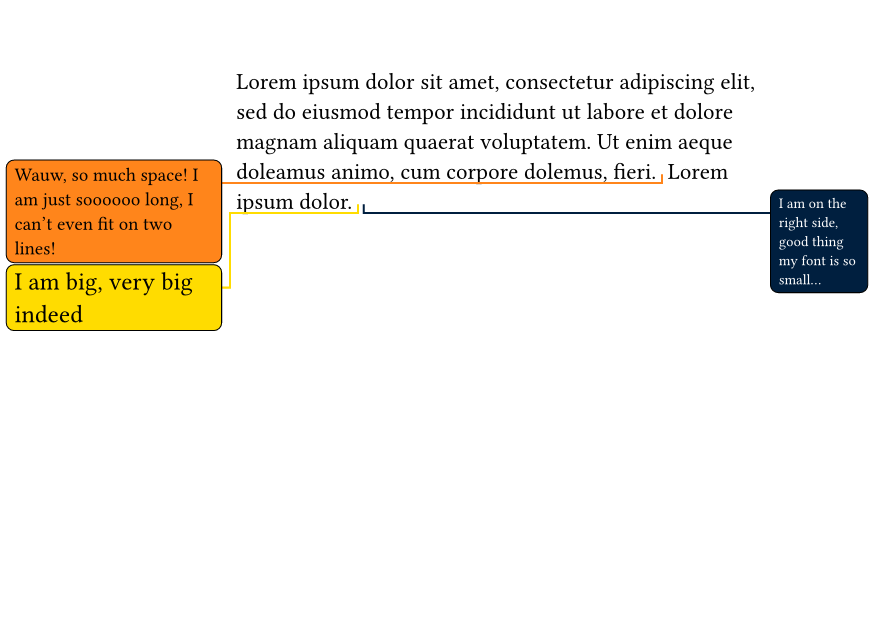
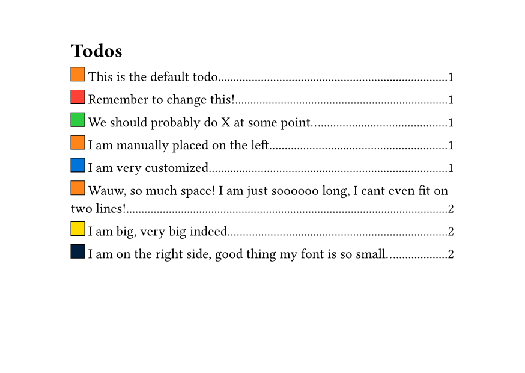

# Todonotes

This package is inspired by the [drafting](https://typst.app/universe/package/drafting) package, whilst trying to mimic
the [todonotes](https://ctan.org/pkg/todonotes) LaTeX package, with a todo outline,
and placement on pages with inside / outside margins.

## Usage

Import the package

```typ
#import "@preview/todonotes:0.1.0": todo, todo-outline
```

The `todo` function takes the following parameters

- `side`: `auto` | `left` | `right` - The side of the page to display the note.
Auto selects the side with the largest margin available, and right if they are equal. (**default**: `auto`)
- `font-size`: `length` - Font size of the text in the todo (**default**: `9pt`)
- `font-color`: `color` | `gradient` - Color of the font (**default**: `black`)
- `color`: `color` | `gradient` - Color of the box and line (**default**: `orange`)
- `body`: `content` - Body of the todo

The `todo-outline` function takes a single optional argument, specifying the title of the outline.
As the name suggests it prints an outline of all the todos in the document, along with a box with the color of the todo.

### `.with` Macros

Create different todos for different authors / purposes.

```typ
#set page("a6", flipped: true, margin: (x: 30mm))
#let urgent = todo.with(color: red)
#let todo-later = todo.with(color: green)
```

We can then use them like this

```typ
#lorem(20)
#todo[This is the default todo]
#lorem(10)
#urgent[Remember to change this!]

#lorem(15)
#todo-later[We should probably do X at some point...]

#lorem(20)
#todo[side: left](I am manually placed on the left)
#todo[color: blue, font-color: white](I am very customized)
```



### Uneven Margins

It even works with inside / outside margins.

```typ
#set page(margin: (inside: 20mm, outside: 40mm))

#lorem(30)
#todo[Wauw, so much space! I am just soooooo long, I can't even fit on two lines!]
#lorem(3)
#todo[side: right, font-size: 7pt](I am on the right side, good thing my font is so small...)
```



### Outline

We can also create an outline of the document, optionally supplying custom title

```typ
#todo-outline(title: "Todos")
```



## Compiler Warnings

Please note, that the compiler will give a warning if 4 or more notes overlap,
due to the dynamic placement of the notes, combined with Typst's iterative typesetting.
