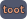

#  Toot: Typst Opinionated Online Tutorials

This is a tool to build online tutorials for Typst packages.
It allows you to include examples of your package that are automatically
rendered to SVG files with optional light/dark mode support.

Toot consists of a Typst template and a Julia CLI app that work together to
create a set of HTML files, a bit similar to the output of `mdbook`.

## Getting started
First, we set up a new Typst project using the template.
This should happen at the root level of your Typst package.
```sh
typst init @preview/toot
cd toot
```
You will find a `src` folder with three files in your current path:
* `SETUP.typ`:
  This is where you configure your toot output.
  See below for configuration options.
* `index.typ`:
  The "landing page" of your tutorial.
  It also serves as a template for all further pages you would like to produce.
  See below for details.
* `OUTLINE.typ`:
  This is similar to the `SUMMARY.md` file you might know from `mdbook`.
  Every `#link` in this file defines a page that will be included in the final
  result.
  Note that the code contains links to `.typ` files but they will appear as links
  to HTML files on the web page.

## Configuration in `SETUP.typ`
If you follow the instructions above, your `SETUP.typ` file should call the
`setup-toot` function.
It accepts the following keyword arguments:
* `name`: The name of the package you want to create a toot for (`string` or
  `content`).
* `universe-url`: The URL of your package's page on the Typst Universe (a
  `string` of the form `"https://typst.app/universe/package/..."`).
* `root`: By default, toot expects the built website to be served directly from
  your domain (i.e. `src/index.typ` will result in `your-domain.org/index.html`)
  but you can set a different path.
  If you set `root` to `"some/nested/path"`, the landing page will be
  `your-domain.org/some/nested/path/index.html`.
  This is important for cross links (see below) and static assets.
* `styling`: A `dict` containing styling options.
  Currently only respects the key `accent-color` determining how decorative
  elements on the website are colored (default `gray`).
* `outline`: Any content that will be shown on the left hand side navigation
  menu. There shouldn't be a reason for this to be anything else than
  `include "OUTLINE.typ"`.
* `snippets`: An `array` of snippets that can be used in `#example`s (see
  below).
  Each snippet must be a `dict` with a `trigger` and an `expansion` entry.
  Earlier snippets can have extensions containing triggers of later snippets.
  There is a built-in snippet with trigger `"// LIGHT DARK"` that inserts code
  handling light and dark styling of examples.
* `general-head-extra`: Arbitrary HTML content that is supposed to be added
  to the `<head> </head>` of every produced HTML page.

## Creating a page
Every Typst source file for a page should start with
```typ
#import "/SETUP.typ": *
#set document(title: [Title of this page])
#show: toot-page
```
By using `#set document(title: ...)`, we make sure that the title also appears
in the HTML `<title> </title>`.

The `#show: toot-page` adds the necessary scaffold for the web page.
You can write `#show: toot-page.with(head-extra: ...)` to add some HTML content
to the `<head> </head>` of this page.

## Adding examples
Use the `#example` function to add an example of using your package to a page.
It will be accompanied by an image showing its result.
````typ
#example(
  ```typ
  // START
  You can use the #fancy-feature(42) from my package.
  ```
)
````

Often, your examples will include some boilerplate that might be distracting
from your pedagogical intention.
You can control which lines are shown using `// START` and `// STOP` markers
(which are hidden themselves):
````typ
#example(
  ```typ
  #some-invisible-setup(a: 13, b: <foo>)
  // START
  This line will appear on the website.
  // STOP
  This will be hidden again
  // START
  This will be shown.
  ```
)
````
As you can see, you can use arbitrary many `// START` and `// STOP`.
All lines before the first `// START` will be hidden.

Other than that, you can make use of the snippets you defined in
`src/SETUP.typ`.
This avoids repetitive code and the need to potentially update, say, the font
for every example.
It also makes sense to have a snippet setting the page size unless you really
want A4 paper sized example images.

`#example` also has some optional keyword arguments:
* `columns`: If your example produces multiple pages, here you can control how
  many of them should be displayed next to eachother (default `1`).
* `border-color`: The `color` of the border to draw around the image (default
  `gray`).
* `hide-code`: Whether or not to hide the code on the website (default `false`).
* `hide-output`: Whether or not to hide the output on the website (default
  `false`).

## Cross linking
For cross linking, you can use `#i-link`.
It works like the standard `#link`, i.e.
`#i-link("path/to/file.typ")[click here]` but the destination will be modified
such that
* `.typ` becomes `.html` and
* if necessary, it is prefixed by the `root` (as configured in `src/SETUP.typ`,
  see above).

## Building the website
While writing the tutorial, you might want to rely on Typst's speedy live
preview.
It won't give you the full experience but running
```sh
typst watch --features=html --format=html src/your-file.typ
```
offers a decent preview.
Most notably, examples will not be rendered and you cannot navigate to other
pages of the toot.

To actually build the whole thing, you have to run the `toot-builder` Julia CLI.
Install it like this:
```sh
julia -e 'import Pkg; Pkg.Apps.add(url="https://codeberg.org/a5s/toot")'
```
Within your toot folder (the one created by `typst init @preview/toot`) run
```sh
toot-builder build
```
which produces a `build` directory (if you prefer a different name, use the
`--build-dir="other name"` argument) you can then deploy.
For a live view use
```sh
toot-builder serve
```

`toot-builder` reads `src/OUTLINE.typ` (or another file defined by the
`--outline=src/my-outline.typ` argument) and identifies all Typst source files
linked to.
Only those will be compiled to HTML and included in the build.
Conversely, that means that you can exclude draft pages from the produced
website by not adding them to the outline.

### Optional dependencies
`toot-builder` calls the following programs if available:
* [`scour`](https://pypi.org/project/scour/): minifies rendered example SVGs
* [`minhtml`](https://crates.io/crates/minify-html): minifies the produced HTML

You can opt out of these tools being run by adding the `--no-minify` option.
