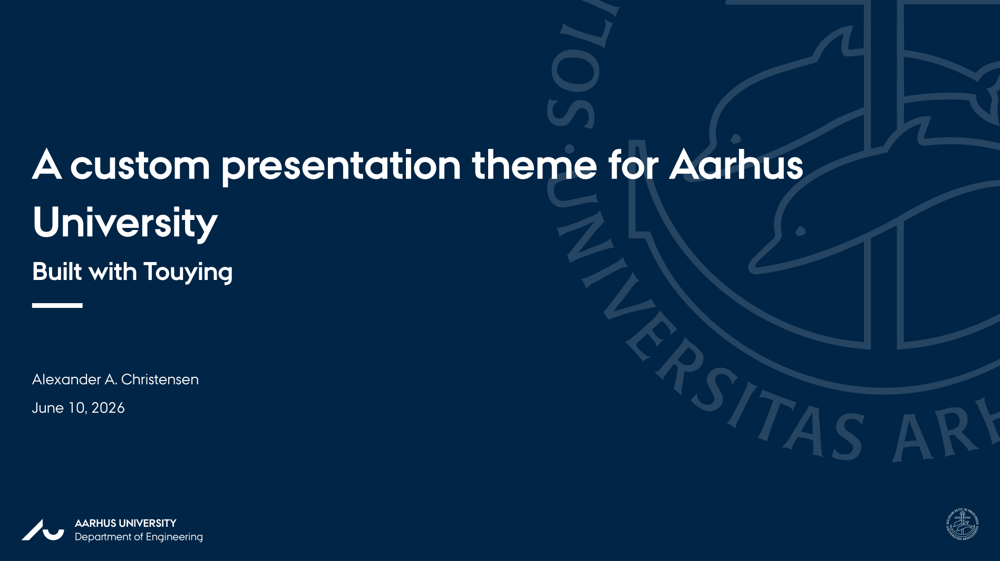
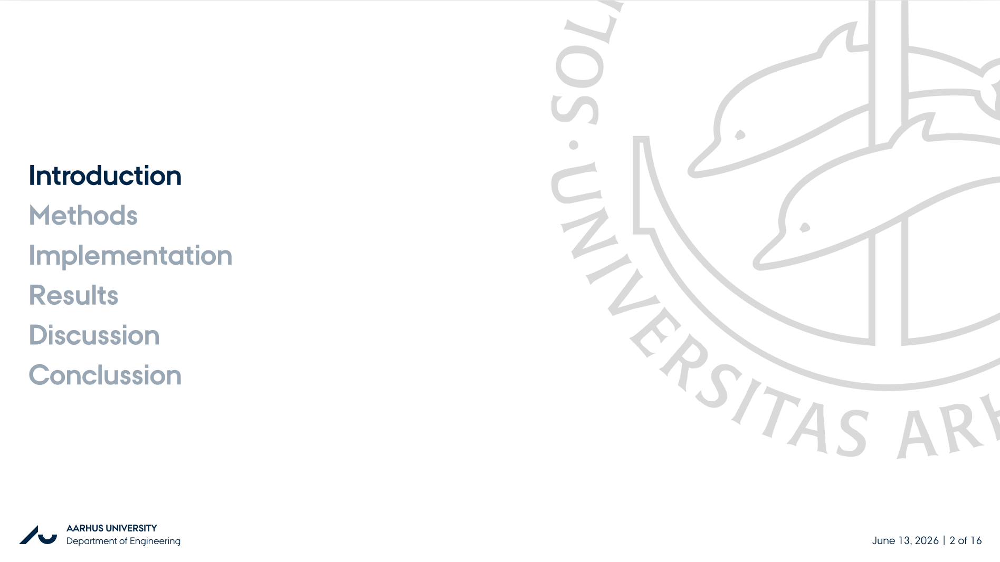
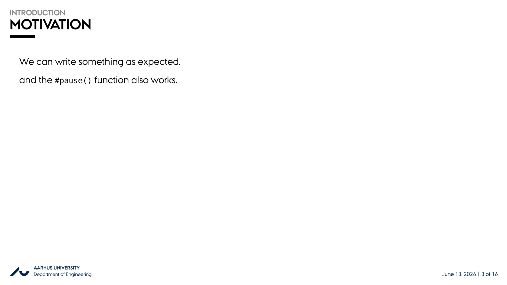

# touying-au-community

A [Typst](https://typst.app/) package for creating presentation at Aarhus University,
built on top of [Touying](https://github.com/johannes-wolf/cetz).

```typ
#import "@preview/touying-au-community:0.2.0": *

#show: touying-au-community.with(
  aspect-ratio: "16-9",
  config-info(
    title: [A custom presentation theme for Aarhus University],
    subtitle: [Built with Touying],
    author: [John Doe],
    date: datetime.today(),
    institution: [Aarhus University],
    department: [Department of Engineering],
  ),
)
```

**Note:** For this package to work you need to provide it with the AU fonts. You can download these [here](https://medarbejdere.au.dk/en/administration/communication/guidelines/guidelinesforfonts/downloadfonts/). (You will need both the *AU Passata* and *AU Logo* font).

## Examples

<picture>
  
</picture>

<picture>
  
</picture>

<picture>
  
</picture>

<picture>
  
</picture>

## Configuration

| Option | Description | Default value |
| --------------- | --------------- | --------------- |
| `include-sections` | Include section titles in the slide heading | `true` |
| `include-agenda` | Include the agenda slide before each new section | `true` |

## Change log

### 0.1.0

- Initial release

### 0.2.0

- Added configuration for figures
- Added configuration for tables
- Added section title to slide heading
- Added agenda slide
- Added color variants
