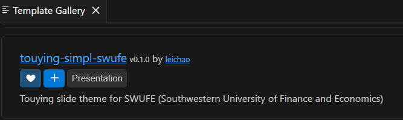
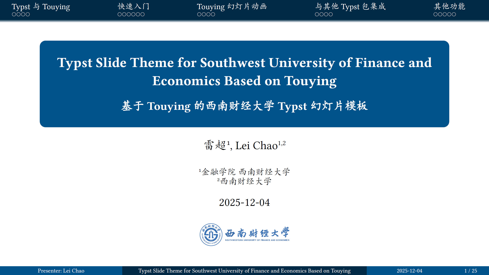

[](https://typst.app/universe/package/touying-simpl-swufe)
[](https://github.com/leichaoL/touying-simpl-swufe/blob/main/LICENSE)

# [English](README.en.md) | [中文说明](README.md)
# Typst Touying Template for Southwestern University of Finance and Economics (SWUFE)

A Typst version of the [SWUFE Beamer template](https://www.overleaf.com/latex/templates/swufe-beamer-theme/hysqbvdbpnsm).

Inspired by [Touying Slide Theme for Beihang University](https://github.com/Coekjan/touying-buaa).

## Quick Start (Official Package)

### Online Editing

Typst provides an official Web App that supports online editing like Overleaf. Here is an [online usage example](https://typst.app/project/rge4aZ0GFg5Ms7vZo51RvI) of this template.

In [Typst Web App](https://typst.app), select `Start from template` to create a new project, search for `touying-simpl-swufe` to use.


The Web App does not have the fonts installed on local Windows or macOS systems, so there may be differences in fonts. For details, see [Font Guidance](#font-guidance).

### Local Use

#### VSCode Local Editing (Recommended)

1. Install the [Tinymist Typst plugin](https://marketplace.visualstudio.com/items?itemName=myriad-dreamin.tinymist) in VSCode.
2. Press `Ctrl+Shift+P` or `F1` to open the command palette, type `Typst: Show available Typst templates (gallery) for picking up a template`, search for `touying-simpl-swufe` in the popup window, click the ❤ button to favorite it, and click the + button to use the template.
3. VSCode will automatically create and open a new project. Open the `main.typ` file and press `Ctrl+K V` for live editing and preview.
4. (Optional) Install and use the [Typst-figure-pasteTools](https://marketplace.visualstudio.com/items?itemName=yuzhong.typst-figure-pastetools) plugin and [Typst-table-paste](https://github.com/leichaoL/typst-table-paste) plugin, which allow you to directly copy and paste images and tables like in Word or PPT, greatly improving the Typst experience.




#### Terminal

Install and initialize the project via the Typst official package manager:

```console
$ typst init @preview/touying-simpl-swufe
Successfully created new project from @preview/touying-simpl-swufe:<latest>
To start writing, run:
> cd touying-simpl-swufe
> typst watch main.typ
```

## Font Guidance

To achieve the same display effect as the example, this template recommends using **KaiTi (楷体)** as the Chinese font.

- **Windows systems**: KaiTi is a built-in system font and can be used directly.
- **macOS systems**: Will typically use the built-in "Kaiti SC" (楷体-简) directly.
- **Linux systems**: You need to manually install the KaiTi font.

**For [Typst Web App](https://typst.app) users**: The template defaults to using `Noto Serif CJK SC` as the Chinese font in the Web App. To ensure the display effect, it is recommended to upload the KaiTi font file; the template will automatically use KaiTi after uploading.


## Quick Start (From GitHub)

### Method 1: Direct File Copy

Copy [`lib.typ`](lib.typ) to your project root directory, then import it at the top of your Typst file:

```typst
#import "/lib.typ": *
```

### Method 2: Local Package Installation

Clone from GitHub and install as a local package for reuse in multiple projects (refer to [Typst documentation](https://github.com/typst/packages/blob/main/README.md)):

```bash
git clone https://github.com/leichaol/touying-simpl-swufe.git {data-dir}/typst/packages/local/touying-simpl-swufe/0.2.0
```

Where `{data-dir}` is:

- Linux: `$XDG_DATA_HOME` or `~/.local/share`
- macOS: `~/Library/Application Support`
- Windows: `%APPDATA%`, i.e., `C:/Users/<username>/AppData/Roaming`

Then import in your document:

```typst
#import "@local/touying-simpl-swufe:0.2.0": *
```

## Examples



See the [`examples`](examples) directory for more examples.

### Compiling Examples

To compile examples locally:

```console
$ typst compile ./examples/main.typ --root .
```

This will generate `./examples/main.pdf`.

## Template Slide Functions and Main Configuration Options

### Template Slide Functions
The template provides a series of functions for generating presentation slides, including:
- `title-slide`: Used to generate the title page
- `outline-slide`: Used to add a table of contents page
- `focus-slide`: Used for a solid-color background focus page
- `ending-slide`: Used to generate an ending acknowledgment page without a title

### Other Functions

- `tblock`: Used to generate a theorem box with slight shadow
- `shadow-figure`: Used to generate images with shadow effects

For usage methods, refer to [main.typ](examples/main.typ) in the examples directory.

### Main Configuration Options


```typst
#show: swufe-theme.with(
  // Aspect ratio of generated slides, can be set to "4-3" or "16-9"
  aspect-ratio: "16-9",
  // Language setting, "zh" for Chinese, "en" for English, affects text display for table of contents and automatic numbering
  lang: "zh",
  // Font settings, the example below sets Libertinus Serif as the English font and KaiTi as the Chinese font, with fallback fonts if not available
  font: ((name: "Libertinus Serif", covers: "latin-in-cjk"), "KaiTi", "Kaiti SC", "楷体", "Noto Serif CJK SC"),

  // Basic information
  config-info(
    title: [Typst Slide Theme for Southwest University of Finance and Economics Based on Touying],
    subtitle: [基于Touying的西南财经大学Typst幻灯片模板],
    // Title displayed in the footer
    short-title: [Typst Slide Theme for SWUFE Based on Touying],
    authors: [雷超#super("1"), Lei Chao#super("1,2")],
    // Author displayed in the footer
    author: [Presenter: Lei Chao],
    date: datetime.today(),
    institution: ([#super("1")金融学院 西南财经大学], [#super("2")西南财经大学]),
    // Image displayed on the home page
    banner: image("../assets/swufebanner.svg"),
  ),

  // Template theme color configuration
  config-colors(
    primary: rgb(1, 83, 139),
    primary-dark: rgb(0, 42, 70),
    secondary: rgb(255, 255, 255),
    neutral-lightest: rgb(255, 255, 255),
    neutral-darkest: rgb(0, 0, 0),
  ),
)
```

## Copyright Disclaimer

The logos in this theme are sourced from [swufe-logo](https://github.com/ChenZhongPu/swufe-logo) by [ChenZhongPu](https://github.com/ChenZhongPu). Thanks to the author for providing the logo resource.

These logos are the property of Southwestern University of Finance and Economics. Their use here is for academic typesetting purposes only and does not represent official authorization or endorsement by the university.

The template author does not own the copyright to these logos and does not claim any related rights.

For official use or redistribution of the logos, please contact [Southwestern University of Finance and Economics](https://www.swufe.edu.cn/) directly.

## License

Licensed under the [MIT License](LICENSE).
