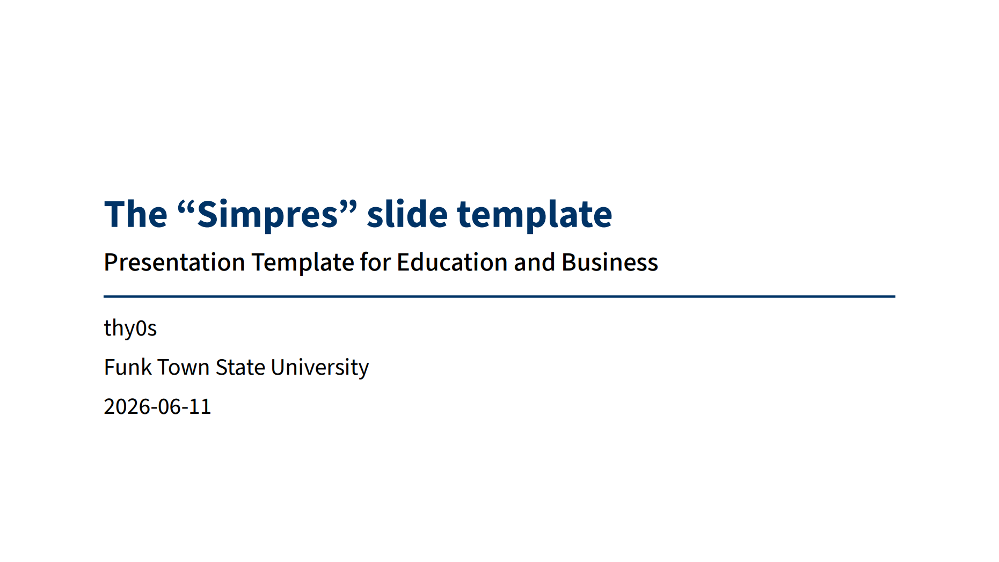

# touying-simpres

[](https://github.com/thy0s/touying-simpres/actions/workflows/build.yml)
[](https://github.com/thy0s/touying-simpres)
[](https://opensource.org/license/mit)

"Simpres" slide template for the [typst](https://typst.app) presentation package [touying](https://touying-typ.github.io). 

It uses the *Source Sans 3* font as the default content font, which can be downloaded [here](https://github.com/adobe-fonts/source-sans). *Source Code 3* is the default font for any content of type *raw*. It can be downloaded [here](https://github.com/adobe-fonts/source-code-pro).


You can either initialize the template in a new folder with:
```bash
typst init @preview/touying-simpres:0.2.0
```

... or import the template to an existing document with:

```typst
#import "@preview/touying-simpres:0.2.0": *
```

## Configuration

Use `#show: touying-simpres.with()` to configure the template as needed.

- `aspect-ratio`: Default is *"16-9"*, alternatively *"4-3"*
- `lang`: The language of the respective presentation (*default "en"*)
- `font`: The font of the presentation (*default "Source Sans 3"*)
- `font-raw`: Monospace font for *raw* content (default: Source Code Pro)
- `text-size`: Size of the text content (*default "22pt"*)
- `text-size-raw`: Size of type *raw* content (i.e. code listings) (default: 11pt)
- `show-level-one`: (bool) Show section heading on the content slides (*default: true*)
- `footer`: The footer of the content slides (*default: none*)

Other parameters, such as `title`, `subtitle`, `author`, `date` and `institution` are taken from the `config-info` object, which looks as follows: 

```typst
  config-info(
    title: [The "Simpres" slide template],
    subtitle: [Straightforward Presentations],
    author: [thy0s],
    date: datetime.today(),
    institution: [Funk Town State University],
  )
```

## Slide types
- `#outline-slide`: Dedicated outline slide with 2 parameters
    + `depth`: Maximum heading level to display (*default: 2*)
    + `title`: Override the default *"Outline"*, e.g. when using a different language
- `#focus-slide` - High contrast slide with no configuration options

The template also shows a `#new-section-slide` for every level one heading and allows for overriding the default settings of `show-level-one` and `footer` by calling the `#slide` function directly.

## Credit 
Parts of this template were inspired by and taken from the [university theme](https://github.com/touying-typ/touying/blob/f9833db352bb1031e1a35a2210427cec15e4e997/themes/university.typ) and the [metropolis theme](https://github.com/touying-typ/touying/blob/f9833db352bb1031e1a35a2210427cec15e4e997/themes/metropolis.typ) aswell as the [clean-math-presentation](https://github.com/JoshuaLampert/clean-math-presentation).

## Contribution
If you have any problems with this template feel free to open an issue. Also, if you have anything useful to add to this template, you can open a pull request and it will be looked at. It might take some time... :disappointed_relieved:

All constructive contributions are welcome and highly appreciated!

## Examples

### Title Slide


### Outline Slide


### Section Slide


### Content Slide (Without L1 Heading)


### Content Slide (With L1 Heading)


### Focus Slide

