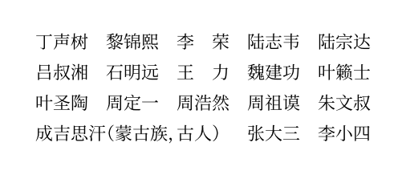
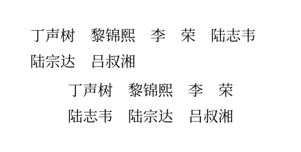
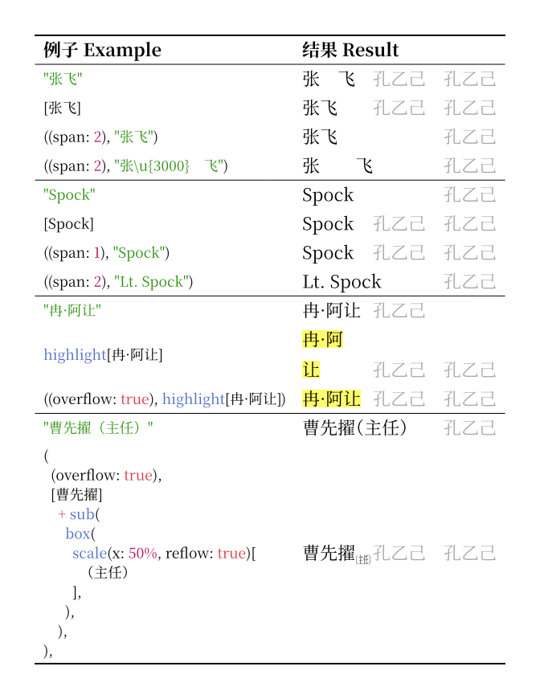

# Typst Tricorder——占三格法花名册

Record Chinese names with a rhythm of three characters.
按占三格的节奏记录中文人名。

```typst
#import "@preview/tricorder:0.1.0": tricorder
#tricorder(
  .."丁声树、黎锦熙、李荣、陆志韦、陆宗达、吕叔湘、石明远、王力、魏建功、叶籁士、叶圣陶、周定一、周浩然、周祖谟、朱文叔".split("、"),
  "成吉思汗（蒙古族，古人）", "张大三", "李小四",
)
```



## 用法 Usage

- [如何控制布局 How to control the layout](#如何控制布局-how-to-control-the-layout)
- [如何记录名字 How to record names](#如何记录名字-how-to-record-names)

### 如何控制布局 How to control the layout

- `columns`：列数 Number of columns

  **默认：**`auto`，会填充所有可用空间。若从头设计版面，无需更改。

  **Default:** `auto`, which will use all available space. This is suitable if you design the whole layout from the beginning.

  可用正的`int`直接规定列数。

  Use a positive `int` to specify the number of columns explicitly.

  ```typst
  #tricorder(columns: auto, ..names)

  #align(
    center,
    tricorder(columns: 3, ..names),
  )
  ```

  

- `row-gutter`/`column-gutter`：行/列间隙 Gaps between rows/columns

  **默认：**`1em`，这会在行/列间空一个字。

  **Default:** `1em`, which will leave a space of one Han character between rows/columns. This is suitable if you have

  如果两个字的名字较多，默认`1em`易引发歧义，可适当增加。

  If there are too many two-character names, the default `1em` may cause ambiguity. A larger value would be better.

  这两个选项类似[`grid`][grid-gutter]，但只有`1em`、`1.5em`、`2em`认真测试过。请谨慎使用其它值。

  These two arguments are similar to [`grid`][grid-gutter], but only `1em`, `1.5em`, and `2em` are properly tested. Use other values at your own risk.

  [grid-gutter]: https://typst.app/docs/reference/layout/grid/#parameters-column-gutter

### 如何记录名字 How to record names

有两种方法。There are two ways.

- `str`：按标准方法处理 Process in the standard way

  例 Example: `"张飞"`

- `((span, overflow), …)`：不再自动处理名字或计算列数 Do not touch the name or calculate the span automatically

  例 Example: `((span: 1, overflow: false), "张　飞")`

  - `span`：这个名字占据的列数 The amount of columns spanned by this name

    **默认：**`1`

    **Default:** `1`

  - `overflow`：是否允许溢出到列间 Whether to allow overflowing into the column gutter

    **默认：**`false`

    **Default:** `false`

  此外，`((span: 1, overflow: false), […])`可被省略成`[…]`。

  Besides, `((span: 1, overflow: false), […])` can be shortened into `[…]`.



## 实现细节 Implementation detail

`#tricorder(…)`始终生成块级容器，但固定列数和自动列数的实现不同。

`#tricorder(…)` always gives a block-level container, but the implementation of fixed columns and auto columns are different.

- `#tricorder(columns: 2, …)` ≈

  ```typst
  #grid(
    columns: (3em,) * 2,
    column-gutter: column-gutter,
    row-gutter: row-gutter,
    [孔乙己], [孔乙己],
  )
  ```

- `#tricorder(columns: auto, …)` ≈

  ```typst
  #set par(leading: row-gutter)
  #block(
    box(width: 3em, "孔乙己"),
    h(column-gutter, weak: true),
    box(width: 3em, "孔乙己"),
  )
  ```

固定列数会略快一点。

Fixed columns would be slightly faster.
