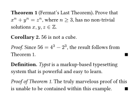

# trivial

A Typst package to make typesetting theorems and proofs trivial.

## Example usage

See the [manual](https://github.com/mkorje/typst-trivial/releases/download/v0.1.0/manual.pdf) for more details.

```typ
#import "@preview/trivial:0.1.0"
#show: trivial.init

#let definition = trivial.theorem.with(
  "definition",
  trivial.styles.theorem.default,
  [Definition],
)

#let numbered-theorem = trivial.theorem.with(
  "theorem",
  trivial.styles.theorem.default,
  numbering: "1",
)
#let corollary = numbered-theorem.with([Corollary])
#let theorem = numbered-theorem.with([Theorem])

#let proof = trivial.proof.with(
  [Proof],
  trivial.styles.proof.default,
  qed: $qed$,
)

#theorem[Fermat's Last Theorem][
  Prove that $x^n + y^n = z^n$, where $n >= 3$, has no non-trivial solutions $x, y, z in ZZ$.
] <fermat>

#corollary[
  $56$ is not a cube.
]

#proof[
  Since $56 = 4^3 - 2^3$, the result follows from @fermat.
]

#definition[
  _Typst_ is a markup-based typesetting system that is powerful and easy to learn.
]

#proof[Proof of @fermat][
  The truly marvelous proof of this is unable to be contained within this example.
]
```


