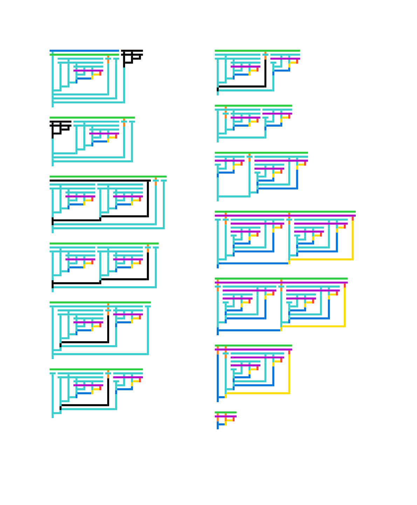
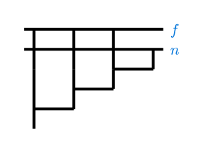

Trompet is a package for drawing [Tromp lambda diagrams](https://tromp.github.io/cl/diagrams.html), a representation of lambda calculus expressions, built on top of [Lambdabus](https://typst.app/universe/package/lambdabus/).

## Examples

<table>
<tr>
<td>
    <a href="example/example1.typ">
        
    </a>
</td>
<td>
    <a href="example/example2.typ">
        
    </a>
</td>
</tr>
</table>

## Usage

For more information, check the [manual](doc/manual.pdf).

To use this package, simply add the following code to your document:

```typ
#import "@preview/trompet:0.1.0": *

#tromp("\\f.\\n.f (f (f n))")
```
