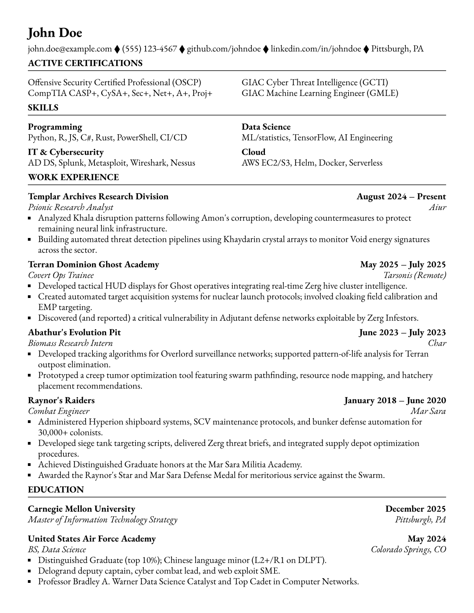

# Tonguetoquill Classic Resume

[](https://github.com/nibsbin/ttq-classic-resume)
[](https://typst.app/universe/package/ttq-classic-resume)
[](https://github.com/nibsbin)

A clean, professional resume template for Typst with a refined, dense layout optimized for single-page resumes.

Maintained by [TongueToQuill](https://www.tonguetoquill.com).

## Preview

<p align="center">
  
</p>

See the [template](template/resume.typ) for complete working resume.

## Quick Start

**Using Typst CLI:**

```bash
typst init @preview/ttq-classic-resume:0.1.0
typst compile resume.typ
```

**Using [typst.app](https://typst.app):**

Click "Start from template" and search for `ttq-classic-resume`.

## Documentation

For documentation and example, see the [template](template/resume.typ).

## License

MIT