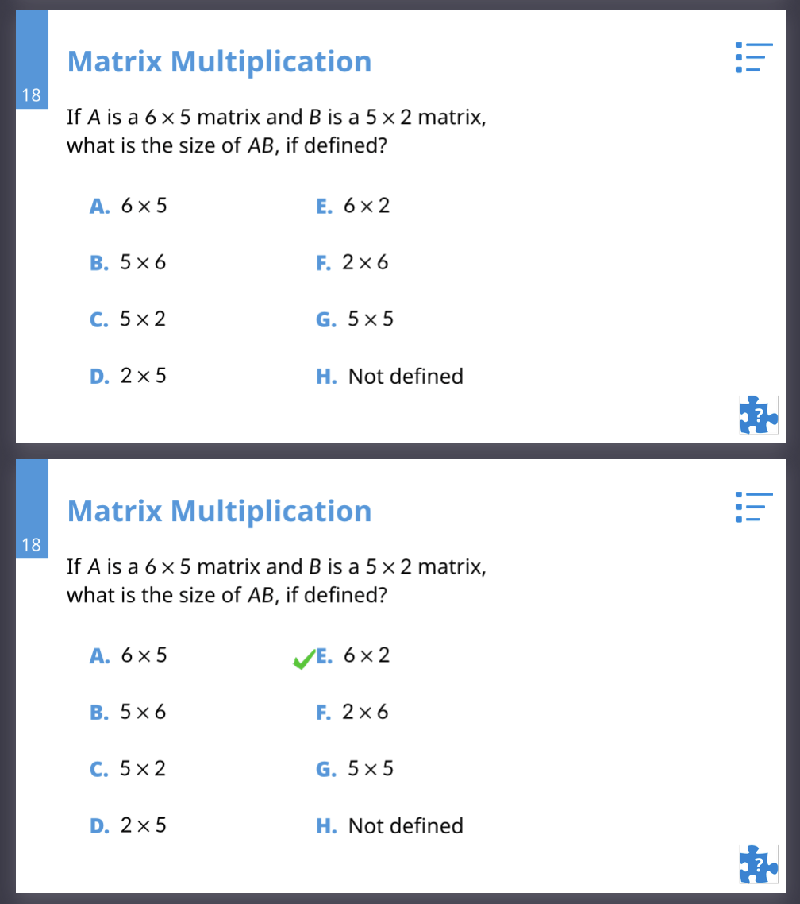

# Creating polling slides

We created a nice function that assists in the creation of polling slides.

Inside a polling slide, you can add your answers using the function `poll_answers`. Poll answers has some default parameters set, but they can be modified to suit your needs. These are the parameters of the function and what they do:

- `rows` (default: `2`): Number of columns for distributing the answers
- `cols` (default: `2`): Number of rows for distributing the answers
- `column-gutter` (default: `1em`): Separation between columns
- `row-gutter` (default: `1.4em`): Separation between rows
- `correct_answer` (default: 1): Index of the correct answer (as an integer) or a list of integers if there are multiple answers
- `students` (default: `false`): When `false` it generates the slide without the tick mark followed by the slide with the tick mark. Otherwise, it generates the slide without the tick mark.

The folling block of code generates the slides in the image below:

```typst
== Matrix Multiplication
#slide(type: "polling")[
  If $A$ is a $6 times 5$ matrix and $B$ is a $5 times 2$ matrix, \
  what is the size of $A B$, if defined?
  #v(1em)
  #poll_answers(row-gutter: 2em, column-gutter: 6em,
                correct_answer: 2, students: false)[
    1. $6 times 5$
    5. $6 times 2$
    2. $5 times 6$
    6. $2 times 6$
    3. $5 times 2$
    7. $5 times 5$
    4. $2 times 5$
    8. Not defined
  ]
]
```


