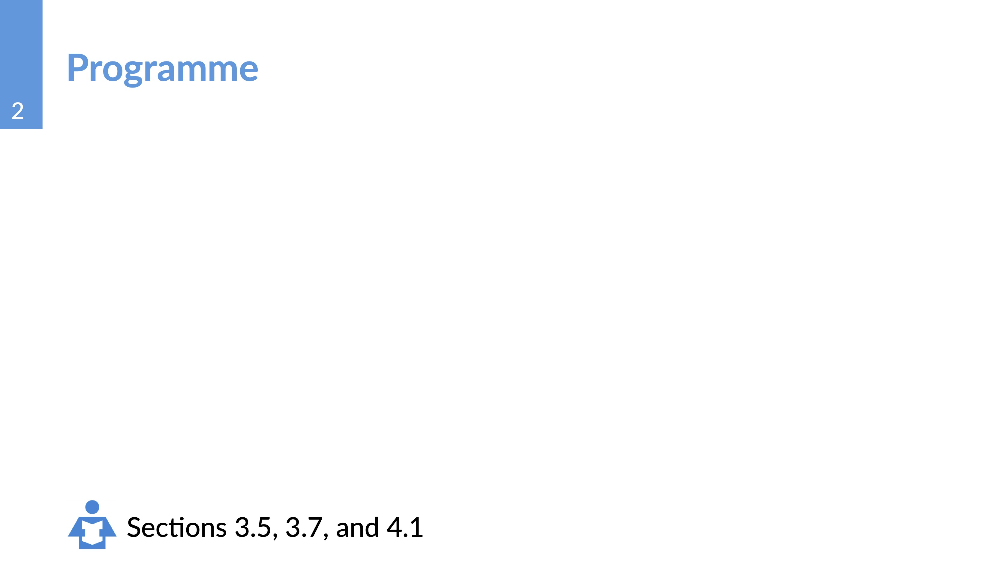
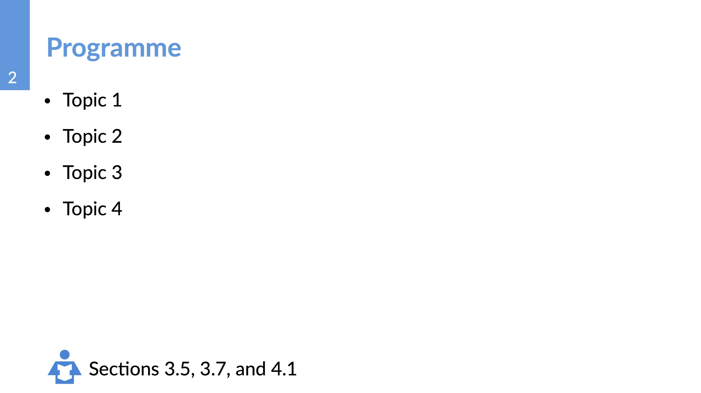

# Creating a Programme Slide

To simplify the creating of the Programme slide, we have created a convenient function just for it. It automatically places the corresponding images and generates the text string for the book section.

## The Function `programme_slide`

To simplify the use of it, let's say that the function `programme_slide` takes one optional parameters:

- `book_sections`: the sections of the book (either one string with one section number or one `float` or `int` representing the section number, or an array of strings or `float`s or `int`s containing the the book section numbers).

## Creation of the Programme Slide

Like any other basic slide, we will set the title with `==` and then we will call the corresponding function:

```typst
== Programme
#programme_slide()[]
```

The code above creates an Programme slide. The title is taken from the `==` line. Notice that the slide is empty.


We can pass a list of book sections to populate the bottom part of the slide:


```typst
== Programme
#programme_slide(book_sections: (3.5,3.7,4.1)[]
```



The string `Sections 3.5, 3.7, and 4.1` will change automatically depending on the values passed.

Now we can populate the slide with the list of topics that we want to cover:

```typst
== Programme
#programme_slide(book_sections: (3.5,3.7,4.1)[
    - Topic 1
    - Topic 2
    - Topic 3
    - Topic 4
]
```


