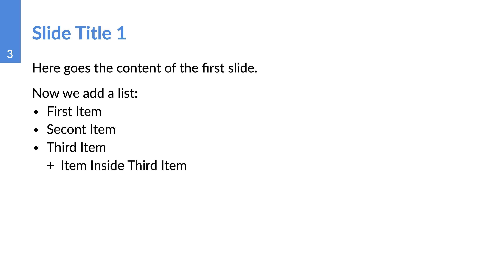

# Creating a new presentation

To create a new presentation we can use either the provided example as a starting template, or we can start from scratch. In this section we will just explain how create a new presentation from scratch. The details of more advanced use of the template will be given in the [next section](using_template.md) in our wiki.


## Starting steps

1. Create a blank file with extension `.typ`.
2. Import the slides' template
3. Initiate the presentation with the corresponding parameters.

### Basic example

**WARNING:** if you installed the template locally, please change `preview` to `local` in the code below.

Suppose that we have created the file `main.typ`. This is how our file would look:

```typst
#import "@preview/tudelft-PRIME-presentation:0.1.2": * 

#show: prime-slides.with(
    title: "Presentation Title",
    subtitle: "Subtitle",
    background : "background/background.png",
    logo : "Linear Algebra/Logos/intersection_planes.png"
)
```

When compiled, this will generate a pdf with one slide containing the main title


To display a section slide we use the syntax `=` followed by a space and the `section title`.

```typst
= First Section
```

This generates the slide below:


For new (blank) slide we can use the syntax `==` followed by a space and the `slide title`.

```typst
== Slide Title 1
```

This generates a blank slide


To add content to the blank slide we can just write the text into a new line immediately after the slide title

```typst
== Slide Title 1
Here goes the content of the first slide.

Now we add a list:
- First Item
- Secont Item
- Third Item
    - Item Inside Third Item
```
The code above produces the folling changes to the blank slide:



To conclude the presentation we could finish with the title slide again. In this case, we need to call it manually
and pass the title and subtitle:

```typst
#title-slide(title: "See you next lecture", subtitle : "")
```


The resulting `main.typ` file is the following:

```typst

#import "@preview/tudelft-PRIME-presentation:0.1.2": *

#show: prime-slides.with(
    title: "Presentation Title",
    subtitle: "Subtitle",
    background : "background/background.png",
    logo : "Linear Algebra/Logos/intersection_planes.png"
)

= First Section

== Slide Title 1
Here goes the content of the first slide.

Now we add a list:
- First Item
- Secont Item
- Third Item
    - Item Inside Third Item

#title-slide(title: "See you next lecture", subtitle : "")
```

