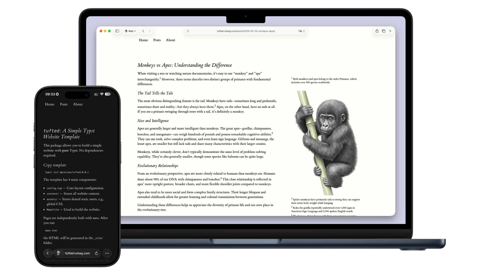

# Tufted

A static website template built using Typst's experimental HTML export. Requires no external dependencies other than basic `make`.



## Installation & Usage

Initialize the template from the Typst package registry:

```shell
typst init @preview/tufted:0.1.0
```

To build the website, run:

```shell
make html
```

Explore the `content/` folder for examples.

## Links

- [Repository on GitHub](https://github.com/vsheg/tufted)
- [Typst Universe](https://typst.app/universe/package/tufted)
- [Tufte CSS](https://edwardtufte.github.io/tufte-css/) — used for styling, loaded automatically from a CDN
- [tufted.vsheg.com](https://tufted.vsheg.com) — live demo and docs

## License

The source code is available on [GitHub](https://github.com/vsheg/tufted) under the [MIT License](LICENSE). The template in the `template/` directory uses the more permissive [MIT-0](https://opensource.org/licenses/MIT-0) license.
