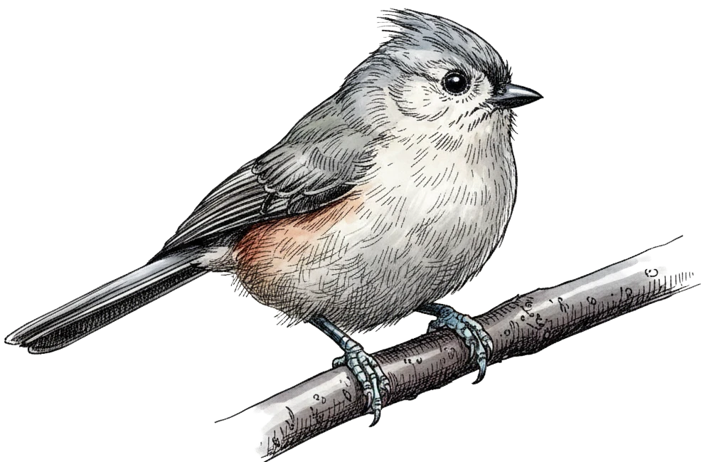

# The Tufted Titmouse

The Tufted Titmouse (*Baeolophus bicolor*) is a small, charismatic songbird native to the deciduous forests of eastern North America. Recognizable by their distinctive grey crest, large black eyes, and rust-colored flanks, these birds are acrobatic foragers and frequent visitors to backyard feeders. During winter, they often join mixed flocks with chickadees and nuthatches. Their song is a clear, whistled *peter-peter-peter*.

We can model their population dynamics using the logistic growth equation:

$$
\frac{dP}{dt} = rP \left(1 - \frac{P}{K}\right)
$$

where $P$ represents the population, $r$ is the intrinsic growth rate, and $K$ is the carrying capacity of their habitat.
