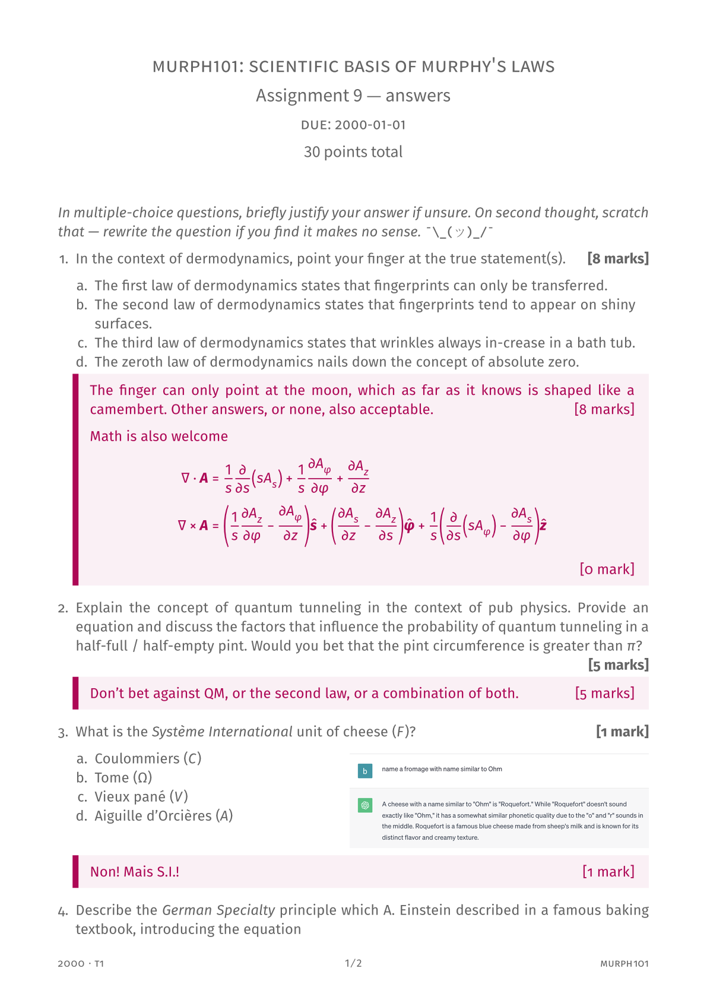

# tuhi-assessment-vuw

A Typst template for VUW assessments. A version with or without answers can be produced by toggling the `answer` keyword.

To get started:

```typst
typst init @preview/tuhi-assessment-vuw:0.2.0
```

And edit the `main.typ` example. 



## Contributing

PRs are welcome! And if you encounter any bugs or have any requests/ideas, feel free to open an issue.

