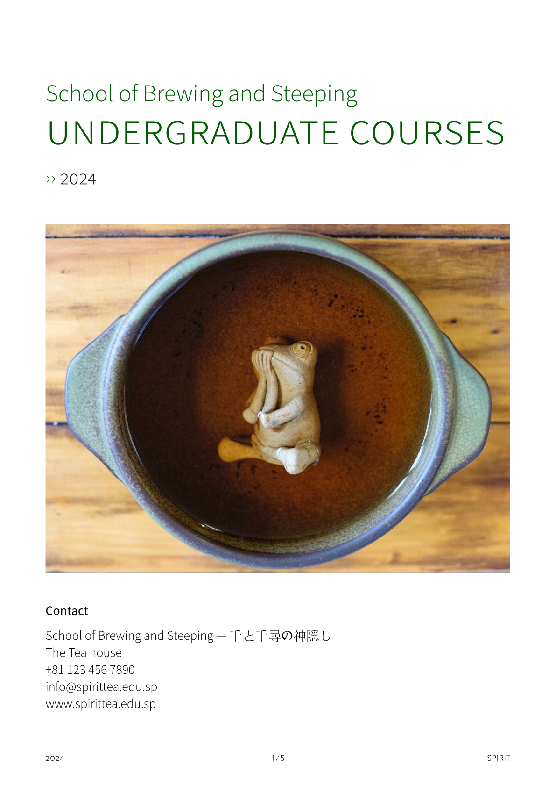

# tuhi-booklet-vuw

A Typst template for VUW course programme descriptions. To get started:

```typst
typst init @preview/tuhi-booklet-vuw:0.2.0
```

And edit the `main.typ` example. 



## Contributing

PRs are welcome! And if you encounter any bugs or have any requests/ideas, feel free to open an issue.

