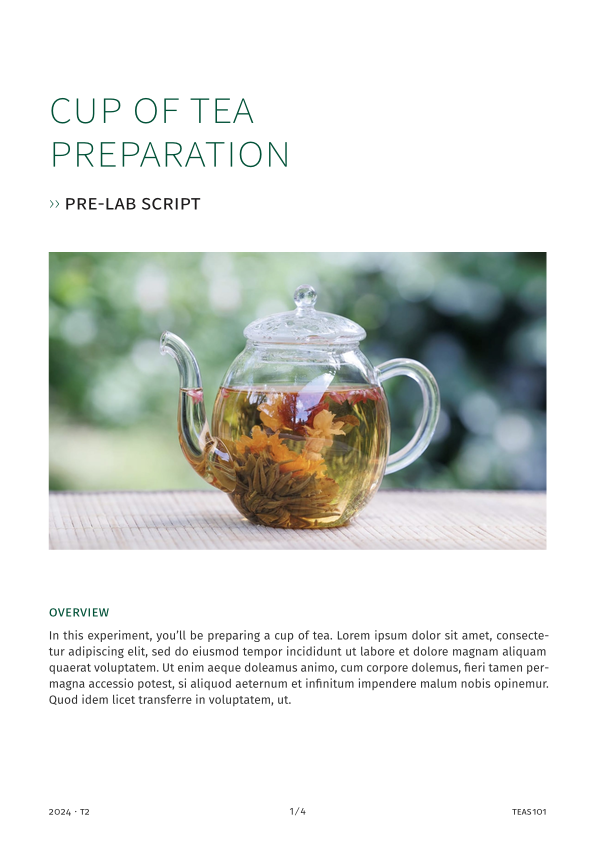

# tuhi-labscript-vuw

A Typst template for VUW lab scripts. To get started:

```typst
typst init @preview/tuhi-labscript-vuw:0.1.0
```

And edit the `main.typ` example. 



## Contributing

PRs are welcome! And if you encounter any bugs or have any requests/ideas, feel free to open an issue.

