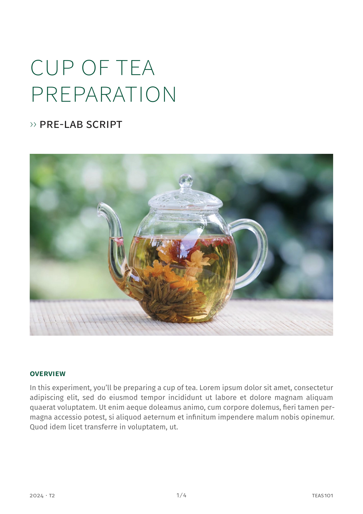

# tuhi-labscript-vuw

A Typst template for VUW lab scripts. To get started:

```typst
typst init @preview/tuhi-labscript-vuw:0.3.0
```

And edit the `main.typ` example. 



## Contributing

PRs are welcome! And if you encounter any bugs or have any requests/ideas, feel free to open an issue.

## Changelog

### v 0.3.0 (2025-06-19)

#### Bug fixes

- inline code introduced line breaks as formatted in a block

#### User level changes

- more customisation possible, with a theming system
- footer displays the coursetitle, if present
- code blocks no longer have a border or inset, to be compatible with more fancy boxes (e.g showybox)

#### Import

- showybox with `script()` wrapper

### v 0.2.0 (2025-03-06)

- updating page number with context
- misc formatting tweaks
- removed SVG icon


### v 0.1.0 (2024-06-16)

- first release