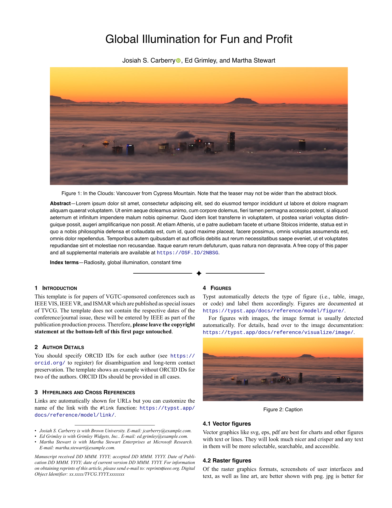

# tvcg-journal-typst

A [Typst](https://typst.app) template for TVCG journals and the IEEE VIS Conference. We aim to closely mirror the [LaTeX template](https://github.com/ieeevgtc/tvcg-journal-latex).

## Usage

You can use this template in the Typst web app by clicking "Start from template" on the dashboard and searching for tvcg-journal.

Alternatively, you can use the CLI to kick this project off using the command

```bash
typst init @preview/tvcg-journal
```

Typst will create a new directory with all the files needed to get you started.

The template will be imported like this:

```typst
#import "@preview/tvcg-journal:0.0.1": tvcg
```

## Previews

<p align="center"></p>

Live [preview of the PDF template](https://domoritz.github.io/tvcg-journal-typst/main.pdf).
