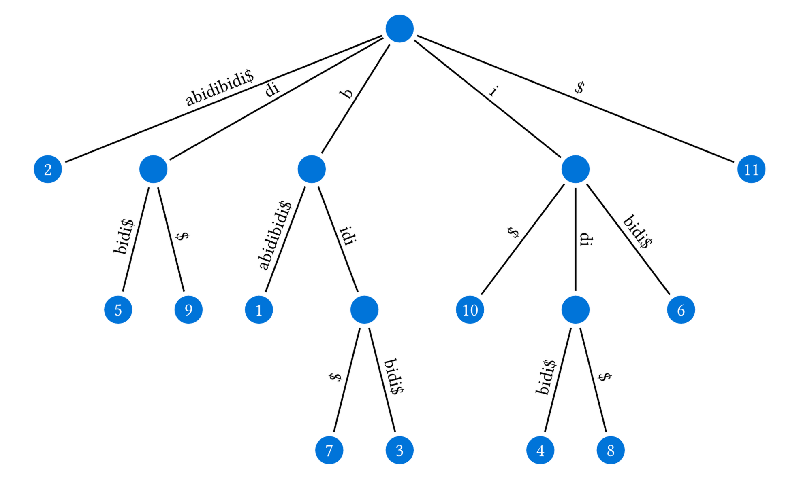

[](https://typst.app/universe/package/twig)

# twig

Twig is a Typst package for easily creating trees with edge labels.  
It takes a list and converts it into a tree structure, then renders it using [cetz](https://typst.app/universe/package/cetz).  

```typ
#import "@preview/twig:0.1.0": list-to-tree, tree-to-cetz
#import "@preview/cetz:0.4.0"

// suffix tree for "babidibidi"
#cetz.canvas({
  import cetz.draw: *
  tree-to-cetz(
    list-to-tree([
      - #[]
        / abidibidi\$: 2
        / di: #[]
          / bidi\$: 5
          / \$: 9
        / b: #[]
          / abidibidi\$: 1
          / idi: #[]
            / \$: 7
            / bidi\$: 3
        / i: #[]
          / \$: 10
          / di: #[]
            / bidi\$: 4
            / \$: 8
          / bidi\$: 6
        / \$: 11
    ]),
    draw-node: (node, ..) => {
      circle((), radius: 0.3, fill: blue, stroke: none)
      content((), text(white, [#node.content]))
    },
    grow: 3,
    spread: 1.5,
    parent-position: "center",
  )
})
```



## Usage

To start using twig, just use the following code:

```typ
#import "@preview/twig:0.1.0": tree-to-cetz, list-to-tree
#import "@preview/cetz:0.4.0"

#cetz.canvas({
  import cetz.draw: *
  tree-to-cetz(
    list-to-tree([
      - root node
      // Continue here
    ]),
    grow: 2,
    spread: 2
  )
})
```

## TODOs

- [ ] Add bounding boxes to prevent elements from intersecting  
- [ ] Simplify the syntax for empty nodes (currently `#[]`)


## Changelog

### 0.1.0

- Initial release
