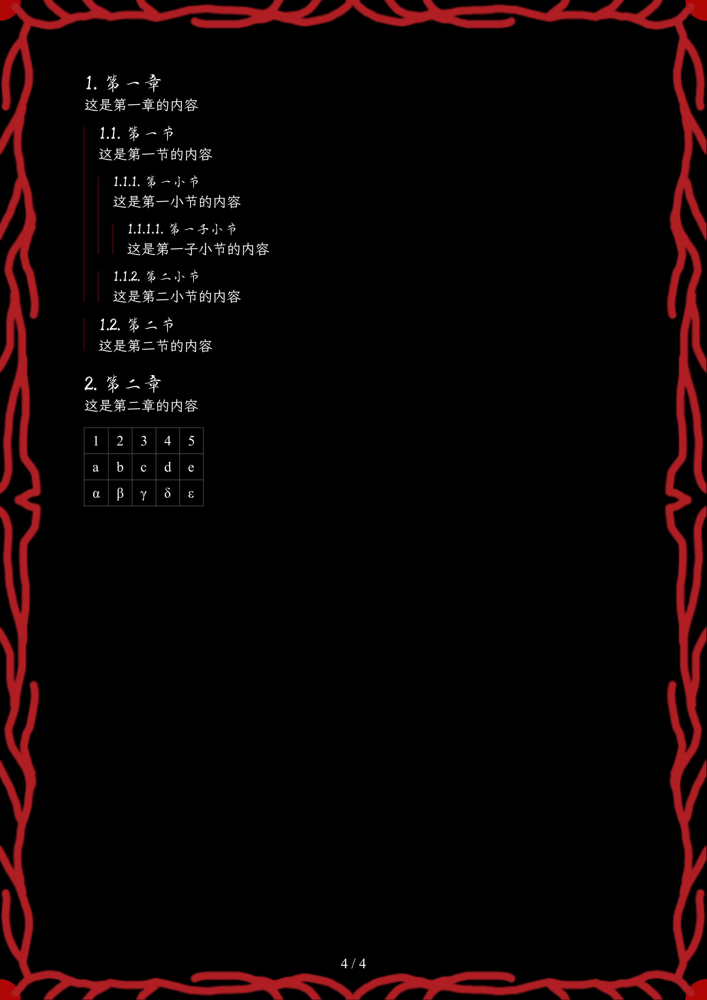

# The `TwilightBook` Package `晨昏之书`

<div align="center">Version 0.1.8</div>

A twilight style template,offers numerous light and dark themes.

晨昏主题模板,提供许多浅色和深色主题.

## Getting Started 入门

These instructions will get you a copy of the project up and running on the typst web app. Perhaps a short code example on importing the package and a very simple teaser usage.

这些说明将为您提供在typst网络应用程序上启动和运行的项目副本。也许是导入软件包的简短代码示例和非常简单的预告使用。

```typ
#import "@preview/twilight-book:0.1.8": *

#show: book.with(
  // 具体的各种设置,详情请见book.typ / Specific Settings
  title: "晨昏之书", // 文件名 / File name
  author: "跨越晨昏", // 作者 / Author
  theme: "abyss", // 主题名称 / Theme name
  // ...
)

// 正文内容
```

<!--
<picture>
  <source media="(prefers-color-scheme: dark)" srcset="./thumbnail-dark.svg">
  
</picture>
-->

### Installation 安装

A step by step guide that will tell you how to get the development environment up and running. This should explain how to clone the repo, along with any pre-requisite software and installation steps.

一份逐步指南，将指导您如何搭建并运行开发环境。包括将代码克隆到本地

#### MacOS

```shell
git clone https://github.com/CrossDark/TwilightBook.git "$HOME/Library/Application Support/typst/packages/local/twilight-book/0.1.8"
```

#### Windows

## 样式 Style

以深渊主题为例

### 封面 Cover


### 正文 Main Text

Supports indenting content based on heading levels and adding reference lines. 

支持根据标题的成绩对内容进行缩进并添加参考线 



### 字体 Fonts

可以使用以下代码自定义字体

```typ
#let serif-family = {"字体名称"}
#let sans-family = {"字体名称"}
#let mono-family = {"字体名称"}
#let art-font = {"字体名称"}
```

[!warning](艺术字体中的*段宁毛笔小楷*为付费字体,商用请小心)

<!--
## Usage 使用说明

A more in-depth description of usage. Any template arguments? A complicated example that showcases most if not all of the functions the package provides? This is also an excellent place to signpost the manual.

更深入的使用说明. 包含复杂的示例，展示了软件包提供的大多数功能

```typ
#import "@preview/twilight-book:0.1.8": *

// #let my-complicated-example = ...
```

## Additional Documentation and Acknowledgments 附加文件和知识点

* Project folder on server:
* Confluence link:
* Asana board:
* etc...
