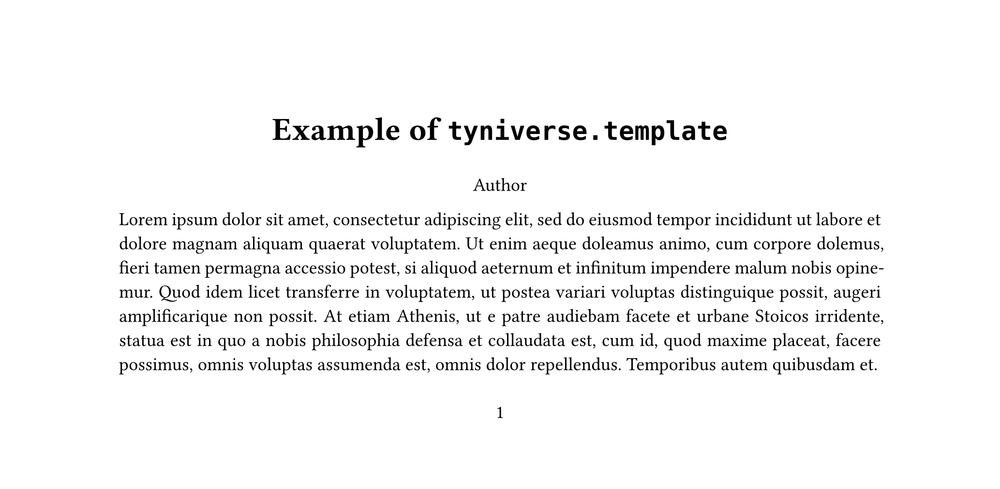
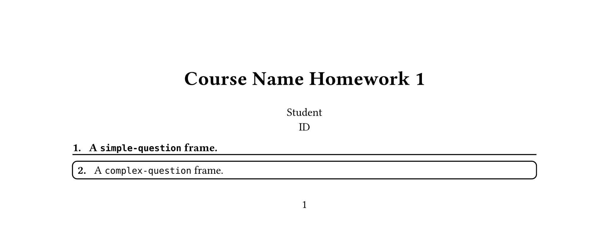
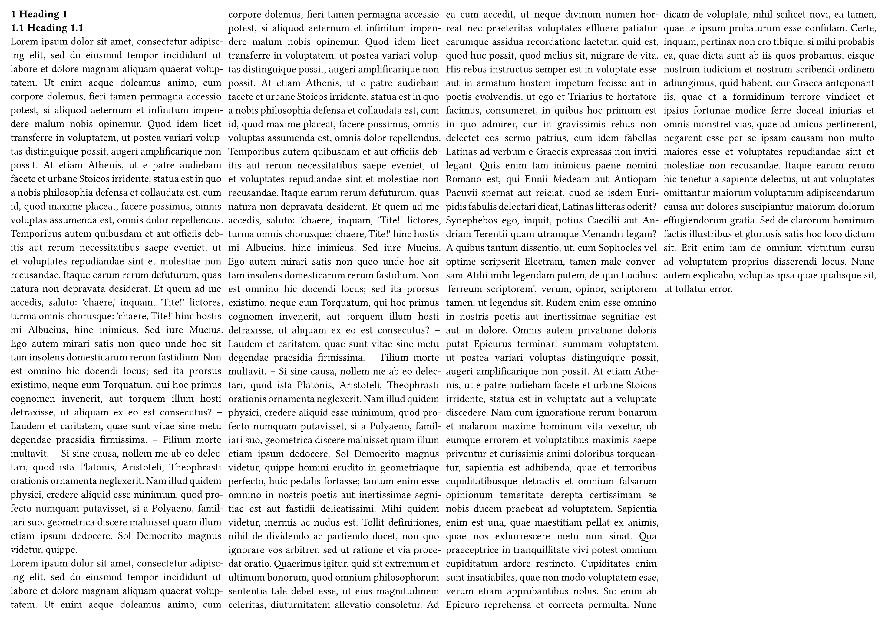

# Tyniverse

A collection of [Typst](https://typst.app) presets to provide a starting point for your writing.

Available presets:

- `set-font()`: Chinese & English Font support.
- `typesetting`: A typesetting preset.
- `template`: A template for writing a document.
- `homework`: Homework template with `simple-question` and `complex-question` frame to write your homework.
- `cheatpaper`: A cheatpaper template.

There are some manuals/docs in the `docs` folder.

## Usage

Tyniverse supports Typst 0.12.0 and newer. You can access it from [Typst Universe](https://typst.app/universe).

```typ
#import "@preview/tyniverse:0.2.3"
```

To install it locally, please refer to [Typst Documentation](https://github.com/typst/packages#local-packages).

## Examples

### Basic Template

```typ
#import "@preview/tyniverse:0.2.3": template

#set page(height: auto)
#show: template.with(
  title: ("Example of tyniverse.template", [Example of `tyniverse.template`]),
  author-infos: "Author"
)

#lorem(100)
```



For more examples, please see [`docs/template.pdf`](./docs/template.pdf).

### Homework

```typ
#import "@preview/tyniverse:0.2.3": homework

#set page(height: auto)
#show: homework.template.with(
  course: "Course Name",
  number: 1,
  student-infos: ((name: "Student", id: "ID"),),
)

#homework.simple-question[
  A `simple-question` frame.
]

#homework.complex-question[
  A `complex-question` frame.
]
```



For more examples, please see [`docs/homework-template.pdf`](./docs/homework-template.pdf) and [`docs/question-frame.pdf`](./docs/question-frame.pdf).

### Cheat Paper

```typ
#import "@preview/tyniverse:0.2.3": cheatpaper

#show: cheatpaper.template.with(
  title: "Cheat Paper",
  authors: "Fr4nk1in",
  font-size: 10pt,
)

= Heading 1
== Heading 1.1

#lorem(256)

#lorem(768)
```


