# typart

SmartArt-style diagrams for Typst: card-table, process, gantt, pyramid, hierarchy, steps, venn, timeline, cycle, tree, matrix, and more.

## Installation

```typst
#import "@preview/typart:0.1.0": *
```

## Widgets

### card-table
A card-style table with rounded cells, coloured header, and alternating row fills.

```typst
#card-table(
  ("Study", "Approach", "Dataset"),
  (
    ("Guo et al.",  "Propose two...", "Homemade"),
    ("Gurunathan",  "Exhaustive...", "PUT Vein"),
    ("Zhang et al.", "ML-based",     "InHouse"),
  ),
)
```

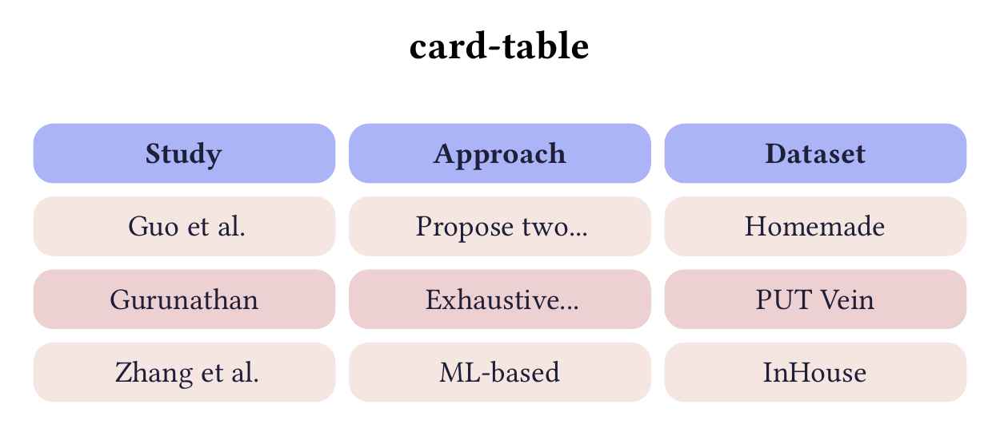

### gantt
A Gantt chart with task bars, progress indicator, grid lines, and a "today" marker.

```typst
#gantt(
  (
    ("Planning",     0, 12, 100),
    ("Development",  6, 30, 60),
    ("Testing",     24, 40, 30),
    ("Papers",       0, 48, 20, false),
  ),
  span: 48, grid-step: 12,
  periods: ("Year 1", "Year 2", "Year 3", "Year 4"),
  today: 20,
)
```


### process
A heartbeat-ring process diagram with icon badges and connector arms. Requires [Font Awesome 7 Free](https://fontawesome.com).

```typst
#process(
  (
    ("\u{f02d}", "1. Review methods"),
    ("\u{f51e}", "2. Data collection"),
    ("\u{f83e}", "3. Signal analysis"),
  ),
)
```

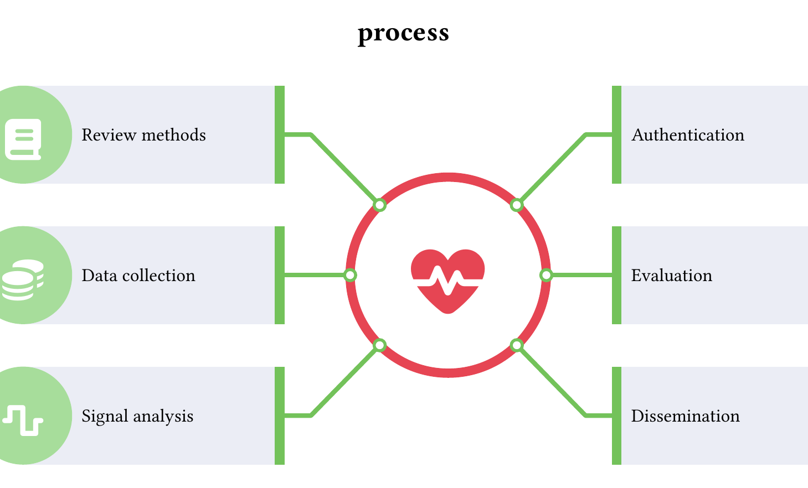

### pyramid
A pyramid or funnel diagram (use `flip: true` for a funnel).

```typst
#pyramid(([Vision], [Strategy], [Tactics]))
```

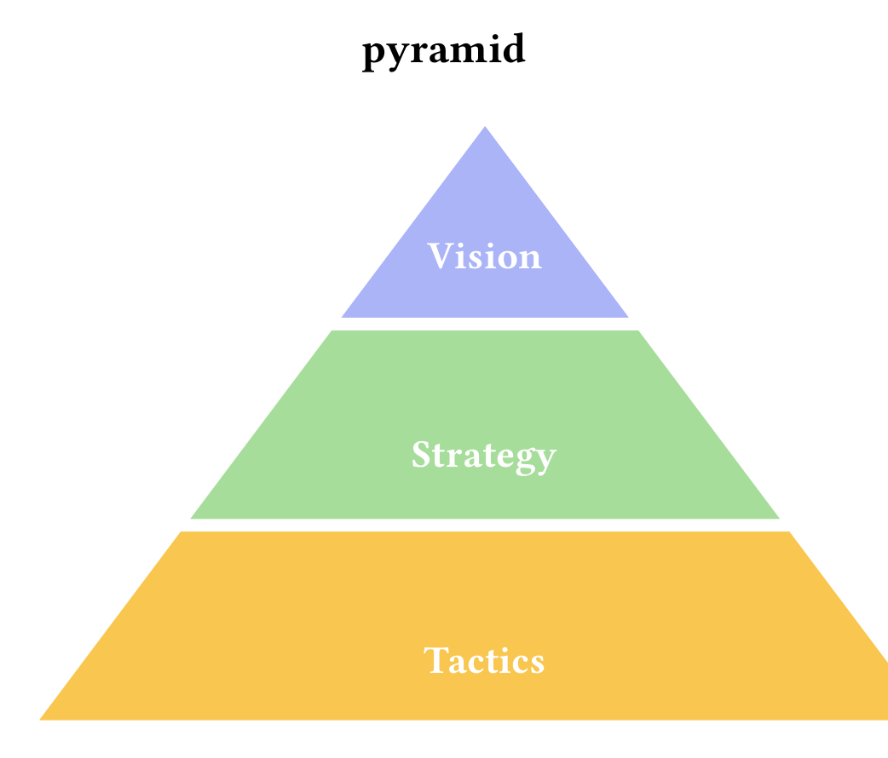

### hierarchy
A root node with a row of children beneath it.

```typst
#hierarchy([CEO], (([Eng], rgb("#a7dd9b")), [Sales], [HR]))
```

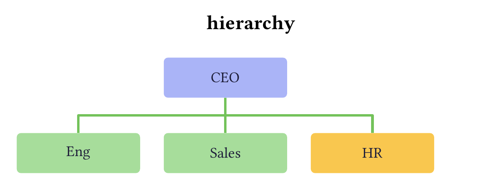

### steps
A vertical numbered list of steps.

```typst
#steps(([Plan], [Execute], [Review], ([Deploy], rgb("#e64553"))))
```


### venn
A 2- or 3-circle Venn diagram.

```typst
#venn((([Behavior], rgb("#aab4f7")), [Signal], [Security]))
```

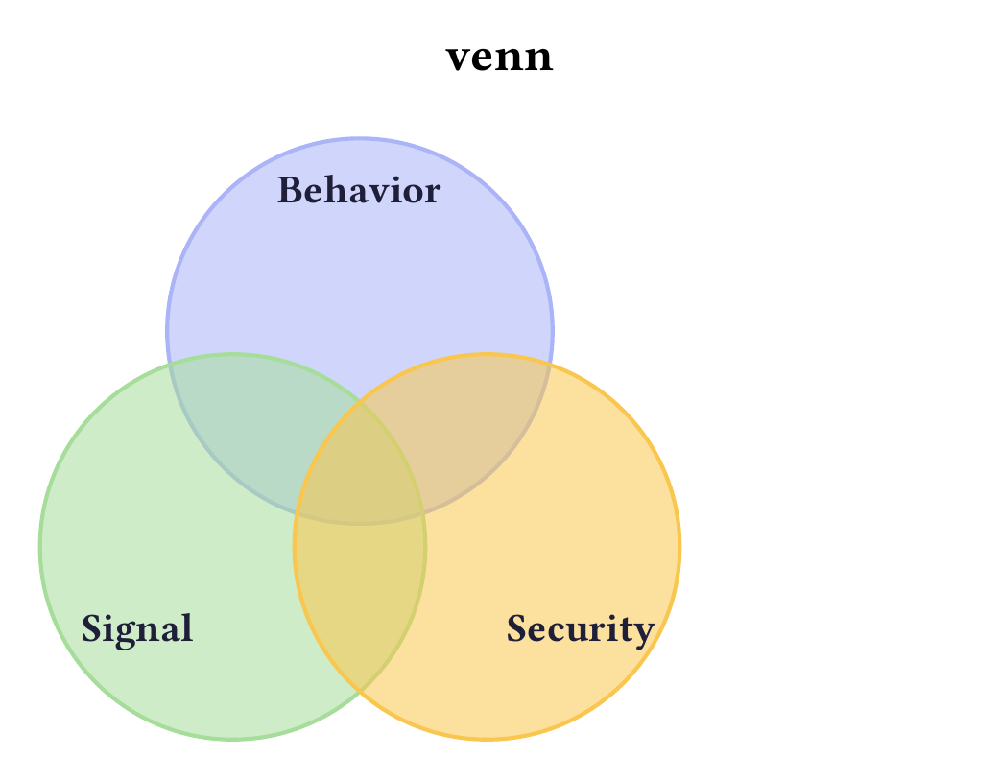

### hlist
A horizontal row of equally sized coloured blocks.

```typst
#hlist(([Plan], [Execute], ([Review], rgb("#e64553"))))
```

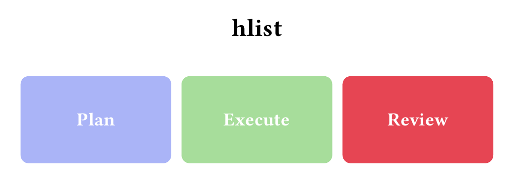

### chevron
A sequence of right-pointing chevron arrows.

```typst
#chevron(([Phase 1], [Phase 2], [Phase 3], [Phase 4]))
```

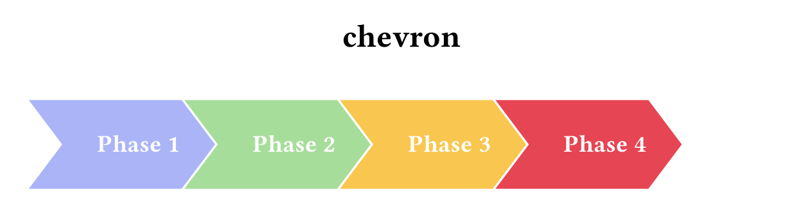

### cycle
Nodes arranged on a ring connected by curved arrows.

```typst
#cycle(([Plan], [Do], [Check], ([Act], rgb("#e64553"))))
```

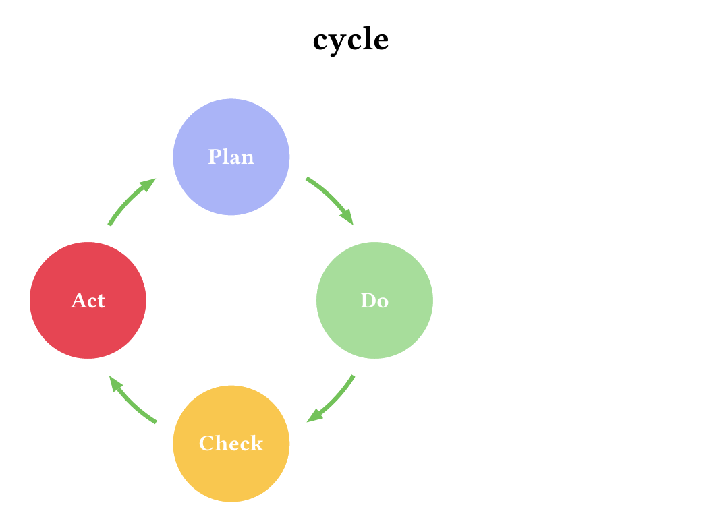

### target
Concentric rings (bullseye).

```typst
#target(([Vision], [Mission], [Goal]))
```


### matrix
A 2x2 matrix with optional axis labels.

```typst
#matrix(([TL], [TR], [BL], [BR]),
  x-axis: ("Low", "High"),
  y-axis: ("High", "Low"))
```

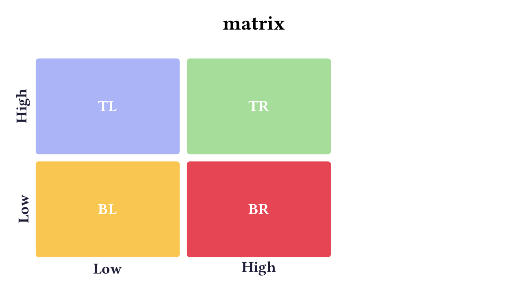

### snake
A bending process that wraps into multiple rows.

```typst
#snake(([Step 1], [Step 2], [Step 3], [Step 4], [Step 5], [Step 6]))
```


### stairs
An ascending stair-step process.

```typst
#stairs(([Plan], [Develop], ([Launch], rgb("#e64553"))))
```

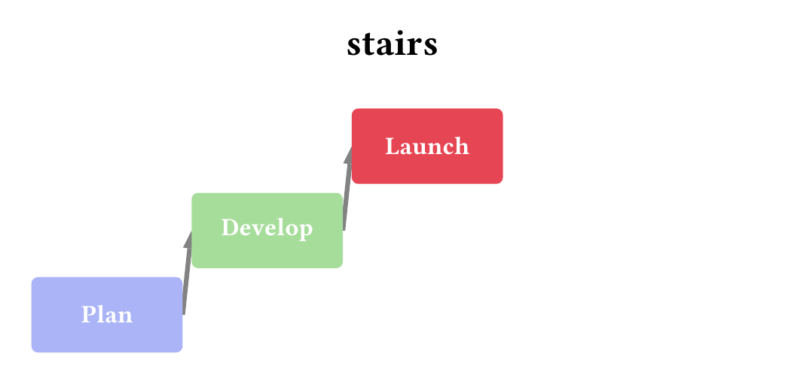

### gears
Up to 3 interlocking cogwheels.

```typst
#gears(([Research], [Development], [Production]))
```

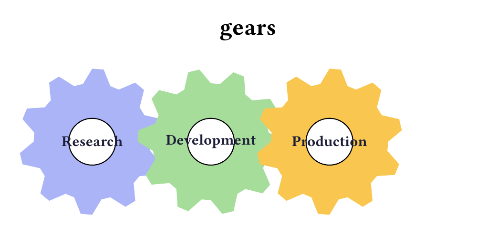

### timeline
A horizontal timeline with alternating labels.

```typst
#timeline((("2024", [Start]), ("2025", [Pilot]), ("2026", [Launch])))
```


### tree
A multi-level tree hierarchy.

```typst
#tree(([CEO], (([Eng], ([Web], [Mobile])), [Sales])))
```

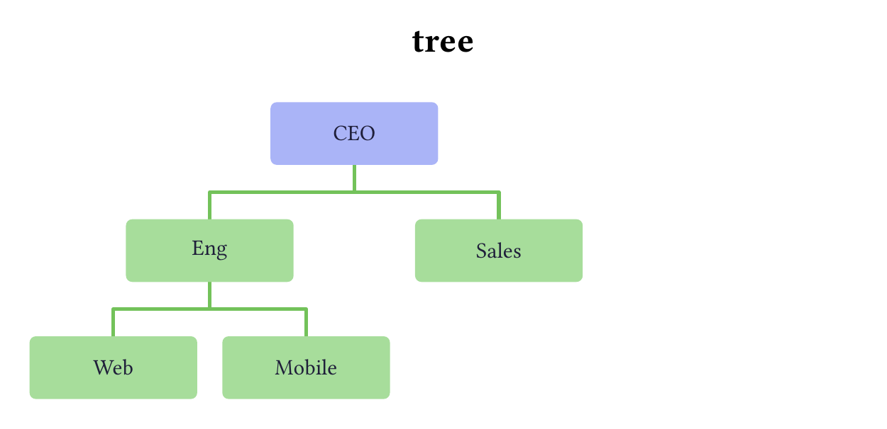

### arrows
Converging or diverging arrows around a central core.

```typst
// converging
#arrows(([Idea 1], [Idea 2], [Idea 3]), core: [Core])

// diverging
#arrows(([Branch 1], [Branch 2]), diverge: true)
```


### opposing
Two block arrows facing each other.

```typst
#opposing(([Pros], [Cons]))
```

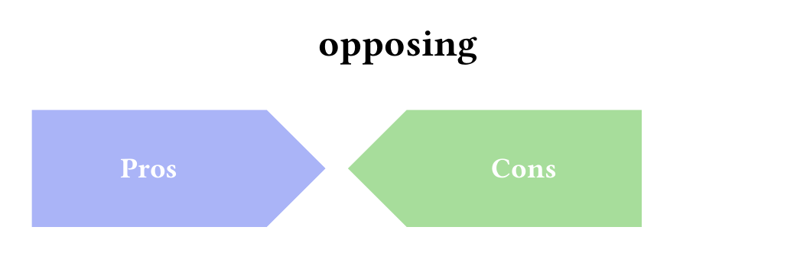

### equation
An A + B = C equation-style diagram.

```typst
#equation(([Input 1], [Input 2], [Output]))
```


### kpi
Stat cards displaying a large value and a caption.

```typst
#kpi((("< 1%", [Target EER]),
      ("99%", [Accuracy], rgb("#40a02b")),
      ("500+", [Users])))
```


### pill-steps
A central hub with connected pill-shaped step rows. Requires [Font Awesome 7 Free](https://fontawesome.com) for icons.

```typst
#pill-steps(
  (
    ([Research], [Gather requirements],
      text(font: "Font Awesome 7 Free", size: 26pt)[\u{f0eb}]),
    ([Develop],  [Build the solution],
      text(font: "Font Awesome 7 Free", size: 26pt)[\u{f0ae}], rgb("#74c7ec")),
  ),
  title: [PROJECT STEPS],
)
```

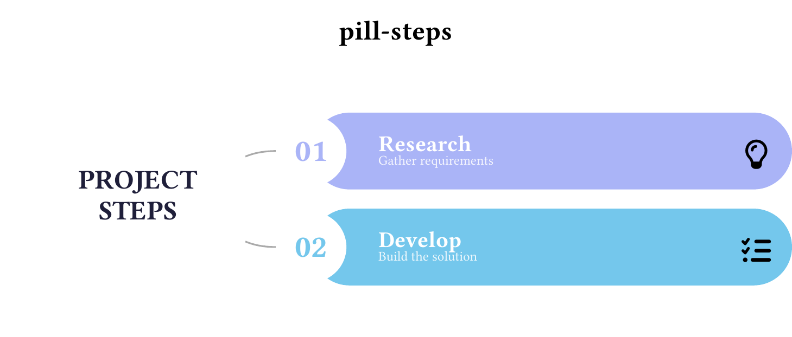
