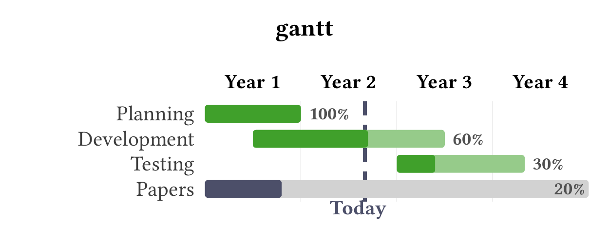
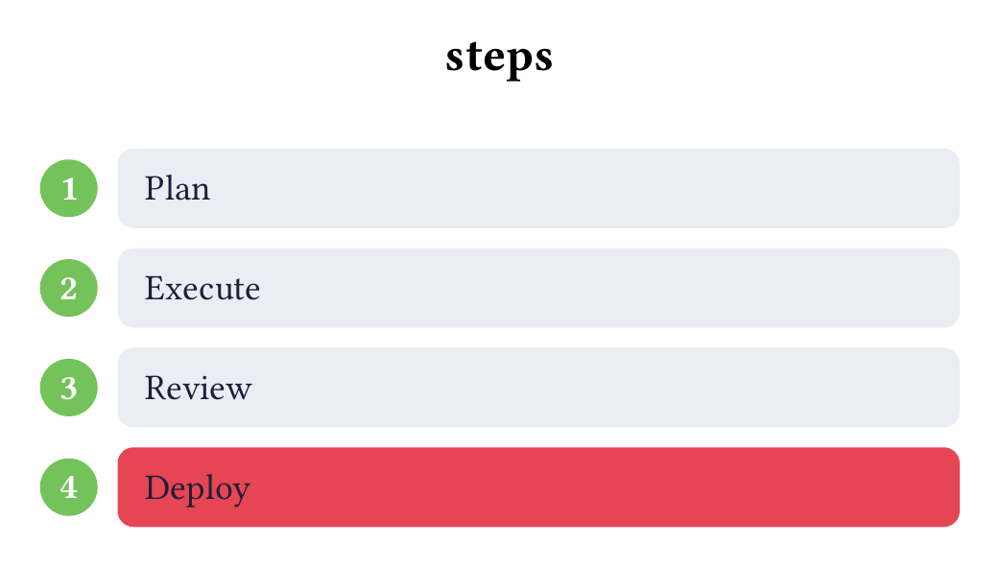
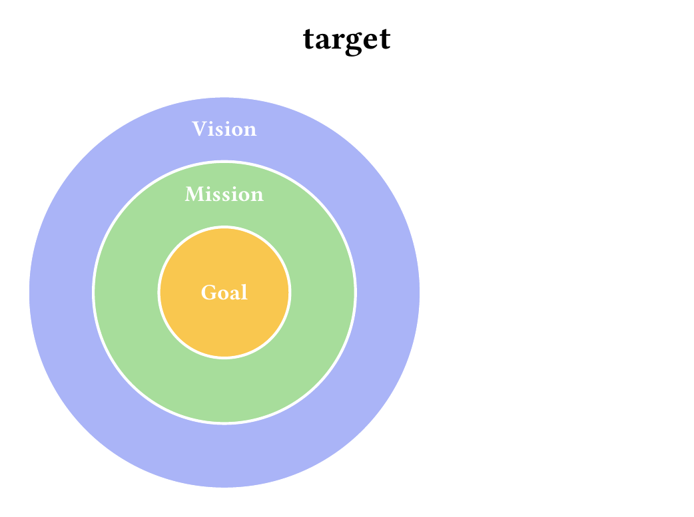
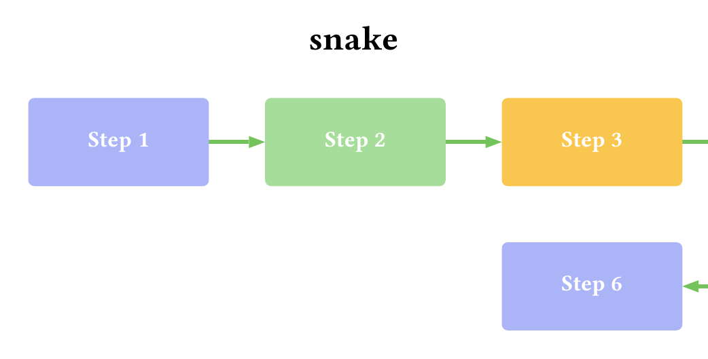
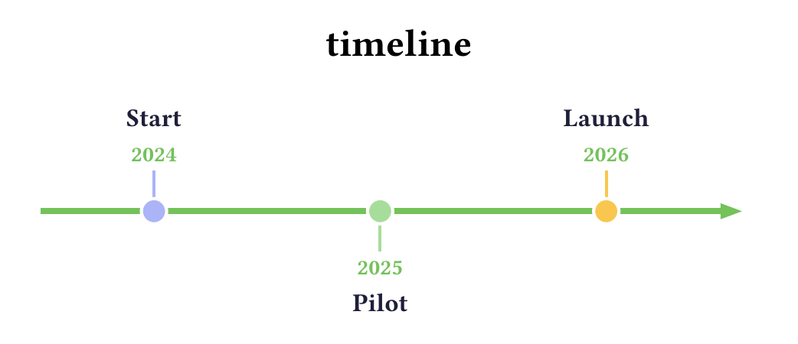
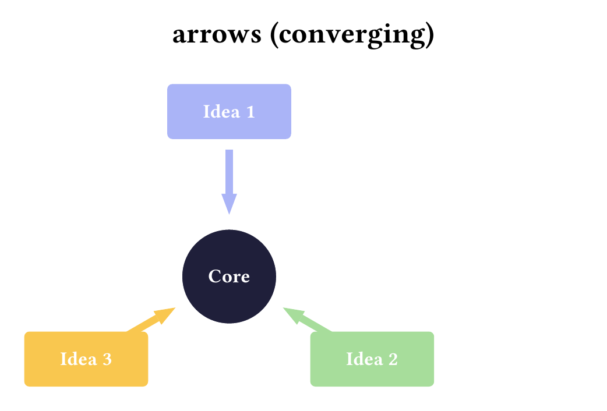
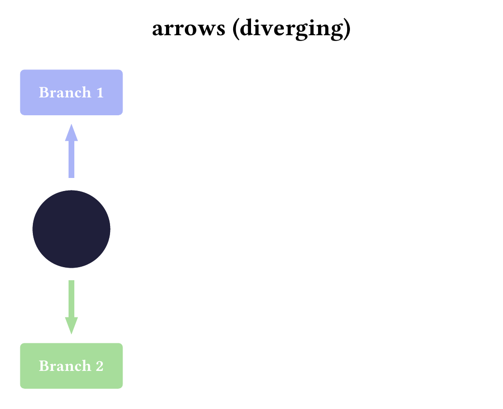
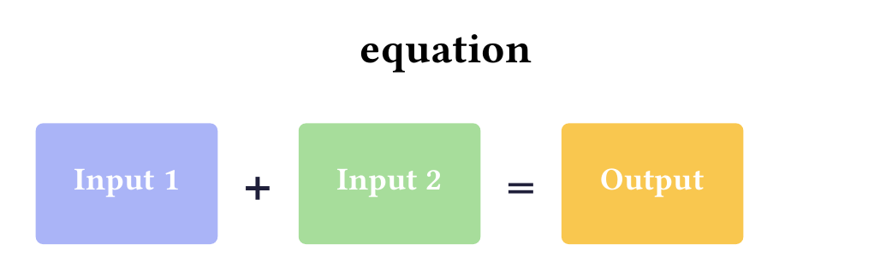
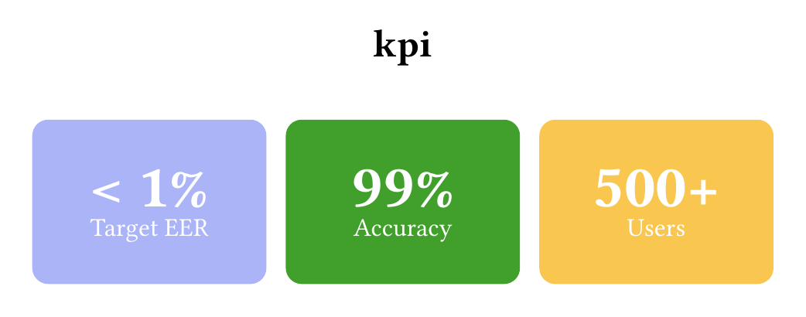

# typart

SmartArt-style diagrams for Typst: card-table, process, gantt, pyramid, hierarchy, steps, venn, timeline, cycle, tree, matrix, and more.

## Installation

```typst
#import "@preview/typart:0.1.1": *
```

## Items and colours

Unless noted otherwise, every widget takes a list of items where each item is either a label (content) or a `(label, color)` tuple that overrides that item's colour. Items without an explicit colour cycle through the built-in `palette` (lavender, green, amber, red, sky), which is also exported for your own use.

Dimension parameters without a unit (`w`, `h`, `radius`, …) are [CeTZ](https://typst.app/universe/package/cetz) canvas units (1 unit = 1 cm); parameters with `pt`/`cm` are regular Typst lengths.

## Widgets

### card-table
A card-style table with rounded cells, coloured header, and alternating row fills.

```typst
#card-table(
  ("Study", "Approach", "Dataset"),
  (
    ("Guo et al.",  "Propose two...", "Homemade"),
    ("Gurunathan",  "Exhaustive...", "PUT Vein"),
    ("Zhang et al.", "ML-based",     "InHouse"),
  ),
)
```


| Parameter | Default | Description |
|---|---|---|
| `headers` | — | Tuple of header cells. |
| `rows` | — | List of rows; each row is a tuple of cells or a `card-row(...)`. |
| `weights` | `none` | Relative column widths, e.g. `(2, 1, 1)`. `none` = all equal. |
| `header-fill` | `rgb("#aab4f7")` | Header row background. |
| `row-fills` | `(rgb("#f5e6e2"), rgb("#ecd0d2"))` | Alternating row backgrounds (cycled). |
| `text-fill` | `rgb("#1f1f3a")` | Body text colour. |
| `header-text-fill` | `auto` | Header text colour; `auto` = same as `text-fill`. |
| `size` | `18pt` | Text size. |
| `radius` | `12pt` | Cell corner radius. |
| `gutter` | `8pt` | Gap between cells and rows. |
| `inset` | `12pt` | Cell padding. |

To override a single row's colours, wrap it with `card-row`:

```typst
#card-row(("This work", "Ours", "New"), fill: rgb("#a7dd9b"), text-fill: white)
```

| Parameter | Default | Description |
|---|---|---|
| `cells` | — | Tuple of cells for the row. |
| `fill` | `none` | Row background; `none` = keep the alternating fill. |
| `text-fill` | `none` | Row text colour; `none` = keep `text-fill` of the table. |

### gantt
A Gantt chart with task bars, progress indicator, grid lines, and a "today" marker.

```typst
#gantt(
  (
    ("Planning",     0, 12, 100),
    ("Development",  6, 30, 60),
    ("Testing",     24, 40, 30),
    ("Papers",       0, 48, 20, false),
  ),
  span: 48, grid-step: 12,
  periods: ("Year 1", "Year 2", "Year 3", "Year 4"),
  today: 20,
)
```



Each task is a tuple `(name, start, end)`, `(name, start, end, progress)` or `(name, start, end, progress, group)` — `group: false` renders the bar greyed instead of in the accent colour.

| Parameter | Default | Description |
|---|---|---|
| `tasks` | — | List of task tuples (see above). |
| `span` | `48` | Total length of the time axis, in any unit (months, years, …). |
| `grid-step` | `auto` | Faint vertical line every N units; `auto` = one per period boundary. |
| `today` | `none` | Unit position of the dashed "Today" marker; `none` = off. |
| `periods` | `()` | Axis header labels, spread evenly across the span. |
| `accent` | `rgb("#40a02b")` | Colour of highlighted task bars. |
| `base-color` | `luma(210)` | Bar fill for non-highlighted (`group: false`) tasks. |
| `done-color` | `rgb("#4c4f69")` | Progress fill for non-highlighted tasks; also the "today" marker colour. |
| `progress-color` | `auto` | Filled progress portion of every bar; `auto` = derive from the above. |
| `track-color` | `auto` | Unfilled bar colour; `auto` = `accent` lightened. |
| `row-gap` | `0pt` | Vertical space between task rows. |
| `period-gap` | `0pt` | Space between the period header and the first task. |
| `name-fr` | `15` | Width ratio of the task-name column. |
| `bar-fr` | `33` | Width ratio of the timeline column. |
| `gutter` | `10pt` | Gap between the name and timeline columns. |

### process
A heartbeat-ring process diagram with icon badges and connector arms. Requires [Font Awesome 7 Free](https://fontawesome.com).

```typst
#process(
  (
    ("\u{f02d}", "1. Review methods"),
    ("\u{f51e}", "2. Data collection"),
    ("\u{f83e}", "3. Signal analysis"),
  ),
)
```


Items are up to 6 tuples `(icon-glyph, label)` or `(icon-glyph, label, color)`; the first three render on the left, the last three mirrored on the right. Any Font Awesome codepoint works as the glyph.

| Parameter | Default | Description |
|---|---|---|
| `items` | — | List of item tuples (see above). |
| `core` | heartbeat icon | Content shown at the centre of the ring. |
| `accent` | `rgb("#73c25a")` | Tab, connector, and ring-dot colour. |
| `badge-color` | `rgb("#a7dd9b")` | Icon badge fill. |
| `icon-color` | `white` | Icon glyph colour inside the badge. |
| `ring` | `rgb("#e64553")` | Central ring colour. |
| `box-fill` | `rgb("#ebedf5")` | Label card background. |
| `box-radius` | `0pt` | Label card corner radius. |
| `box-h` | `3cm` | Fixed card height (badge diameter matches it). |
| `ring-radius` | `3` | Central ring radius. |

### pyramid
A pyramid or funnel diagram (use `flip: true` for a funnel).

```typst
#pyramid(([Vision], [Strategy], [Tactics]))
```


| Parameter | Default | Description |
|---|---|---|
| `levels` | — | Top-to-bottom levels; label or `(label, color)`. |
| `width` | `18` | Base width. |
| `height` | `12` | Total height. |
| `text-fill` | `white` | Label colour. |
| `size` | `22pt` | Label size. |
| `gap` | `0.18` | Gap between levels. |
| `flip` | `false` | `true` renders an inverted pyramid (funnel). |

### hierarchy
A root node with a row of children beneath it.

```typst
#hierarchy([CEO], (([Eng], rgb("#a7dd9b")), [Sales], [HR]))
```


| Parameter | Default | Description |
|---|---|---|
| `root` | — | Root node label. |
| `children` | — | Child items; label or `(label, color)`. |
| `root-fill` | `rgb("#aab4f7")` | Root box fill. |
| `box-fill` | `rgb("#ebedf5")` | Fallback child box fill (unused while children cycle the palette). |
| `text-fill` | `rgb("#1f1f3a")` | Text colour. |
| `accent` | `rgb("#73c25a")` | Connector line colour. |
| `box-w` | `5.2` | Box width. |
| `box-h` | `1.7` | Box height. |
| `gap-x` | `1.0` | Horizontal gap between children. |
| `level-gap` | `3.2` | Vertical distance between root and children. |
| `size` | `18pt` | Text size. |

### steps
A vertical numbered list of steps.

```typst
#steps(([Plan], [Execute], [Review], ([Deploy], rgb("#e64553"))))
```



| Parameter | Default | Description |
|---|---|---|
| `items` | — | Steps; label or `(label, color)` (colour overrides the box fill). |
| `accent` | `rgb("#73c25a")` | Number-circle fill. |
| `box-fill` | `rgb("#ebedf5")` | Default step box fill. |
| `text-fill` | `rgb("#1f1f3a")` | Text colour. |
| `size` | `18pt` | Text size. |
| `radius` | `8pt` | Box corner radius. |
| `gutter` | `10pt` | Space between steps and between circle and box. |
| `inset` | `14pt` | Box padding. |

### venn
A 2- or 3-circle Venn diagram.

```typst
#venn((([Behavior], rgb("#aab4f7")), [Signal], [Security]))
```


| Parameter | Default | Description |
|---|---|---|
| `items` | — | 2 or 3 items; label or `(label, color)`. |
| `radius` | `3.4` | Circle radius. |
| `text-fill` | `rgb("#1f1f3a")` | Label colour. |
| `size` | `20pt` | Label size. |
| `transparency` | `45%` | Circle fill transparency (higher = more see-through). |

### hlist
A horizontal row of equally sized coloured blocks.

```typst
#hlist(([Plan], [Execute], ([Review], rgb("#e64553"))))
```


| Parameter | Default | Description |
|---|---|---|
| `items` | — | Blocks; label or `(label, color)`. |
| `text-fill` | `white` | Text colour. |
| `size` | `18pt` | Text size. |
| `height` | `3cm` | Block height. |
| `radius` | `8pt` | Block corner radius. |
| `gutter` | `10pt` | Gap between blocks. |
| `inset` | `12pt` | Block padding. |

### chevron
A sequence of right-pointing chevron arrows.

```typst
#chevron(([Phase 1], [Phase 2], [Phase 3], [Phase 4]))
```


| Parameter | Default | Description |
|---|---|---|
| `items` | — | Chevrons; label or `(label, color)`. |
| `w` | `5` | Chevron width. |
| `h` | `2.4` | Chevron height. |
| `notch` | `0.9` | Depth of the arrow notch/point. |
| `text-fill` | `white` | Text colour. |
| `size` | `18pt` | Text size. |

### cycle
Nodes arranged on a ring connected by curved arrows.

```typst
#cycle(([Plan], [Do], [Check], ([Act], rgb("#e64553"))))
```


| Parameter | Default | Description |
|---|---|---|
| `items` | — | Nodes; label or `(label, color)`. |
| `radius` | `auto` | Ring radius; `auto` scales with the item count. |
| `node` | `1.5` | Node circle radius. |
| `arrow` | `rgb("#73c25a")` | Arrow colour. |
| `text-fill` | `white` | Text colour. |
| `size` | `16pt` | Text size. |

### target
Concentric rings (bullseye), outermost item first.

```typst
#target(([Vision], [Mission], [Goal]))
```



| Parameter | Default | Description |
|---|---|---|
| `items` | — | Rings from outside in; label or `(label, color)`. |
| `radius` | `5` | Outer ring radius. |
| `text-fill` | `white` | Label colour. |
| `size` | `16pt` | Label size. |

### matrix
A 2x2 matrix with optional axis labels. Cells in order: top-left, top-right, bottom-left, bottom-right.

```typst
#matrix(([TL], [TR], [BL], [BR]),
  x-axis: ("Low", "High"),
  y-axis: ("High", "Low"))
```


| Parameter | Default | Description |
|---|---|---|
| `cells` | — | 4 cells; label or `(label, color)`. |
| `x-axis` | `none` | `(left, right)` labels below the matrix. |
| `y-axis` | `none` | `(top, bottom)` labels beside the matrix. |
| `cw` | `6` | Cell width. |
| `ch` | `4` | Cell height. |
| `gutter` | `0.3` | Gap between cells. |
| `text-fill` | `white` | Cell text colour. |
| `size` | `18pt` | Text size. |
| `axis-fill` | `rgb("#1f1f3a")` | Axis label colour. |
| `radius` | `0.12` | Cell corner radius. |

### snake
A bending process that wraps into multiple rows.

```typst
#snake(([Step 1], [Step 2], [Step 3], [Step 4], [Step 5], [Step 6]))
```



| Parameter | Default | Description |
|---|---|---|
| `items` | — | Steps; label or `(label, color)`. |
| `cols` | `4` | Items per row before wrapping. |
| `w` | `4.5` | Box width. |
| `h` | `2.2` | Box height. |
| `gx` | `1.4` | Horizontal gap between boxes. |
| `gy` | `1.4` | Vertical gap between rows. |
| `accent` | `rgb("#73c25a")` | Arrow colour. |
| `text-fill` | `white` | Text colour. |
| `size` | `16pt` | Text size. |
| `radius` | `0.15` | Box corner radius. |

### stairs
An ascending stair-step process.

```typst
#stairs(([Plan], [Develop], ([Launch], rgb("#e64553"))))
```


| Parameter | Default | Description |
|---|---|---|
| `items` | — | Steps; label or `(label, color)`. |
| `w` | `3.4` | Box width. |
| `h` | `1.7` | Box height. |
| `dx` | `3.6` | Horizontal offset between steps. |
| `dy` | `1.9` | Vertical rise between steps. |
| `accent` | `luma(130)` | Arrow colour. |
| `text-fill` | `white` | Text colour. |
| `size` | `16pt` | Text size. |
| `radius` | `0.15` | Box corner radius. |

### gears
Up to 3 interlocking cogwheels (extra items are ignored).

```typst
#gears(([Research], [Development], [Production]))
```


| Parameter | Default | Description |
|---|---|---|
| `items` | — | Up to 3 gears; label or `(label, color)`. |
| `r` | `2.6` | Gear radius. |
| `teeth` | `10` | Number of teeth per gear. |
| `text-fill` | `rgb("#1f1f3a")` | Label colour. |
| `size` | `15pt` | Label size. |

### timeline
A horizontal timeline with alternating labels above and below the line.

```typst
#timeline((("2024", [Start]), ("2025", [Pilot]), ("2026", [Launch])))
```



Items are tuples `(date, label)` or `(date, label, color)`.

| Parameter | Default | Description |
|---|---|---|
| `items` | — | Milestone tuples (see above). |
| `accent` | `rgb("#73c25a")` | Axis line and date colour. |
| `text-fill` | `rgb("#1f1f3a")` | Milestone label colour. |
| `size` | `16pt` | Label size. |
| `date-size` | `14pt` | Date size. |
| `step` | `5` | Horizontal distance between milestones. |

### tree
A multi-level tree hierarchy. A node is a label, `(label, children)`, `(label, color)`, or `((label, color), children)`. Box heights grow automatically to fit wrapped text.

```typst
#tree(([CEO], (([Eng], ([Web], [Mobile])), [Sales])))
```


| Parameter | Default | Description |
|---|---|---|
| `root` | — | Root node (see node forms above). |
| `box-w` | `4` | Box width. |
| `box-h` | `1.5` | Minimum box height. |
| `xstep` | `4.6` | Horizontal spacing per leaf. |
| `ystep` | `2.8` | Vertical spacing between levels. |
| `root-fill` | `rgb("#aab4f7")` | Root box fill. |
| `box-fill` | `rgb("#a7dd9b")` | Non-root box fill. |
| `text-fill` | `rgb("#1f1f3a")` | Text colour. |
| `accent` | `rgb("#73c25a")` | Connector line colour. |
| `size` | `15pt` | Text size. |
| `filled` | `true` | `false` draws outlined boxes instead of filled ones. |
| `outline` | `2.5pt` | Outline thickness when `filled: false`. |
| `pad` | `0.3` | Vertical padding around wrapped text. |

### arrows
Converging or diverging arrows around a central core.

```typst
// converging
#arrows(([Idea 1], [Idea 2], [Idea 3]), core: [Core])

// diverging
#arrows(([Branch 1], [Branch 2]), diverge: true)
```




| Parameter | Default | Description |
|---|---|---|
| `items` | — | Outer boxes; label or `(label, color)`. |
| `core` | `none` | Label inside the central circle. |
| `diverge` | `false` | `true` points the arrows outward instead of inward. |
| `radius` | `4.8` | Distance from centre to the boxes. |
| `bw` | `3.6` | Box width. |
| `bh` | `1.6` | Box height. |
| `text-fill` | `white` | Text colour. |
| `size` | `16pt` | Text size. |
| `core-fill` | `rgb("#1f1f3a")` | Central circle fill. |
| `core-r` | `1.4` | Central circle radius. |

### opposing
Two block arrows facing each other.

```typst
#opposing(([Pros], [Cons]))
```


| Parameter | Default | Description |
|---|---|---|
| `items` | — | Exactly 2 items; label or `(label, color)`. |
| `w` | `6.5` | Arrow width. |
| `h` | `2.6` | Arrow height. |
| `notch` | `1.3` | Depth of the arrow point. |
| `gap` | `0.5` | Gap between the two points. |
| `text-fill` | `white` | Text colour. |
| `size` | `18pt` | Text size. |

### equation
An A + B = C equation-style diagram (last item is the result).

```typst
#equation(([Input 1], [Input 2], [Output]))
```



| Parameter | Default | Description |
|---|---|---|
| `items` | — | Operands then result; label or `(label, color)`. |
| `w` | `3.6` | Box width. |
| `h` | `2.4` | Box height. |
| `gap` | `1.6` | Gap between boxes (where operators sit). |
| `text-fill` | `white` | Text colour. |
| `size` | `18pt` | Text size. |
| `op-size` | `32pt` | Operator (`+`, `=`) size. |
| `op-fill` | `rgb("#1f1f3a")` | Operator colour. |
| `radius` | `0.15` | Box corner radius. |

### kpi
Stat cards displaying a large value and a caption.

```typst
#kpi((("< 1%", [Target EER]),
      ("99%", [Accuracy], rgb("#40a02b")),
      ("500+", [Users])))
```



Items are tuples `(value, caption)` or `(value, caption, color)`.

| Parameter | Default | Description |
|---|---|---|
| `items` | — | Card tuples (see above). |
| `h` | `3.6cm` | Card height. |
| `value-size` | `38pt` | Big value size. |
| `label-size` | `16pt` | Caption size. |
| `text-fill` | `white` | Text colour. |
| `gutter` | `12pt` | Gap between cards. |
| `radius` | `10pt` | Card corner radius. |
| `inset` | `14pt` | Card padding. |

### pill-steps
A central hub with connected pill-shaped step rows. Requires [Font Awesome 7 Free](https://fontawesome.com) for icons.

```typst
#pill-steps(
  (
    ([Research], [Gather requirements],
      text(font: "Font Awesome 7 Free", size: 26pt)[\u{f0eb}]),
    ([Develop],  [Build the solution],
      text(font: "Font Awesome 7 Free", size: 26pt)[\u{f0ae}], rgb("#74c7ec")),
  ),
  title: [PROJECT STEPS],
)
```


Items are tuples `(title, body)`, `(title, body, icon)`, or `(title, body, icon, color)`. The icon may be a Font Awesome glyph string or any pre-styled content. Pill heights grow automatically to fit wrapped text.

| Parameter | Default | Description |
|---|---|---|
| `items` | — | Step tuples (see above). |
| `title` | `[INFOGRAPHIC \ STEPS]` | Text inside the hub circle. |
| `hub-body` | `none` | Optional smaller text under the hub title. |
| `hub-r` | `3.6cm` | Hub circle radius. |
| `step-r` | `1.1cm` | Step-number circle radius. |
| `pill-w` | `15cm` | Pill width. |
| `pill-h` | `2.4cm` | Minimum pill height. |
| `vgap` | `0.6cm` | Vertical gap between pills. |
| `gap-hub` | `1.8cm` | Gap between the hub and the pills. |
| `text-fill` | `white` | Pill title colour. |
| `body-fill` | `white.transparentize(12%)` | Pill body text colour. |
| `hub-fill` | `white` | Hub circle fill. |
| `hub-text` | `rgb("#1f1f3a")` | Hub text colour. |
| `step-circle-fill` | `white` | Step-number circle fill. |
| `step-text-fill` | `auto` | Step number colour; `auto` = the pill's colour. |
| `connector` | `luma(170)` | Connector curve colour. |
| `connector-dot-fill` | `white` | Connector dot fill. |
| `dot-stroke` | `luma(150)` | Connector dot outline. |
| `icon-color` | `auto` | Icon colour; `auto` = leave the icon content as given. |
| `icon-font` | `"Font Awesome 7 Free"` | Font used when the icon is a glyph string. |
| `icon-size` | `26pt` | Icon size for glyph strings. |
| `title-size` | `20pt` | Pill title size. |
| `body-size` | `12pt` | Pill body size. |
| `step-size` | `28pt` | Step number size. |
| `pad-y` | `0.3cm` | Vertical padding inside each pill. |
