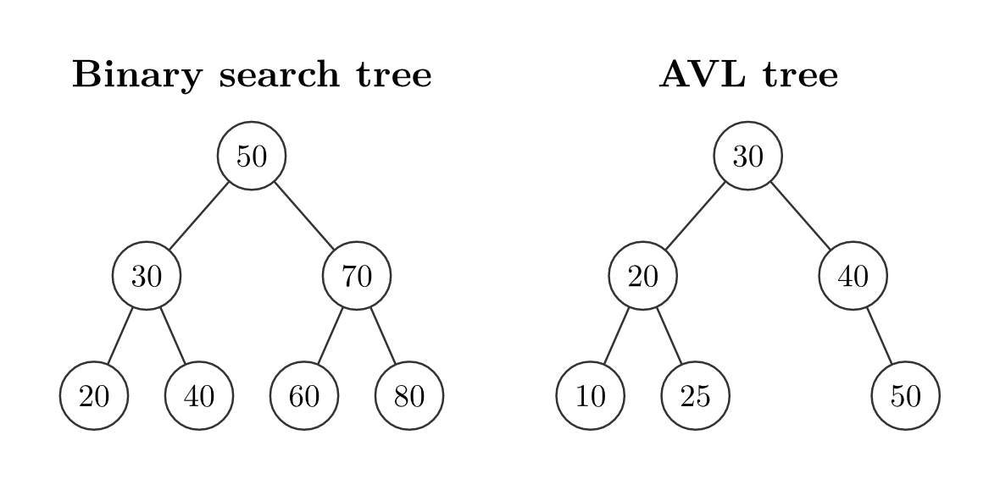
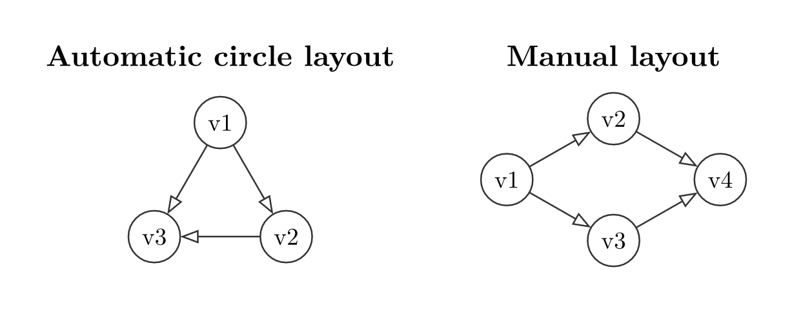

# typed-dsa


`typed-dsa` draws data-structure diagrams in Typst from declarative calls.
Give it keys, values, or an operation, and it produces a laid-out diagram with
consistent styling. It is built on top of
[CeTZ](https://typst.app/universe/package/cetz).

```typst
#import "@preview/typed-dsa:0.1.0": *
```

For the complete argument reference, including all nested `style:` and
`edge-customizations:` options, see the
[documentation PDF](https://github.com/GeronimoCastano/typed-dsa/blob/40df0a3d521132163d589b73b07e9e9fbbfd5bdf/docs/documentation.pdf).

Use it for lecture notes, problem sets, and explanations where the shape of a
tree, heap, list, queue, stack, array, matrix, or graph matters more than
hand-positioning every node.

## Static Structures

Every builder returns an object. Show its `.diagram` field to render the
static structure.

### Trees

`bst` inserts keys in the given order. `avl` inserts keys in order too, but
rebalances after each insertion.

```typst
#bst(50, 30, 70, 20, 40, 60, 80).diagram
#avl(10, 20, 30, 40, 50, 25).diagram
```



### Heaps

`min-heap` and `max-heap` are array-backed binary heaps. Each input key is
inserted and sifted up, then drawn as the complete binary tree represented by
the heap array.

```typst
#min-heap(50, 30, 70, 20, 40, 60, 80).diagram
#max-heap(50, 30, 70, 20, 40, 60, 80).diagram
```


### Linked Lists, Stack, And Queue

`linked-list` and `doubly-linked-list` can draw simple node chains or pointer
cells. `stack` treats the first value as the top; `queue` treats the first
value as the front.

```typst
#linked-list(3, 1, 4, 1, 5, head: true).diagram
#doubly-linked-list(3, 1, 4, 1, 5, head: true).diagram
#stack(9, 7, 2).diagram
#queue(3, 8, 5, 1).diagram
```


### Graphs

`graph` draws from an adjacency dictionary. Automatic layout places nodes on a
circle; `layout: "manual"` lets you define every position yourself. An edge
entry can be just a neighbor label, or `(neighbor, label)` when you want an
edge label such as a weight. Use `node-labels:` for outside annotations such
as Dijkstra distances, ranks, or visit order.

```typst
#graph(("v1": ("v2", "v3"), "v2": ("v3",), "v3": ())).diagram

#graph(("A": (("B", [4]), ("C", [5])), "B": (("C", [11]),), "C": ())).diagram

#graph(
  ("S": (("A", [7]), ("B", [2])), "A": (), "B": ()),
  node-labels: (("S", [$0$]), ("A", [$7$]), ("B", [$2$])),
).diagram

#graph(
  ("v1": ("v2", "v3"), "v2": ("v4",), "v3": ("v4",), "v4": ()),
  layout: "manual",
  positions: (
    "v1": (0, 0),
    "v2": (rel: "v1", offset: (1.4, 0.8)),
    "v3": (rel: "v1", offset: (1.4, -0.8)),
    "v4": (rel: "v2", offset: (1.4, -0.8)),
  ),
).diagram
```



### Arrays And Matrices

`array-view` and `matrix` draw compact grid-style cells. Use
`style.indices` to draw array indices and `cell-customizations:` to restyle
individual cells.

```typst
#array-view(
  4, 1, 7, 3,
  style: (indices: (enabled: true, weight: "bold")),
  cell-customizations: ((2, (fill: rgb("#D3F9D8"), stroke: 1pt + rgb("#2B8A3E"))),),
).diagram

#matrix(
  ((0, 1, 0), (1, 0, 1), (0, 1, 0)),
  cell-customizations: (((1, 2), (fill: rgb("#E7F5FF"), stroke: 1pt + rgb("#1971C2"))),),
).diagram
```

## Operation Transitions

For operation diagrams, use the object notation. Call an operation field with
parentheses, then show the returned step’s `.diagram`.

```typst
#let b = bst(50, 30, 70, 20, 40)
#let step = (b.insert)(45)
#step.diagram
```

The operation step also exposes `.before`, `.after`, `.label`, and `.result`.
Use `.result` to chain the next operation.

```typst
#let a = avl(30, 10)
#let rotation = (a.insert)(20, rebalance: (
  enabled: true,
  all-steps: true,
))
#rotation.diagram
```

The AVL example above shows a double rotation as separate panels. BST and AVL
objects support `insert`, `delete`, and `search`; heaps support `insert` and
`extract`; stacks, queues, linked lists, and doubly linked lists expose their
natural operations too.

Use `sequence(..., columns:)` to wrap multiple operation steps into rows
instead of building one very long horizontal trace.


## Styling

Every builder accepts `style:`. Common tree and graph keys include
`node-shape`, `node-radius`, `node-fill`, `node-stroke`, `edge-stroke`,
`edge-arrow`, and `edge-pattern`. Linear structures use box keys such as
`box-fill`, `box-stroke`, `ptr-fill`, `prev-ptr-fill`, and `next-ptr-fill`.

```typst
#bst(50, 30, 70, 20, 40, style: (
  node-shape: "square",
  node-radius: 0.4,
  node-fill: rgb("#E3F2FD"),
  node-stroke: 1pt + rgb("#1565C0"),
)).diagram
```

Diff highlights are styleable too. `new-style`, `path-style`, `remove-style`,
and `rotate-style` can be colors or dictionaries with `fill`, `shape`,
`stroke`, `node-radius`, and `text`. Set `diff-colors: false` to keep
operation marks while drawing their fills like ordinary nodes.


## Worked Example: Last Stone Weight

This example solves LeetCode 1046 with a `max-heap` object. Each round
extracts the two heaviest stones, inserts the difference when needed, and
renders the heap state produced by the same algorithm.


## License

MIT
