# typed-dsa

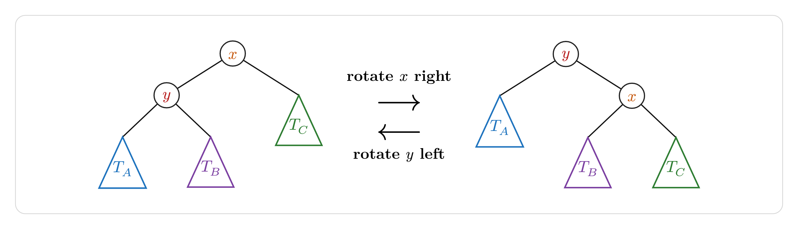

`typed-dsa` draws data-structure diagrams in Typst from declarative calls.
Give it keys, values, or an operation, and it produces a laid-out diagram with
consistent styling. It is built on top of
[CeTZ](https://typst.app/universe/package/cetz).

```typst
#import "@preview/typed-dsa:0.4.0": *
```

For the complete argument reference, including all nested `style:` and
`edge-customizations:` options, see the
[documentation PDF](https://github.com/GeronimoCastano/typed-dsa/blob/33bc098f8d8918f46f748b0ceb5a417f8a7a4da7/docs/documentation.pdf).

Use it for lecture notes, problem sets, and explanations where the shape of a
tree, heap, list, queue, stack, hash table, array, matrix, or graph matters more than
hand-positioning every node.

## Static Structures

Every builder returns an object. Show its `.diagram` field to render the
static structure.

### Trees

`bst` inserts keys in the given order. `avl` inserts keys in order too, but
rebalances after each insertion.

```typst
#bst(50, 30, 70, 20, 40, 60, 80).diagram
#avl(10, 20, 30, 40, 50, 25).diagram
```


### Heaps

`min-heap` and `max-heap` are array-backed binary heaps. Each input key is
inserted and sifted up, then drawn as the complete binary tree represented by
the heap array.

```typst
#min-heap(50, 30, 70, 20, 40, 60, 80).diagram
#max-heap(50, 30, 70, 20, 40, 60, 80).diagram
```

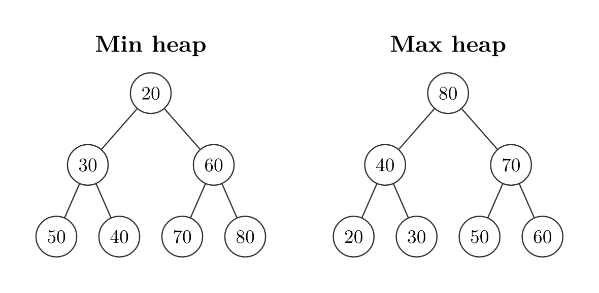

### Linked Lists, Stack, And Queue

`linked-list` and `doubly-linked-list` can draw simple node chains or pointer
cells. `stack` treats the first value as the top; `queue` treats the first
value as the front. List objects support `prepend`, append or indexed
`insert`, value `delete`, `delete-at`, and `search`.

```typst
#linked-list(3, 1, 4, 1, 5, head: true).diagram
#doubly-linked-list(3, 1, 4, 1, 5, head: true).diagram
#stack(9, 7, 2).diagram
#queue(3, 8, 5, 1).diagram
```

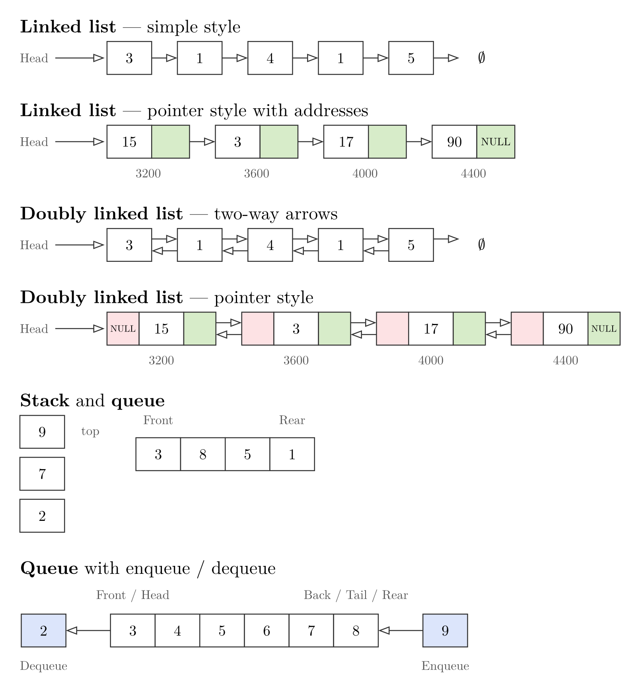

### Skip Lists

`skip-list` draws a sorted list with express-lane levels above it. Pass values
in strictly ascending order, without duplicates. A node's height is assigned once — by
`decision-fn`, deterministically from the value since Typst has no RNG — and
never changes just because something else is inserted or deleted elsewhere.
Objects support `search`, `insert` (`level: auto` or an explicit height), and
`delete`. Searches return `found` and `index`, including for a missing value.

```typst
#let l = skip-list(1, 2, 3, 4, 5, 6)
#(l.search)(4).diagram
#(l.insert)(7).diagram
```

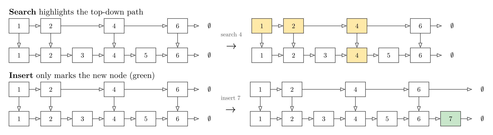

### Graphs

`graph` draws from an adjacency dictionary. Automatic layout places nodes on a
circle; `layout: "linear"` lines them up in a row (handy for topological
orderings), with spacing set by `gap:`; `layout: "manual"` lets you define
every position yourself. An edge entry can be just a neighbor label, or
`(neighbor, label)` when you want an edge label such as a weight. Use
`node-labels:` for outside annotations such as Dijkstra distances, ranks, or
visit order.

```typst
#graph(("v1": ("v2", "v3"), "v2": ("v3",), "v3": ())).diagram

#graph(("A": (("B", [4]), ("C", [5])), "B": (("C", [11]),), "C": ())).diagram

#graph(
  ("S": (("A", [7]), ("B", [2])), "A": (), "B": ()),
  node-labels: (("S", [$0$]), ("A", [$7$]), ("B", [$2$])),
).diagram

#graph(
  ("v1": ("v2",), "v2": ("v3",), "v3": ("v4",), "v4": ()),
  layout: "linear",
  gap: 2,
).diagram

#graph(
  ("v1": ("v2", "v3"), "v2": ("v4",), "v3": ("v4",), "v4": ()),
  layout: "manual",
  positions: (
    "v1": (0, 0),
    "v2": (rel: "v1", offset: (1.4, 0.8)),
    "v3": (rel: "v1", offset: (1.4, -0.8)),
    "v4": (rel: "v2", offset: (1.4, -0.8)),
  ),
).diagram
```

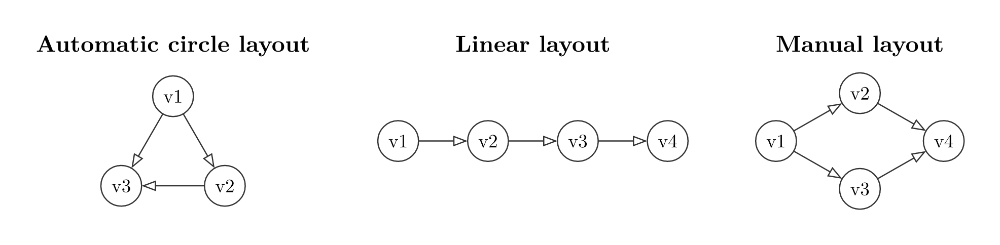

Graph algorithms return full traces directly on the graph. Visited nodes are
green, the current node is blue, queued/stacked nodes are yellow, and the edge
being inspected is highlighted. `dijkstra` also labels every node with its
current distance as `d = ...`; when it reaches a target, the final state
highlights the shortest-path edges. A target is optional; omit it to traverse
every reachable node.

```typ
#bfs(
  (
    "S": ("A", "B"),
    "A": ("T",),
    "B": ("T",),
    "T": (),
  ),
  "S",
  target: "T",
  columns: 3,
  style: graph-style(scale: 0.65),
).diagram
#dfs(adjacency, "S", target: "T").diagram
#dijkstra(weighted-adjacency, "S", target: "T").diagram
```

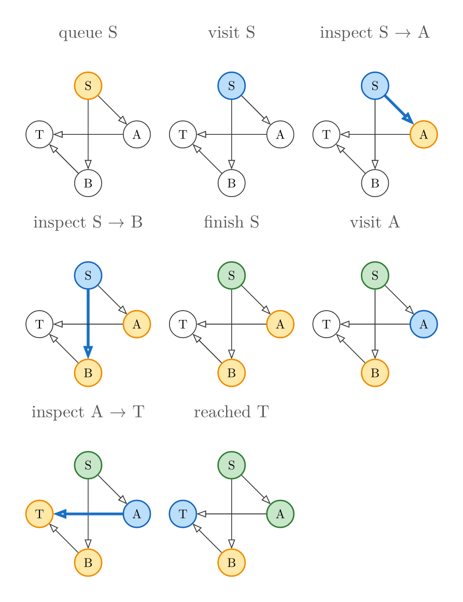

### Arrays And Matrices

`array-view` and `matrix` draw compact grid-style cells. Use
`style.indices` to draw array indices and `cell-customizations:` to restyle
individual cells.

```typst
#array-view(
  4, 1, 7, 3,
  style: (indices: (enabled: true, weight: "bold")),
  cell-customizations: ((2, (fill: rgb("#D3F9D8"), stroke: 1pt + rgb("#2B8A3E"))),),
).diagram

#matrix(
  ((0, 1, 0), (1, 0, 1), (0, 1, 0)),
  cell-customizations: (((1, 2), (fill: rgb("#E7F5FF"), stroke: 1pt + rgb("#1971C2"))),),
).diagram
```

### Hash Tables

`hash-table` accepts keys or `(key, value)` pairs and supports separate
chaining or linear probing. Its `insert`, `delete`, and `search` methods return
the same before/after operation steps as the other live structures.

```typ
#hash-table(1, 6, 11, size: 5, collision: "chaining").diagram
#hash-table(1, 6, 11, size: 5, collision: "linear").diagram
```

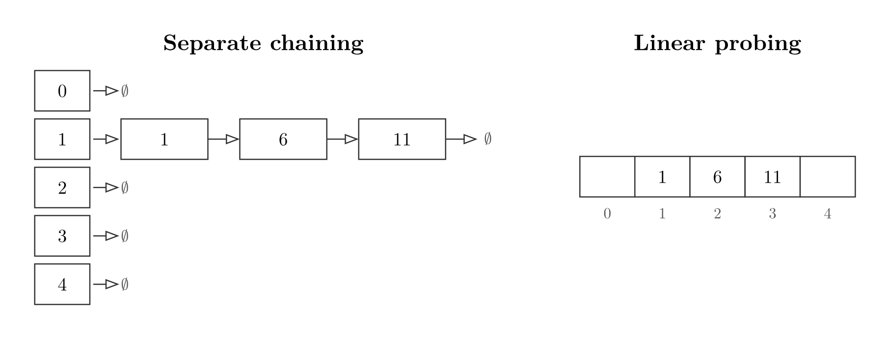

### Sorting Algorithms

Sorting builders generate full teaching traces automatically. Each takes one
array plus `order:` (`quick-sort` also takes `pivot:`), and returns `.diagram`,
`.steps`, and `.result`, so you can show the whole algorithm or lay out selected
steps yourself. Pass a styled `array-view(...)` instead of a bare array to carry
its style through every step. `merge-operation`, bubble sort, insertion sort,
and selection sort show cursor pointers by default; pass `pointers: false` to
hide them. Pass `labels: false` to hide generated trace captions while keeping
the arrays, highlights, indices, and pointers.

```typst
#merge-sort((38, 27, 43, 3, 9)).diagram
#merge-operation((1, 4, 7), (2, 3, 8)).diagram
#partition-step((7, 2, 9, 3, 6)).diagram
#quick-sort((8, 3, 1, 7, 0, 10, 2), pivot: "last").diagram
#bubble-sort((5, 1, 4, 2)).diagram
```

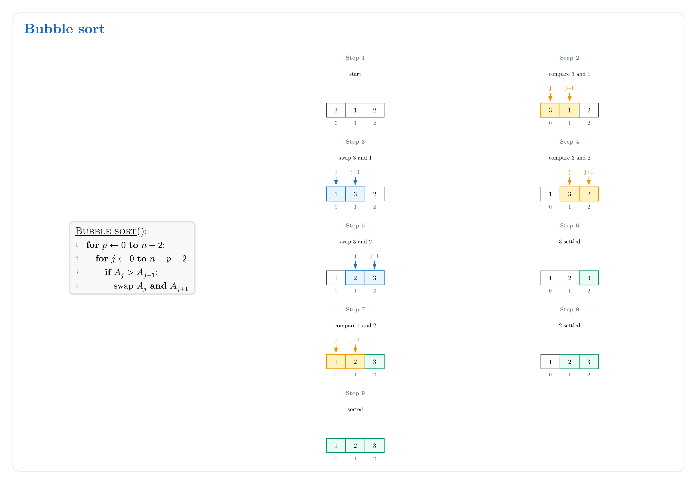

## Operation Transitions

For operation diagrams, use the object notation. Call an operation field with
parentheses, then show the returned step’s `.diagram`.

```typst
#let b = bst(50, 30, 70, 20, 40)
#let step = (b.insert)(45)
#step.diagram
```

The operation step also exposes `.before`, `.after`, `.label`, and `.result`.
Use `.result` to chain the next operation.

```typst
#let a = avl(30, 10)
#let rotation = (a.insert)(20, rebalance: (
  enabled: true,
  all-steps: true,
))
#rotation.diagram
```

The AVL example above shows a double rotation as separate panels. BST and AVL
objects support `insert`, `delete`, and `search`; heaps support `insert` and
`extract`; stacks, queues, linked lists, and doubly linked lists expose their
natural operations too.

Use `sequence(..., columns:)` to wrap multiple operation steps into rows
instead of building one very long horizontal trace.

Use `operation-sequence(initial, ..operations)` when you want the package to
apply and chain the operations too:

```typ
#operation-sequence(
  linked-list(2, 4),
  list => (list.prepend)(1),
  list => (list.insert)(3, index: 2),
  list => (list.search)(4),
  columns: 1,
).diagram
```

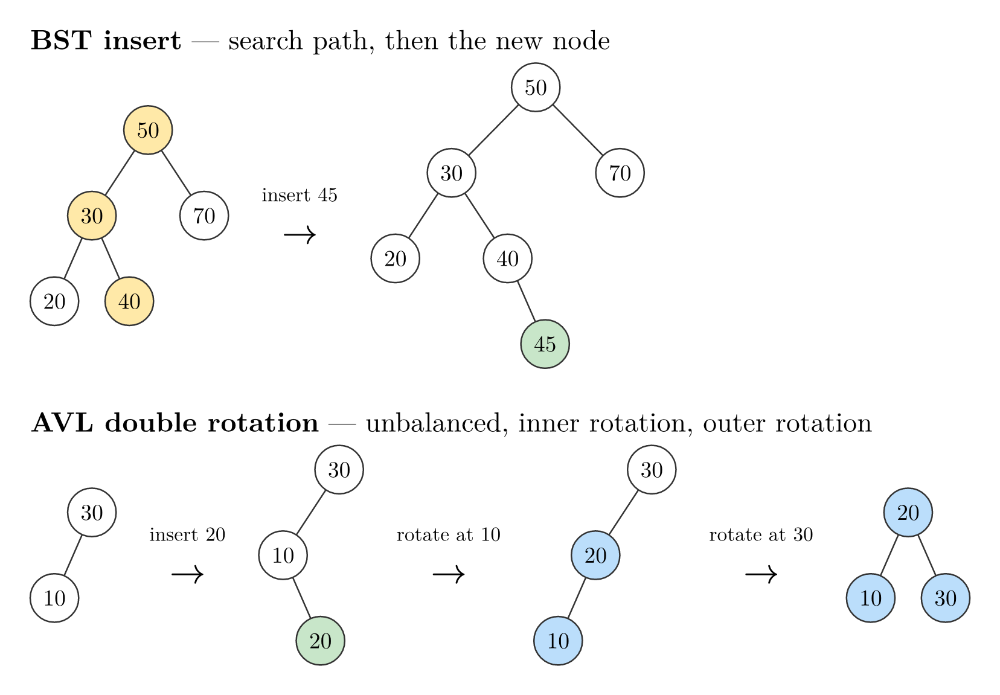

## Styling

Every builder accepts `style:`. Use structure-specific helpers such as
`tree-style(...)`, `stack-style(...)`, or `graph-style(...)` to get relevant
named-argument suggestions from Typst editors, or pass a raw dictionary.
Tip: if you forget a key like `x-gap` or `box-gap`, start typing inside the
helper call and your editor can autocomplete the supported arguments.
Common tree and graph keys include
`node-shape`, `node-radius`, `node-fill`, `node-stroke`, `edge-stroke`,
`edge-arrow`, and `edge-pattern`. Linear structures use box keys such as
`box-fill`, `box-stroke`, `ptr-fill`, `prev-ptr-fill`, and `next-ptr-fill`.
Nodes accept `"rounded"` and `"capsule"` shapes; cells accept them through
`box-shape`. `theme-preset` provides `default`, `dark`, `print`, `colorblind`,
and `chalkboard` presets.

```typst
#bst(50, 30, 70, 20, 40, style: tree-style(
  node-shape: "square",
  node-radius: 0.4,
  node-fill: rgb("#E3F2FD"),
  node-stroke: 1pt + rgb("#1565C0"),
  node-text: text-style(weight: "bold"),
)).diagram
```

Diff highlights are styleable too. `new-style`, `path-style`, `remove-style`,
and `rotate-style` can be colors or dictionaries with `fill`, `shape`,
`stroke`, `node-radius`, and `text`; `node-mark-style(...)` provides completion
for tree/heap marks, while `cell-mark-style(...)` exposes only the options
supported by linear cells. Set `diff-colors: false` to keep
operation marks while drawing their fills like ordinary nodes.

Typography can be targeted by role with `value-text`, `index-text`,
`pointer-text`, `operation-text`, `edge-label-text`, and
`algorithm-label-text`; all inherit from the existing `node-text` or
`label-text` defaults.

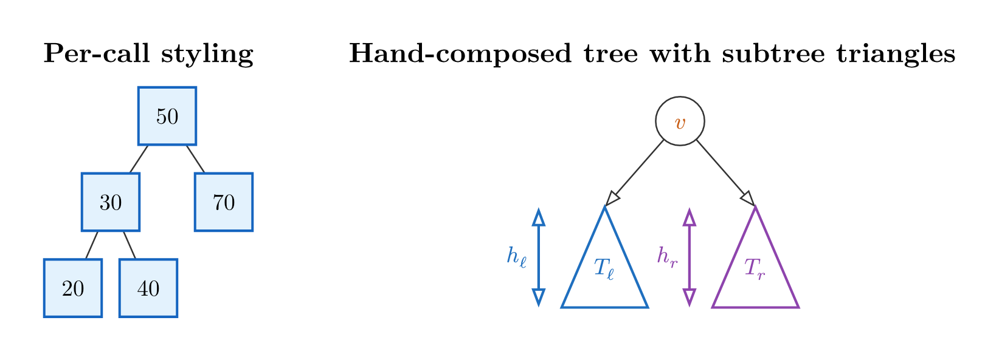

## Localization

Every generated caption — operation wording, graph-trace labels, sorting phase
names, and the `Head`/`Front`/`Rear`/`top` annotations — is drawn from a central
message catalog. Pass `language:` to switch it. Supported codes are `"en"`
(default), `"de"`, and `"es"`; an invalid code fails with a clear assertion.

```typst
#(bst(8, 4, 12, language: "de").insert)(6).diagram   // caption: "6 einfügen"
#bfs(("A": ("B",), "B": ()), "A", language: "es").diagram
#bubble-sort((4, 2, 3), language: "de").diagram
```

The chosen language persists through operations and chained `.result` objects.
Layer `messages:` over any language to override individual phrases — build the
override with the `messages(...)` helper, whose values are content or callbacks
returning content:

```typst
#let mine = messages(tree: (insert: key => [insertar #key]))
#(bst(8, 4, 12, language: "es", messages: mine).insert)(6).diagram
```

`step-label:` still overrides a single operation call, winning over both. See
the user guide's Localization chapter for the full message-key catalog.

## Worked Example: Last Stone Weight

This example solves LeetCode 1046 with a `max-heap` object. Each round
extracts the two heaviest stones, inserts the difference when needed, and
renders the heap state produced by the same algorithm.

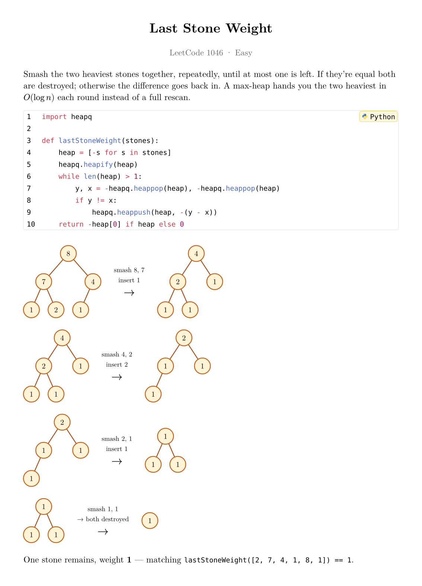

## License

MIT
